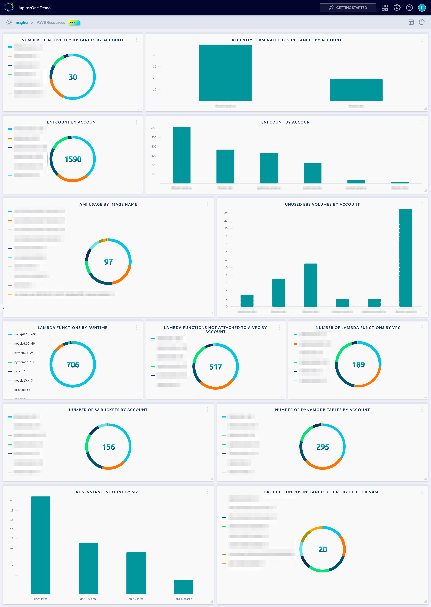

# AWS Resources Dashboard

Example dashboard charts and layout for AWS Resources:



The above example contains the following charts/queries:

## EC2 Instances

### (Left) Number of Active EC2 Instances by Account

Chart type: `pie`

Query:

```j1ql
Find aws_instance with active=true as e
  return e.tag.AccountName as name, count(e) as value
```

### (Right) Recently terminated EC2 instances by account

Chart type: `bar`

Query:

```j1ql
Find aws_instance with state='terminated' as i
  return i.tag.AccountName as x, count(i) as y
```

## ENI network interfaces

### (Left) ENI Count by Account

Chart type: `pie`

Query:

```j1ql
Find aws_eni as e
return e.tag.AccountName as name, count(e) as value
```

### (Right) ENI Count by Account

Chart type: `bar`

Query:

```j1ql
Find aws_eni as e
return e.tag.AccountName as x, count(e) as y
```

## AMI usage by image name

Chart type: `pie`

Query:

```j1ql
Find aws_instance as h that uses aws_ami as a 
return a.displayName as name, count(h) as value
```

## Unused EBS volumes by account

Chart type: `bar`

Query:

```j1ql
Find aws_ebs_volume as v that !uses aws_instance
return v.tag.AccountName as x, count(v) as y
```

## Lambda serverless functions

### (Left) Lambda functions by runtime (all functions)

Chart type: `pie`

Query:

```j1ql
Find aws_lambda_function as f
Return
  f.runtime as name,
  count(f) as value
```

### (Middle) Lambda functions not attached to a VPC by account

Chart type: `pie`

Query:

```j1ql
Find aws_lambda_function with vpcId=undefined or vpcId='' as f
Return
  f.tag.AccountName as name,
  count(f) as value
```

### (Right) Number of lambda functions by VPC

Chart type: `pie`

Query:

```j1ql
Find aws_lambda_function as f that HAS aws_vpc as v
Return
  v.name as name,
  count(f) as value
```

## Storage (S3 and Dynamo)

### (Left) Number of S3 buckets by account

Chart type: `pie`

Query:

```j1ql
FIND aws_s3_bucket as bkt
RETURN
  bkt.tag.AccountName AS name,
  count(bkt) AS value
```

### (Right) Number of DynamoDb Tables by Account

Chart type: `pie`

Query:

```j1ql
Find aws_dynamodb_table as e
return e.tag.AccountName as name, count(e) as value
```

## RDS databases

### (Left) RDS instances count by size

Chart type: `bar`

Query:

```j1ql
find aws_db_instance as i
return i.dbInstanceClass as x, count(i) as y
```

### (Right) Production RDS instances count by cluster name

Chart type: `pie`

Query:

```j1ql
Find aws_rds_cluster with tag.Production=true as c
that contains aws_db_instance as i
return c.displayName as name, count(i) as value
```