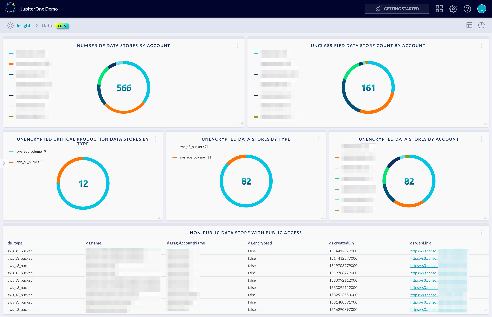

# Data Security Dashboard

Example dashboard charts and layout for Data Security:



The above example contains the following charts/queries:

## Repos with the most vulnerability findings

Chart type: `pie`

Query:

```j1ql
Find DataStore AS ds
Return
  ds.tag.AccountName as name,
  count(ds) AS value
```

## Unclassified data store count by account

Chart type: `pie`

Query:

```j1ql
Find DataStore with classification=undefined as ds
return
  ds.tag.AccountName as name,
  count(ds) as value
```

## Unencrypted critical production data stores by type

Chart type: `pie`

Query:

```j1ql
Find DataStore with 
  encrypted=false and 
  tag.Production=true and 
  classification=('critical' or undefined) as ds
return
  ds._type as name,
  count(ds) as value
```

## Unencrypted data stores by type

Chart type: `pie`

Query:

```j1ql
Find DataStore with encrypted=false as ds
return
  ds._type as name,
  count(ds) as value
```

## Unencrypted data stores by account

Chart type: `pie`

Query:

```j1ql
Find DataStore with encrypted=false as ds
return
  ds.tag.AccountName as name,
  count(ds) as value
```

## Non-public data store with public access

Chart type: `bar`

Query:

```j1ql
Find DataStore with (classification!='public' or classification=undefined) as ds
  that ALLOWS everyone
return
  ds._type, ds.name, ds.tag.AccountName, ds.encrypted, ds.createdOn, ds.webLink
```
