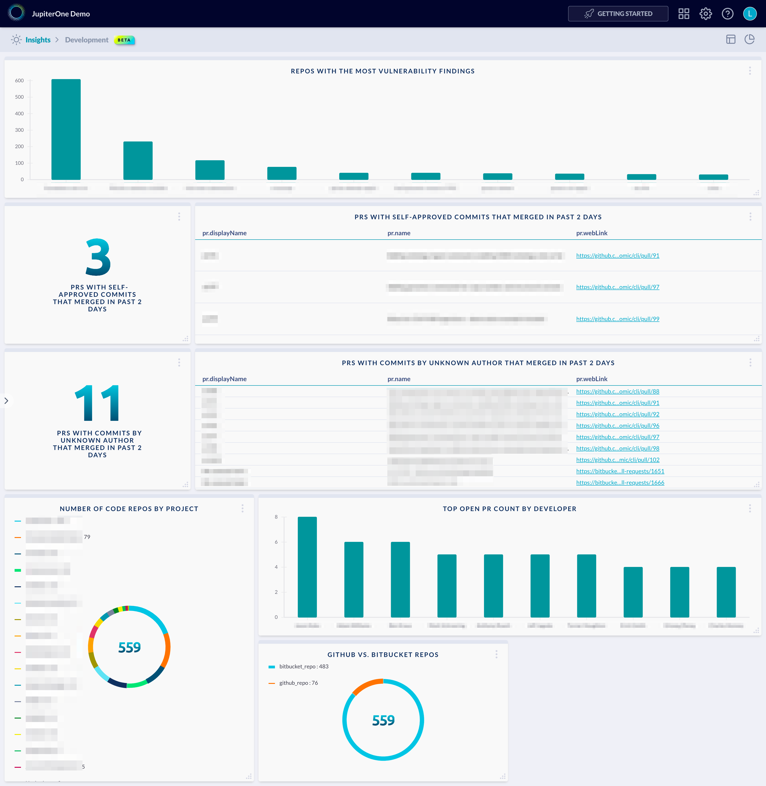

# Development and Secure SDLC Dashboard

Example dashboard charts and layout for Development and Secure SDLC:



The above example contains the following charts/queries:

## Repos with the most vulnerability findings

Chart type: `bar`

Query:

```j1ql
Find CodeRepo as code that has (Vulnerability|Finding) as vuln
  return code.name as x, count(vuln) as y
  order by y desc limit 10
```

## PRs with Self-approved commits that merged in past 2 days

**(Left Chart)**

Chart type: `number`

Query:

```j1ql
Find PR with
  approved=false and
  merged=true and
  updatedOn > date.now-2days
as pr Return count(pr) as value
```

**(Right Chart)**

Chart type: `table`

Query:

```j1ql
Find PR with
  approved=false and
  merged=true and
  updatedOn > date.now-2days
as pr Return pr.displayName, pr.name, pr.webLink
```

## PRs with commits by unknown author that merged in past 2 days

**(Left Chart)**

Chart type: `number`

Query:

```j1ql
Find PR with
  validated=false and
  merged=true and
  updatedOn > date.now-2days
as pr Return count(pr) as value
```

**(Right Chart)**

Chart type: `table`

Query:

```j1ql
Find PR with
  validated=false and
  merged=true and
  updatedOn > date.now-2days
as pr Return pr.displayName, pr.name, pr.webLink
```

## Number of Code Repos by Project

Chart type: `pie`

Query:

```j1ql
Find CodeRepo AS repo that relates to (Project|github_account) as p
Return
  p.name as name,
  count(repo) AS value
```

## Top Open PR count by developer

Chart type: `bar`

Query:

```j1ql
Find Person that is User AS u
  that opened PR
  that open=true AS pr
Return
  u.displayName AS x,
  count(pr) AS y
Order By y Desc
Limit 10
```

## Github vs. Bitbucket Repos

Chart type: `bar`

Query:

```j1ql
Find CodeRepo as repo
Return
  repo._type as name,
  count(repo) as value
```
