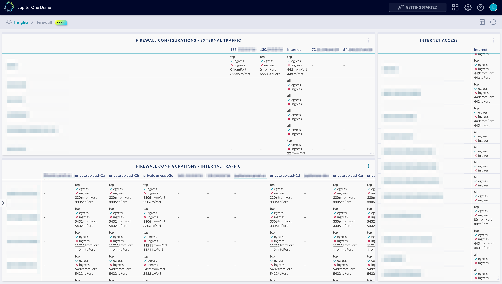

# Firewall Configuration Dashboard

Example dashboard charts and layout for firewall configuration (e.g. AWS
Security Groups and Network ACLs):



The above example contains the following charts/queries:

## Firewall Configurations - External Traffic

Chart type: `matrix`

Query:

```j1ql
FIND Firewall AS row
  THAT allows AS rel
  Network with public=true or _source='system-mapper' AS col
RETURN
  row.displayName AS x,
  col.displayName AS y,
  rel.egress AS egress,
  rel.ingress AS ingress,
  rel.fromPort as fromPort,
  rel.toPort as toPort,
  rel.ipProtocol AS label
```

## Firewall Configurations - Internal Traffic

Chart type: `matrix`

Query:

```j1ql
FIND Firewall AS row
  THAT allows AS rel
  Network with public!=true AS col
RETURN
  row.displayName AS x,
  col.displayName AS y,
  rel.egress AS egress,
  rel.ingress AS ingress,
  rel.fromPort as fromPort,
  rel.toPort as toPort,
  rel.ipProtocol AS label
```

## Internet Access

Chart type: `matrix`

Query:

```j1ql
FIND Firewall AS row
  THAT allows AS rel
  Internet AS col
RETURN
  row.displayName AS x,
  col.displayName AS y,
  rel.egress AS egress,
  rel.ingress AS ingress,
  rel.fromPort as fromPort,
  rel.toPort as toPort,
  rel.ipProtocol AS label
```
