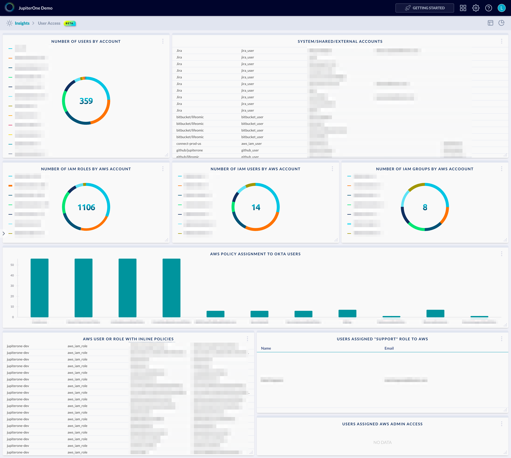

# User Access Dashboard

Example dashboard charts and layout for users and access:



The above example contains the following charts/queries:

## Number of Users by Account

Chart type: `pie`

Query:

```j1ql
Find User as u
Return
  u.tag.AccountName as name,
  count(u) as value
```

## System/Shared/External accounts

Chart type: `table`

Query:

```j1ql
Find User as u that !is Person
  return u.tag.AccountName, u._type, u.displayName, u.username, u.email
  order by u.tag.AccountName
```

## Number of IAM Roles by AWS Account

Chart type: `pie`

Query:

```j1ql
Find aws_iam_role as role
  return role.tag.AccountName as name, count(role) as value
```

## Number of IAM Users by AWS Account

Chart type: `pie`

Query:

```j1ql
Find aws_iam_user as user
  return user.tag.AccountName as name, count(user) as value
```

## Number of IAM Groups by AWS Account

Chart type: `pie`

Query:

```j1ql
Find aws_iam_group as group
  return group.tag.AccountName as name, count(group) as value
```

## AWS policy assignment to Okta users

Chart type: `bar`

Query:

```j1ql
Find okta_user as user
  that assigned aws_iam_role as role
  that assigned aws_iam_policy as policy
return policy.displayName as x, count(user) as y
```

## AWS User or Role with inline policies

Chart type: `table`

Query:

```j1ql
Find (User|AccessRole) as u
  that (has|assigned) (aws_iam_user_policy|aws_iam_role_policy) as p
return u.tag.AccountName, u._type, u.name, p.name
  order by u.tag.AccountName
```

## Okta users assigned "Support" role to AWS

Chart type: `table`

Query:

```j1ql
Find okta_user as u that assigned aws_iam_role with name='Support'
return
  u.name as Name,
  u.email as Email
```

## Users or Roles assigned AWS Admin Access

Chart type: `table`

Query:

```j1ql
'admin' with _class='AccessPolicy' as p
  that assigned (aws_iam_role|User) as u
return u._type, u.name, p._type, p.name
```
