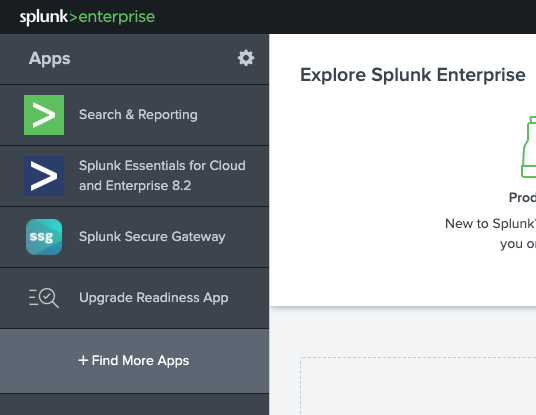
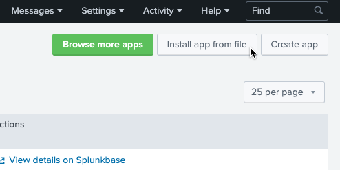
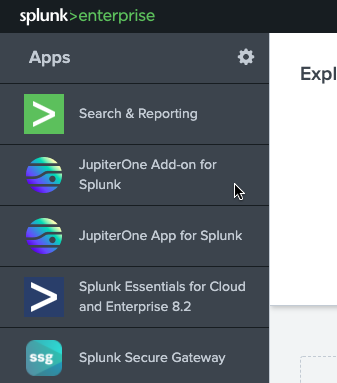
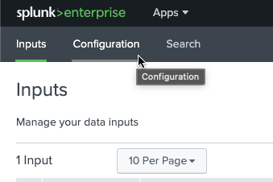
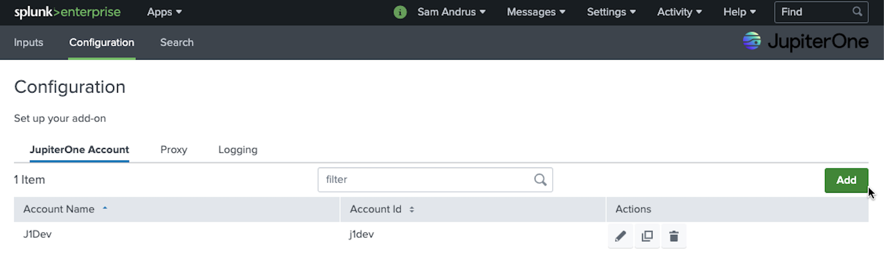
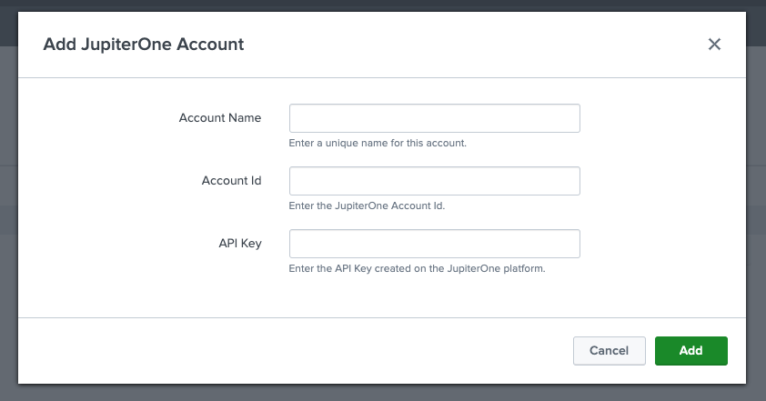
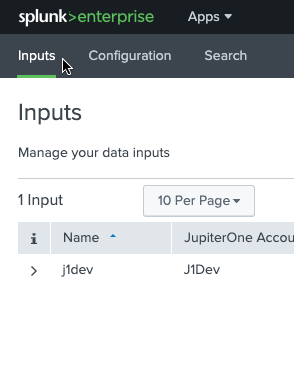
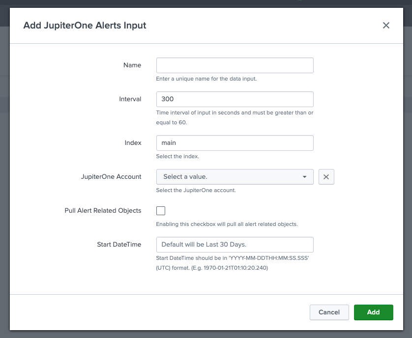

# Integration with JupiterOne

## Splunk + JupiterOne Integration Benefits

- Import JupiterOne alert data to your Splunk account.
- View alerts on a Splunk dashboard.
- Link back to alerts in JupiterOne for easy access to additional information.

## How it Works

- Splunk periodically imports alert details from JupiterOne.
- Write your own Splunk searches to find data about JupiterOne alerts.
- View JupiterOne alerts on a dashboard in Splunk with breakdowns by severity, over time, active and dismissed. 

## Requirements

- A JupiterOne API key and your JupiterOne account ID.
- Splunk Enterprise 8.0, 8.1 or 8.2
- Permission to install new add-ons and apps in Splunk.

## Support

If you need help with this integration, contact [JupiterOne Support](https://support.jupiterone.io).

## Integration Instructions

### In JupiterOne

1. [Generate an API key](https://support.jupiterone.io/hc/en-us/articles/360025847594-Enable-API-Key-Access).
2. Look up your `accountId` by executing this query in your JupiterOne account: `find jupiterone_account`. The result has a column labeled `accountId`.

### Install Add-on and App in Splunk

1. On the Splunk home dashboard, use the **Find More Apps** link to find and install the JupiterOne add-on and JupiterOne app.

or

1. Download the [add-on](https://splunkbase.splunk.com/app/6138) or [App](https://splunkbase.splunk.com/app/6139) package from the Splunkbase marketplace.
2. In Splunk, navigate to **Apps > Manage Apps** by clickingthe gear icon in the upper-left corner.

3. In the top-right corner, select **Install app from file**.

4. Select **Choose File** and select the add-on or app package you downloaded.
5. Select **Upload** and follow the instructions.

### Configure the Add-on in Splunk

1. In Splunk, navigate to **JupiterOne Add-on for Splunk**.

1. Click **Configuration**.

2. Click **Add** to create a new JupiterOne account configuration.

3. In the Add JupiterOne Account screen, enter an **Account Name**, the **Account Id**, and the **API Key**. Click **Add** when finished.

4. If needed, configure a proxy on the Proxy tab.
5. If required, change the log level on the Logging tab. The default is INFO.
6. Navigate to the **Inputs** tab.

7. Click **Create New Input**.
8. Enter the details and click **Add**.

| Field Name | Field Description                  |
| ------------------ | -----------------------------------|
| Name*               | Unique name for the data input.     |
| Interval*           | Time interval of input in seconds. How often JupiterOne collects the data.  |
| Index*              | Index where data is stored.    |
| JupiterOne Account* | Account that was configured in the **Configuration** tab. |
| Pull Alert Related Objects | If enabled, pulls data for entities in Alert. |
| Start DateTime | Date in UTC when you want to start collecting data. Default is 30 days in the past. |

`*` denotes required field

### Configure the App in Splunk

AFter you have configured the add-on and it is running, the app starts working. There is no configuration needed.

More details are available on the Splunkbase marketplace for the [add-on](https://splunkbase.splunk.com/app/6138) and the [App](https://splunkbase.splunk.com/app/6139)
