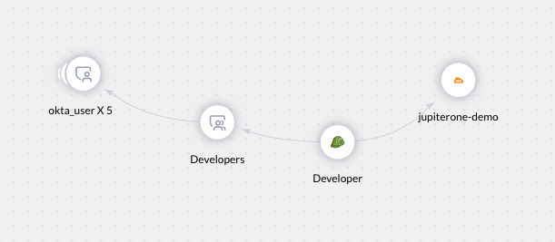
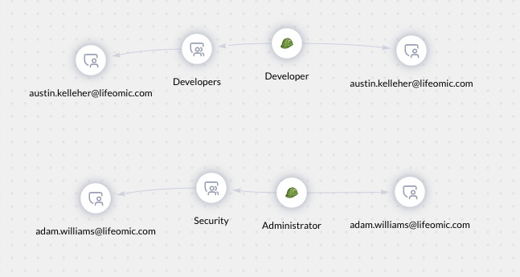
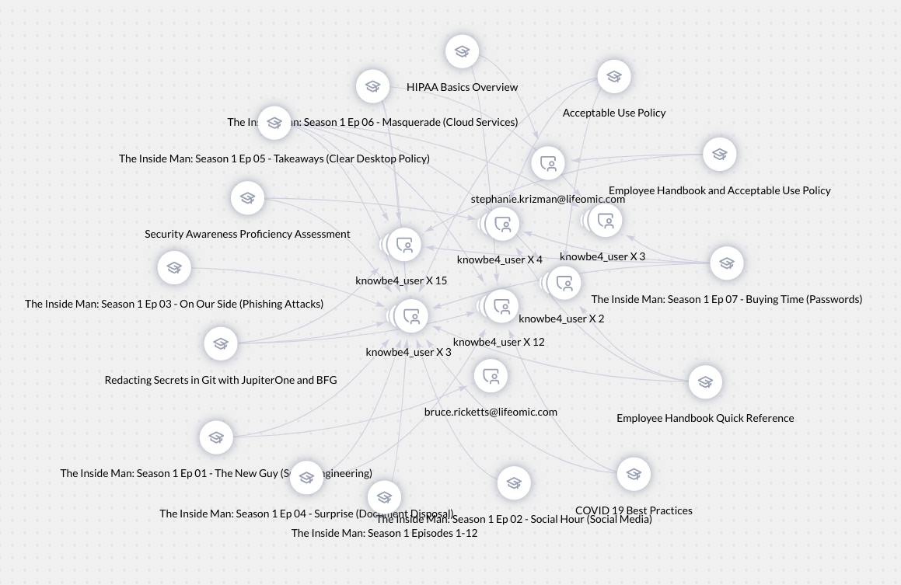
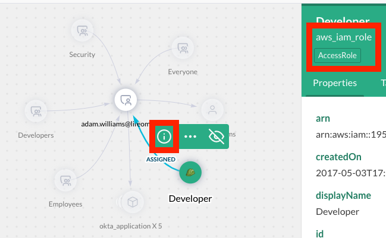
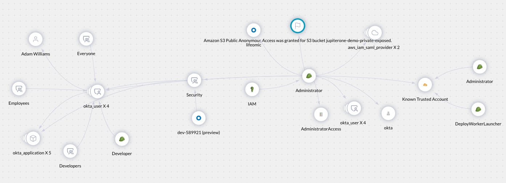

# J1QL Tips and Tricks

This guide contains useful topics for creating custom JupiterOne queries within
your own account. We recommend starting with our wide-array of
[pre-canned questions](https://support.jupiterone.io/hc/en-us/articles/360038496974-Packaged-Questions-Catalog),
tweaking them as needed, then creating your own from scratch.

## When to Use WITH vs WHERE

`WITH` and `WHERE` are both keywords used to filter the results of your query.
The filtering of the results happens either pre-traversal or post-traversal. 

In a *pre-traversal* filter, the nodes specified in the query are filtered down
before traversing child nodes and finding matching query results.

In a *post-traversal* filter, the entire graph is traversed to find potential
matching query results before filtering occurs on the resulting graph to produce
the final query result.

### WITH

1. `WITH` is used to filter entity **node** properties **pre-traversal**. 

Take the following example.

```j1ql
Find User that HAS UserGroup that ASSIGNED AccessRole that (ALLOWS|TRUSTS) Account WITH tag.Production=true
```



The query will iterate through the graph database finding any User across your
environment that is part of a UserGroup, and the UserGroup is assigned an
AccessRole, and the AccessRole allows or trusts an Account that is tagged as 
production.

### WHERE

`WHERE` must be used anytime we need to compare two properties across different
nodes.

1. `WHERE` is used to filter entity **node** properties **post-traversal**.

Let's continue with the previous example.

```j1ql
Find User as u1 that HAS UserGroup that ASSIGNED AccessRole that ASSIGNED User as u2 WHERE u1.name=u2.name
```



This query finds Users that are part of a UserGroup that are assigned an
AccessRole, but are assigned to that same AccessRole directly as a User outside
of a UserGroup.

2. `WHERE` can also be used to filter the relationship **edge** properties **post-traversal**.

Let's look at a different example with an edge that has properties.

```j1ql
Find Training as t that ASSIGNED as enrollment User as u WHERE enrollment.completedOn = undefined
```



This query checks the edge, `ASSIGNED`, and filters on its properties. In this
example we find trainings assigned to Users where the `completedOn` date is
undefined (or incomplete).

**NOTE** Use `WITH` over `WHERE` when possible as the `WITH` operation is more
efficient.

## Variable Placeholders

A variable placeholder is used to prompt a user for a specific value to be
injected into a pre-saved query. Variable placeholders can be leveraged in J1QL
using the double curly bracket syntax `{{variable-placeholder-name}}`.

Take the following pre-saved query as an example.

```j1ql
Find aws_instance with instanceId='{{instance-id}}'
```

Running the above query displays a modal that prompts the user to enter a value.
The query will not execute until you enter a value and press the submit button.


### Create a Question that uses a Placeholder

The placeholder double curly bracket syntax cannot be used in the search bar.
There are two ways to create a new question and add a variable placeholder.

1. Save a New Question

- Type a query into the search bar and enter a *temporary* value
- Click the star icon to save
- Type in a Title that describes the query (this is the question name)
- Edit the query, replacing the temporary value with `{{your variable placeholder name here}}`
- Click **Save**


2. Duplicate an Existing Question

- Click on the Library icon
- Find an existing question with query elements similar to your new query  
- Click on the Duplicate icon
- Update the Title
- Update the existing query and add `{{your variable placeholder name here}}`
- Click **Save**


**NOTES**
- One or more placeholders can be used in a single saved query.
- Placeholders are not supported via the J1 API.

## Leveraging the Graph for Context

Before leveraging the graph, check out the [Data Model - Overview](https://support.jupiterone.io/hc/en-us/articles/360022903573-Data-Model-Overview)
document for a comprehensive list of JupiterOne entities, their properties, and their relationships to other entities. The graph is a tool that can be used when these details are unknown.

Also keep in mind that when traversing the graph from a starting node, you may
not see all the possible relationships to other nodes. For a comprehensive list
of entities and their relationships for a specific integration, see the
[integration guides](https://support.jupiterone.io/hc/en-us/sections/360004247473-Integrations).

**HINT** To see all of the related entities from a single node, use the
relationship verb `RELATES TO`, which graphs out related entities and the
relationships between them. See the following example.

```j1ql
Find User that RELATES TO *
```

1. To start, navigate to the Landing page of JupiterOne and type in a basic query,
replacing `DataStore` with the entity class/type you are interested in.


2. Click on the specific result you are interested in. 

3. Click on the vertical ellipses to open additional actions then click **Open in Graph**.


A new browser tab will be opened and will run a query that returns a graph
showing everything related to or mapped to the entity via a relationship.

4. Click on the queried entity and you will see the relationship verbs for each
   mapped entity.


5. The type & class of a node can be determined by by selecting the node,
   clicking the info icon, and looking under the display name.



The `Developer` node from in the example screenshot has a type of `aws_iam_role`
and a class of `AccessRole`. We know the following relationships exist for a
User class.

- A User is ASSIGNED an AccessRole
- A User IS a Person
- A User HAS a UserGroup
- A User is ASSIGNED an Application

These relationships can be used to craft queries.

```j1ql
Find User that ASSIGNED AccessRole
Find User that IS Person
Find User that HAS UserGroup
Find User that ASSIGNED Application
```

**Hint** Relationships can be queried bidirectionally. For example, `Find User
that HAS UserGroup` can also be queried as `Find UserGroup that HAS User` and will
return the same results in the graph. However, the list view will return a list
of either `User` or `UserGroup` depending on which entity you `Find`.

6. Continue to expand the query by clicking on and expanding nodes in the
graph. To do this, select any node and click on the ellipses.


From here we see several additional nodes. We can select a path that we are
interested and continue to expand the graph until we arrive at a query that is
meaningful.

In the following example we traversed from a User to a UserGroup to an AccessRole to an Account. 
Written out more specifically using types we have an okta_user to an okta_user_group to an aws_iam_role to an aws_account.

Our final query could be something similar to the following example, adding in filters, sorting, pagination, etc. as needed. 
See [J1QL Language Specs](https://support.jupiterone.io/hc/en-us/articles/360022722014-J1QL-Language-Specs) to understand the query language features.

```j1ql
Find User that HAS UserGroup that ASSIGNED AccessRole that TRUSTS Account
```



