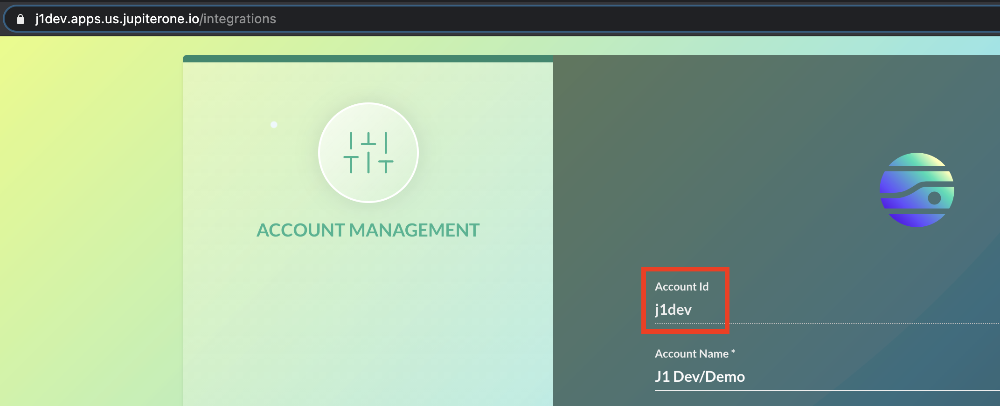
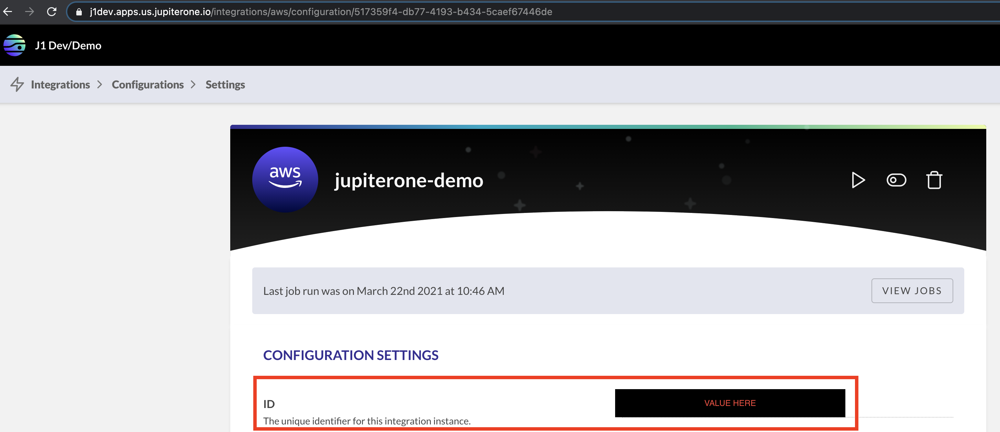

# JupiterOne API

The JupiterOne platform exposes a number of public GraphQL endpoints.

**Base URL**: `https://api.us.jupiterone.io`

**Endpoint for query and graph operations**: `/graphql`

**Endpoint for alert and rules operations**: `/rules/graphql`

**Rate Limits**: Rate limiting is enforced based on your account tier. A `429`
HTTP response code indicates the limit has been reached. The API does not
currently return any rate limit headers.

**Authentication**: The JupiterOne APIs use a Bearer Token to authenticate. Include the API key in the header as a Bearer Token. You also need to include `JupiterOne-Account` as a header parameter. You can find the `Jupiterone-Account` value in your account by running the following J1QL query:

```j1ql
FIND jupiterone_account as a return a._accountId
```

**Example cURL command with authentication**

```curl
curl --location --request POST 'https://api.us.jupiterone.io/graphql' \
--header 'JupiterOne-Account: accountId' \
--header 'Authorization: Bearer 123456abcdef' \
--header 'Content-Type: application/json' \
--data-raw '{"query":...}
```

An experimental [node.js client and CLI][1] is available on Github.

[1]: https://github.com/JupiterOne/jupiterone-client-nodejs

## Entity and Relationship Queries

**Endpoint:** `/graphql`

### Querying the graph with J1QL

This query will allow you to run J1QL queries for fetching data.
The GraphQL resolver requires that one parameter is provided:

- `query`: A J1QL query string that describes what data to return

Optionally, additional parameters can be provided:

- `variables`: A `JSON` map of values to be used as parameters for the query
- `cursor`: A token that can be exchanged to fetch the next page of
information.
- `includeDeleted`: When set to `true`, recently deleted information will
be included in the results.
- `deferredResponse`: This option allows for a deferred response to be
returned. When a deferred response is returned, a `url` pointing
the state of the query is provided. API consumers should poll the status of
the deferred query by requesting the given `url` until the `status` property of the
returned JSON document has a value of `COMPLETED` (see example below).
Upon completion of the query, the `url` will provide a link to the query results.
The results contain the same `type`, `data`, and `cursor` fields that the non-deferred
GraphQL response would contain.
Allowed values are `DISABLED` and `FORCE`.

!!! note
    When paging through data, it is _highly_ recommended that cursors
    are leveraged instead of adding `limit` and `skip` clauses to queries.

!!! note
    Be sure to include `cursor` in the GraphQL response if you need to
    paginate through the results. The returned `cursor` will be `null`
    if there are no more pages available.

!!! note
    Queries that may take longer than 30 seconds should use the `FORCE` option
    for `deferredResponse` to avoid request timeouts. You should only use the
    `DISABLED` option when testing a simple query. It is _highly_ recommended
    that all automated processes use the the `FORCE` option when issuing
    J1QL queries.

**Example GraphQL query:**

```graphql
query J1QL(
  $query: String!,
  $variables: JSON,
  $cursor: String
) {
  queryV1(
    query: $query,
    variables: $variables,
    cursor: $cursor
  ) {
    type
    data
    cursor
  }
}
```

**Example variables:**

```json
{
  "query": "find Person with _type=${type} return Person.name",
  "variables": {
    "type": "employee"
  },
  "cursor": "eyJjYWNoZUtleSI6IjFlNDg3MT..."
}
```

**Example `queryV1` resolver result:**

```json
{
  "type": "table",
  "data": [
    { "Person.name": "Mochi" }
  ],
  "cursor": "eyJjYWNoZUtleSI6IjFlNDg3MT..."
}
```

**Example GraphQL query using with deferred responses:**

```graphql
query J1QL(
  $query: String!,
  $variables: JSON,
  $cursor: String
  $deferredResponse: DeferredResponseOption
) {
  queryV1(
    query: $query,
    variables: $variables,
    deferredResponse: $deferredResponse,
    cursor: $cursor
  ) {
    type
    url
  }
}
```

**Example variables:**

```json
{
  "query": "find Person with _type=${type}",
  "deferredResponse": "FORCE",
  "variables": {
    "type": "employee"
  },
  "cursor": "eyJjYWNoZUtleSI6IjFlNDg3MT..."
}
```

**Example `queryV1` resolver result when using a deferred response:**

```json
{
  "type": "deferred",
  "url": "https://example.com/state.json"
}
```

**Example state responses:**

```json
{
  "status": "IN_PROGRESS",
  "correlationId": "912788f1-e0c7-43bd-b853-455c0031be8a"
}
```

```json
{
  "status": "COMPLETED",
  "url": "https://example.com/results.json",
  "correlationId": "912788f1-e0c7-43bd-b853-455c0031be8a"
}
```

### Fetching Graph Data

This query will be used for fetching graph data. The returned data includes the
details of all vertices found on the graph as well as the edges that connect the
vertices.

!!! note
    At the moment, a canned query for IAM Role data is run. No input variables
    need to be provided.

```graphql
query testQuery {
  queryGraph {
    vertices {
      id
      entity {
        _id
        _key
        _type
        _accountId
        _integrationName

        _integrationDefinitionId
        _integrationInstanceId
        _version
        _createdOn
        _beginOn
        _endOn
        _deleted
        displayName
      }
      properties
    }
    edges {
      id
      toVertexId
      fromVertexId
      relationship {
        _id
        _key
        _type
        _accountId
        _integrationName
        _integrationDefinitionId
        _integrationInstanceId
        _version
        _createdOn
        _beginOn
        _endOn
        _deleted
        _fromEntityKey
        _toEntityKey
        displayName
      }
      properties
    }
  }
}
```

### Retrieving a Single Vertex by ID

This query will be used for fetching a vertex and its properties by its ID. The
query requires one of two parameters:

- `id`: The ID as a string
- `filters`: A set of filters that define the desired vertex.

The example below contains all of the currently available filters.

!!! note
    Only one of the variables (`id` or `filters`) is required. Specifying both
    is allowed but somewhat redundant unless you want to assert that a vertex with
    the specified `id` exists *and* has specific entity properties.

```graphql
query VertexQuery($id: String!, $filters: VertexFilters) {
  vertex(id: $id, filters: $filters) {
    id
    entity {
      _id
      _key
      _type
      _accountId
      _integrationName
      _integrationDefinitionId
      _integrationInstanceId
      _version
      _createdOn
      _beginOn
      _endOn
      _deleted
      displayName
    }
    properties
  }
}
```

Variables:

```json
{
  "id": "<a vertex id>",
  "filters": {
    "_id": "<an entity id>",
    "_key": "<an entity key>",
    "_type": ["<a entity type>"],
    "_class": ["<a entity class>"]
  }
}
```

### Fetching Neighbors of a Vertex

The `Vertex` type allows you to retrieve vertex and edge neighbors up to a
certain depth using the `neighbors` field. The return type of the `neighbors`
resolver is the same as that of a graph query. This query requires two
parameters:

- `id`: The ID of the vertex as a string
- `depth`: An integer specifying how many "levels" deep the query will go to
  look for neighbors.

```graphql
query VertexQuery($id: String!, $depth: Int) {
  vertex(id: $id) {
    id
    entity {
      displayName
    }
    neighbors(depth: $depth) {
      vertices {
        id
        entity {
          displayName
        }
      }
      edges {
        id
        relationship {
          displayName
        }
      }
    }
  }
}
```

Variables:

```json
{
  "id": "<a vertex id>",
  "depth": 5
}
```

!!! note
    The depth that is supplied must be a value between 1 and 5 (inclusive)

### Retrieving an Edge by ID

This query allows you to fetch an edge, its properties, and the relationship it
describes by its ID or label and filters. The query requires one or two of three
parameters:

- `id`: The ID as a string.
- `label`: The label displayed on the edge.
- `filters`: A set of filters that define the desired vertex.

The example below contains all of the currently available filters.

!!! note
    Only one of the variables (`id`, `label`, or `filters`) is required.
    Specifying `label` and `filters` with `id` is allowed but somewhat redundant
    unless you want to assert that a vertex with the specified `id` exists *and* has
    the specific label and properties.

```graphql
query VertexQuery($id: String!) {
  edge(id: $id, label: $id, filters: $id) {
    id
    relationship {
      _id
      _key
      _type
      _accountId
      _integrationName
      _integrationDefinitionId
      _integrationInstanceId
      _version
      _createdOn
      _beginOn
      _endOn
      _deleted
      _fromEntityKey
      _toEntityKey
      displayName
    }
    properties
  }
}
```

Variables:

```json
{
  "id": "<an edge id>",
  "label": "<edge label>",
  "filters": {
    "_id": "<a relationship id>",
    "_key": "<a relationship key>",
    "_type": "<a relationship type>",
    "_class": "<a relationship class>"
  }
}
```

### Fetching the Count of Entities Via a \_type and/or \_class

This query allows you to fetch the count of entities. The `_id`, `_key`,
`_type`, or `_class` fields can be supplied as filters. This query only counts
the latest versions of entities matching the filter criteria. This query
requires two parameters:

- `filters`: A set of vertex filters that describe the entities that are to be
  returned.
- `filterType`: A `FilterType` (`AND` or `OR`).

If `OR` is specified as the filter type, any entity that has any class in the
filter will be included in the count. By default, the query uses `AND`, which
only includes entities that have _all_ of the specified classes in the count.

!!! note
    This resolver uses the `JSON` scalar as the return type.

```graphql
query testQuery($filters: VertexFilters, $filterType: FilterType) {
  entityCount(filters: $filters, filterType: $filterType)
}
```

!!! note
    Use field aliases to request the counts of multiple different entities.

```graphql
query testQuery {
  Users: entityCount(filters: { _class: ["User"] }, filterType: "AND")
  Repos: entityCount(filters: { _class: ["CodeRepo"] }, filterType: "OR")
}
```

Example result:

```json
{
  "User": 40,
  "CodeRepo": 153
}
```

### Fetching the Count of All Types and Classes

This query returns the entity counts for all types and classes.

!!! note
    This resolver uses the `JSON` scalar as the return type.

```graphql
query testQuery {
  allEntityCounts
}
```

Example result:

```json
{
  "typeCounts": {
    "iam_user": 12,
    "iam_managed_policy": 10,
    "iam_role_policy": 10
  },
  "classCounts": {
    "User": 12,
    "AccessPolicy": 20
  }
}
```

### Fetching the Count of All Types With a Set of Classes

This query returns all types that have the specified classes. The query requires
two parameters:

- `classes`: An array of strings detailing which classes should be returned.
- `filterType`: A `FilterType` (`AND` or `OR`).

If `OR` is specified as the filter type, any entity that has any class in the
filter will be included in the count. By default, the query uses `AND`, which
only includes entities that have _all_ of the specified classes in the count.

!!! note
    This resolver uses the `JSON` scalar as the return type.

```graphql
query testQuery ($classes: [String], filterType: FilterType) {
  typeCounts (classes: $classes, filterType: $filterType)
}
```

Example result:

```json
{
  "iam_user": 12,
  "iam_managed_policy": 10,
  "iam_role_policy": 10
}
```

### Listing Vertices Via a \_type and/or \_class

For fetching entities with specified filters. The `_id`, `_key`, `_type` and
`_class` fields can be supplied as filters. This query only returns the latest
versions of entities matching the filter criteria. This query accepts three
parameters:

- `filters`: A set of vertex filters that describe the entities to return (required).
- `after`: A string to begin searching after (required).
- `filterType`: A `FilterType` (`AND` or `OR`).

If `OR` is specified as the filter type, any entity that has any class in the
filter will be included in the count. By default, the query uses `AND`, which
only includes entities that have _all_ of the specified classes in the count.

```graphql
query testQuery($filters: VertexFilters, $filterType: FilterType, $after: String) {
  listVertices(filters: $filters, filterType: $filterType, after: $after) {
    vertices {
      id
      entity {
        // entity details here
      }
      properties
    }
    total
    pageInfo {
      endCursor
      hasNextPage
    }
  }
}
```

Variables:

```json
{
  "filters": {
    "_type": ["<an entity type>"],
    "_class": ["<an entity class>"]
  },
  "filterType": "<AND or OR>",
  "after": "the value of pageInfo.endCursor"
}
```

Example result

```json
{
  "vertices": [
    {
      "id": "some-id",
      "entity": {
        "displayName": "Laptop-2345"
      }
    }
  ],
  "total": 1,
  "pageInfo": {
    "endCursor": "some-base64-cursor",
    "hasNextPage": true
  }
}
```

## Entity Mutations

**Endpoint:** `/graphql`

### Create Entity

This mutation creates a JupiterOne entity with the given specifications. This
mutation requires three parameters (with two optional parameters):

- `entityKey`: A string that gives the key value for the entity so that this entity can be referenced later.
- `entityType`: A string that gives the type of the entity being created.
- `entityClass`: A string that gives the class of the entity being created.
- Optional Parameters
  - `timestamp`:
  - `properties`: A `JSON` list that gives specific properties that the entity will have.

```graphql
mutation CreateEntity (
  $entityKey: String!
  $entityType: String!
  $entityClass: String!
  $timestamp: Long
  $properties: JSON
) {
  createEntity (
    entityKey: $entityKey,
    entityType: $entityType,
    entityClass: $entityClass,
    timestamp: $timestamp,
    properties: $properties
  ) {
    entity {
      _id
      ...
    }
    vertex {
      id,
      entity {
        _id
        ...
      }
      properties
    }
  }
}
```

Variables:

```json
{
  "entityKey": "<an entity key>",
  "entityType": "<an entity type>",
  "entityClass": "<an entity class>",
  "timestamp": 1529329792552,
  "properties": {
    // Custom properties on the Entity
    ...
  }
}
```

### Updating Entity

This mutation updates an already existing entity (does not create an entity).
You cannot change the `entityKey`, `entityClass`, or `entityType`.
This mutation requires one parameter (with two optional parameters):
- `entityId`: A string specific to the entity that finds the entity.
- Optional Parameters:
  - `timestamp`:
  - `properties`: A `JSON` list of properties to be changed.


```graphql
mutation UpdateEntity (
  $entityId: String!
  $timestamp: Long
  $properties: JSON
) {
  updateEntity (
    entityId: $entityId,
    timestamp: $timestamp,
    properties: $properties
  ) {
    entity {
      _id
      ...
    }
    vertex {
      id,
      entity {
        _id
        ...
      }
      properties
    }
  }
}
```

Variables:

```json
{
  "entityId": "<an entity Id (entity._id)>",
  "timestamp": 1529329792552,
  "properties": {
    // Custom properties to get updated
    ...
  }
}
```

### Deleting Entity

This mutation deletes an existing entity.
This mutation requires one parameter (with one optional parameter):
- `entityId`: A string specific to the entity that finds the entity.
- Optional Parameters:
  - `timestamp`:

```graphql
mutation DeleteEntity (
  $entityId: String!
  $timestamp: Long
) {
  deleteEntity (
    entityId: $entityId,
    timestamp: $timestamp,
  ) {
    entity {
      _id
      ...
    }
    vertex {
      id,
      entity {
        _id
        ...
      }
      properties
    }
  }
}
```

Variables:

```json
{
  "entityId": "<an entity Id (entity._id)>",
  "timestamp": 1529329792552
}
```

## Relationship Mutations

**Endpoint:** `/graphql`

### Create Relationship

```graphql
mutation CreateRelationship (
  $relationshipKey: String!
  $relationshipType: String!
  $relationshipClass: String!
  $fromEntityId: String!
  $toEntityId: String!
  $timestamp: Long
  $properties: JSON
) {
  createRelationship (
    relationshipKey: $relationshipKey,
    relationshipType: $relationshipType,
    relationshipClass: $relationshipClass,
    fromEntityId: $fromEntityId,
    toEntityId: $toEntityId,
    timestamp: $timestamp,
    properties: $properties
  ) {
    relationship {
      _id
      ...
    }
    edge {
      id
      toVertexId
      fromVertexId
      relationship {
        _id
        ...
      }
      properties
    }
  }
}
```

Variables:

```json
{
  "relationshipKey": "<a relationship key>",
  "relationshipType": "<a relationship type>",
  "relationshipClass": "<a relationship class>",
  "fromEntityId": "<the _id of the from entity>",
  "toEntityId": "<the _id of the to entity>",
  "timestamp": 1529329792552,
  "properties": {
    // Custom properties on the relationship
    ...
  }
}
```

### Update Relationship

```graphql
mutation UpdateRelationship (
  $relationshipId: String!
  $timestamp: Long
  $properties: JSON
) {
  updateRelationship (
    relationshipId: $relationshipId,
    timestamp: $timestamp,
    properties: $properties
  ) {
    relationship {
      _id
      ...
    }
    edge {
      id
      toVertexId
      fromVertexId
      relationship {
        _id
        ...
      }
      properties
    }
  }
}
```

Variables:

```json
{
  "relationshipId": "<a relationship Id (relationship._id)>",
  "timestamp": 1529329792552,
  "properties": {
    // Custom properties to get updated
    ...
  }
}
```

### Delete Relationship

```graphql
mutation DeleteRelationship (
  $relationshipId: String!
  $timestamp: Long
) {
  deleteRelationship (
    relationshipId: $relationshipId,
    timestamp: $timestamp,
  ) {
    relationship {
      _id
      ...
    }
    edge {
      id
      toVertexId
      fromVertexId
      relationship {
        _id
        ...
      }
      properties
    }
  }
}
```

Variables:

```json
{
  "relationshipId": "<a relationship Id (relationship._id)>",
  "timestamp": 1529329792552
}
```

## Entity and Relationship Synchronization (Bulk Upload)

An integration job is responsible for sending all of the latest entities and
relationships to the persister and the persister will compare the _new state_ to
the _old state_ and automatically apply the changes to the graph.

The persister exposes a public REST API that will be used when developing,
testing, and running integrations outside the JupiterOne cloud infrastructure.

The synchronization API also supports synchronizing a _grouping_ of entities and
relationships from an API source by using a _scope_ property. That is, a group
of entities and relationships can be logically grouped together by an arbitrary
scope value and uploaded to the persister via the synchronization API and the
create, update, and delete operations will be automatically determined within
the given scope. The scope value is stored on the entities and relationships in
the `_scope` property.

### Integration Job Bookkeeping

While an integration job is running, the persister will need to keep track of
data as the job progresses.

This information will be tracked:

- New entities
- New relationships
- Raw data associated with entities (including `Content-Type`)
- Job status and progress counters
- Job metadata (start time, source, etc.)

### Phases of Synchronization

1. **Data Collection:** An integration job or other tools runs and collects all
   data and stores it temporarily on filesystem.

1. **Data Upload:** All data that represents "new state" is uploaded to the
   persister and associated with an integration job identifier. The "new state"
   will consist of entities, relationships, and raw data.

1. **Finalization:** Once an integration has uploaded all data to the persister
   "finalization" is triggered. During the "finalization" phase, the persister
   will compare the "new state" with "old state" and determine changes. Any
   changes that are detected will cause operations to be produced will persisted
   during the run of the finalization task (they will not be enqueued on a
   Kinesis stream).

   Entities are finalized first and relationships are finalized afterward (since
   relationships might reference new entities).

## Synchronization API Usage

### Request Flags

ignoreDuplicates:

Instructs the system to not throw an error if there are graph objects with
duplicate keys. This will allow the latest graph object to be created if there
are duplicate keys already in use.

### Request Body Properties

`source`:

- `api` for ad hoc data.
- `integration-external` for custom integrations.

`scope`:

- The Scope value can be set to any string. The same value needs to be used in the
  future for updating entities/relationships/properties within that scope.
- Scope is required when the `syncMode` is `DIFF`.
- Scope can only be used when the `source` is `api`.

`syncMode`:

- `DIFF` is the default value when a syncMode is not specified. This mode will
  update/replace all of the entities/relationships within a specified scope. The
  full dataset should be provided, otherwise entities and relationships may be
  unintentionally deleted.
- `CREATE_OR_UPDATE` should be used when you are editing an existing scope of
  data. Use this mode when you want to add, update, or delete a subset of
  entities/relationships.

`integrationInstanceId`:

- Required when referencing a custom integration (the `scope` is equal to
  `integration-external`).

### Start a synchronization job

**Sample request:**

```text
POST /persister/synchronization/jobs
```

```json
{
  "source": "api",
  "scope": "my-sync-job"
}
```

**Sample request:**

```text
POST /persister/synchronization/jobs
```

```json
{
  "source": "integration-managed",
  "integrationInstanceId": "5465397d-8491-4a12-806a-04792839abe3"
}
```

**Sample response:**

```json
{
  "job": {
    "source": "api",
    "scope": "my-sync-job",
    "id": "f445397d-8491-4a12-806a-04792839abe3",
    "status": "AWAITING_UPLOADS",
    "startTimestamp": 1586915139427,
    "numEntitiesUploaded": 0,
    "numEntitiesCreated": 0,
    "numEntitiesUpdated": 0,
    "numEntitiesDeleted": 0,
    "numRelationshipsUploaded": 0,
    "numRelationshipsCreated": 0,
    "numRelationshipsUpdated": 0,
    "numRelationshipsDeleted": 0
  }
}
```

### Get status of synchronization job

**Sample request:**

```text
GET /persister/synchronization/jobs/f445397d-8491-4a12-806a-04792839abe3
```

**Sample response:**

```json
{
  "job": {
    "source": "api",
    "scope": "my-sync-job",
    "id": "f445397d-8491-4a12-806a-04792839abe3",
    "status": "AWAITING_UPLOADS",
    "startTimestamp": 1586915139427,
    "numEntitiesUploaded": 0,
    "numEntitiesCreated": 0,
    "numEntitiesUpdated": 0,
    "numEntitiesDeleted": 0,
    "numRelationshipsUploaded": 0,
    "numRelationshipsCreated": 0,
    "numRelationshipsUpdated": 0,
    "numRelationshipsDeleted": 0
  }
}
```

### Upload batch of entities and relationships

Batch upload accepts the formats: `json`, `csv`, and `yaml` sent as text the
request body. The following `Content-Type` request headers should be set
accordingly for the intended type:

| Format | Content-Type         |
| :----: | -------------------- |
|  json  | `'application/json'` |
|  yaml  | `'application/yaml'` |
|  csv   | `'text/csv'`         |

In the case of a `csv`, the type of graph object ("entity" or "relationship") is
inferred by the presence of one or more of the following the columns:
`_fromEntityKey`, `_fromEntityId`, `_toEntityKey`, `_toEntityId`.

**Sample request:**

```text
POST /persister/synchronization/jobs/f445397d-8491-4a12-806a-04792839abe3/upload
```

**Entity / Relationship JSON:**

```json
{
  "entities": [
    {
      "_key": "1",
      "_class": "DataStore",
      "_type": "fake_entity",
      "displayName": "my_datastore"
    },
    {
      "_key": "2",
      "_class": "Database",
      "_type": "fake_entity",
      "displayName": "my_database"
    },
    {
      "_key": "3",
      "_class": "Domain",
      "_type": "fake_entity",
      "displayName": "my_domain"
    }
  ],
  "relationships": [
    {
      "_key": "a",
      "_type": "fake_relationship",
      "_fromEntityKey": "1",
      "_toEntityKey": "2"
    },
    {
      "_key": "b",
      "_type": "fake_relationship",
      "_fromEntityKey": "2",
      "_toEntityKey": "3"
    }
  ]
}
```

**Entity / Relationship CSV**

```csv
"_type","_class","_key","displayName","_fromEntityKey","_toEntityKey"
"<a relationship type>","<a relationship class>","<a relationship key>","my_relationship_name","<an entity key>","<an entity key>"
"<a entity type>","<a entity class>","<an entity key>","my_entity_name",,
```

**Sample response:**

```json
{
  "job": {
    "source": "api",
    "scope": "my-sync-job",
    "id": "f445397d-8491-4a12-806a-04792839abe3",
    "status": "AWAITING_UPLOADS",
    "startTimestamp": 1586915752483,
    "numEntitiesUploaded": 3,
    "numEntitiesCreated": 0,
    "numEntitiesUpdated": 0,
    "numEntitiesDeleted": 0,
    "numRelationshipsUploaded": 2,
    "numRelationshipsCreated": 0,
    "numRelationshipsUpdated": 0,
    "numRelationshipsDeleted": 0
  }
}
```

### Upload batch of entities

Batch upload accepts the formats: `json`, `csv`, and `yaml` sent as text the
request body. The following `Content-Type` request headers should be set
accordingly for the intended type:

| Format | Content-Type         |
| :----: | -------------------- |
|  json  | `'application/json'` |
|  yaml  | `'application/yaml'` |
|  csv   | `'text/csv'`         |

**Sample request:**

```text
POST /persister/synchronization/jobs/f445397d-8491-4a12-806a-04792839abe3/entities
```

**Upload Entity JSON**

```json
{
  "entities": [
    {
      "_key": "1",
      "_type": "fake_entity"
    },
    {
      "_key": "2",
      "_type": "fake_entity"
    },
    {
      "_key": "3",
      "_type": "fake_entity"
    }
  ]
}
```

**Upload Entity CSV**

```csv
"_type","_class","_key","displayName"
"<a entity type>","<a entity class>","<an entity key>","my_entity_name"
```

**Sample response:**

```json
{
  "job": {
    "source": "api",
    "scope": "my-sync-job",
    "id": "f445397d-8491-4a12-806a-04792839abe3",
    "status": "AWAITING_UPLOADS",
    "startTimestamp": 1586915752483,
    "numEntitiesUploaded": 3,
    "numEntitiesCreated": 0,
    "numEntitiesUpdated": 0,
    "numEntitiesDeleted": 0,
    "numRelationshipsUploaded": 0,
    "numRelationshipsCreated": 0,
    "numRelationshipsUpdated": 0,
    "numRelationshipsDeleted": 0
  }
}
```

### Upload batch of relationships

Batch upload accepts the formats: `json`, `csv`, and `yaml` sent as text the
request body. The following `Content-Type` request headers should be set
accordingly for the intended type:

| Format | Content-Type         |
| :----: | -------------------- |
|  json  | `'application/json'` |
|  yaml  | `'application/yaml'` |
|  csv   | `'text/csv'`         |

**Sample request:**

```text
POST /persister/synchronization/jobs/f445397d-8491-4a12-806a-04792839abe3/relationships
```

**Upload Relationship JSON:**

```json
{
  "relationships": [
    {
      "_key": "a",
      "_type": "fake_relationship",
      "_fromEntityKey": "1",
      "_toEntityKey": "2"
    },
    {
      "_key": "b",
      "_type": "fake_relationship",
      "_fromEntityKey": "2",
      "_toEntityKey": "3"
    }
  ]
}
```

**Upload Relationship CSV:**

```csv
"_type","_class","_key","_id","displayName","_fromEntityKey","_toEntityKey"
"<a relationship type>","<a relationship class>","<a relationship key>","my_relationship_name","<an entity key>","<an entity key>"
```


**Sample response:**

```json
{
  "job": {
    "source": "api",
    "scope": "my-sync-job",
    "id": "f445397d-8491-4a12-806a-04792839abe3",
    "status": "AWAITING_UPLOADS",
    "startTimestamp": 1586915752483,
    "numEntitiesUploaded": 3,
    "numEntitiesCreated": 0,
    "numEntitiesUpdated": 0,
    "numEntitiesDeleted": 0,
    "numRelationshipsUploaded": 2,
    "numRelationshipsCreated": 0,
    "numRelationshipsUpdated": 0,
    "numRelationshipsDeleted": 0
  }
}
```

### CSV Upload Data Types

JupiterOne will infer primitive types (e.g. strings, numbers, booleans) within
columns automatically. If the value can be converted to a number or boolean, it
will be converted during the upload process.

To include JSON arrays within a csv column, there are two acceptable ways to express these structures:

**Double Quote Format**

Use double quotes `""` to escape quotes within an JSON array. This
format is the most common way to express and escape quote characters when
embedding JSON within a csv column.

_JSON Array_:

```csv
"_type","_class","_key","_id","custom"
"my_type","my_class","my_key","my_id","[""my_value"",100,true]"
```

**Column Dot Notation**

JSON arrays can also be described by using the value's JSON path
(via dot notation) within the name of the column. Each element of
that JSON array would then receive its own column with a zero indexed number specifying its location in the array.

_JSON Array_:

```csv
"_type","_class","_key","_id","custom.0","custom.1","custom.2"
"my_type","my_class","my_key","my_id","my_value","100","true"
```

**Sample response:**

_JSON Array_:

```json
[
  {
    "_type": "my_type",
    "_class": "my_class",
    "_key": "my_key",
    "_id": "my_id",
    "custom": ["my_value", 100, true]
  }
]
```

### Finalize synchronization job

**Sample request:**

```text
POST /persister/synchronization/jobs/f445397d-8491-4a12-806a-04792839abe3/finalize
```

**Sample response (when running locally):**

```json
{
  "job": {
    "source": "api",
    "scope": "my-sync-job",
    "id": "f445397d-8491-4a12-806a-04792839abe3",
    "status": "FINISHED",
    "startTimestamp": 1586915752483,
    "numEntitiesUploaded": 3,
    "numEntitiesCreated": 3,
    "numEntitiesUpdated": 0,
    "numEntitiesDeleted": 0,
    "numRelationshipsUploaded": 2,
    "numRelationshipsCreated": 2,
    "numRelationshipsUpdated": 0,
    "numRelationshipsDeleted": 0
  }
}
```

**Sample response (when running in AWS):**

```json
{
  "job": {
    "source": "api",
    "scope": "my-sync-job",
    "id": "f445397d-8491-4a12-806a-04792839abe3",
    "status": "FINALIZE_PENDING",
    "startTimestamp": 1586915752483,
    "numEntitiesUploaded": 3,
    "numEntitiesCreated": 0,
    "numEntitiesUpdated": 0,
    "numEntitiesDeleted": 0,
    "numRelationshipsUploaded": 2,
    "numRelationshipsCreated": 0,
    "numRelationshipsUpdated": 0,
    "numRelationshipsDeleted": 0
  }
}
```

### Synchronization job status upon completion

**Sample request:**

```text
GET /persister/synchronization/jobs/f445397d-8491-4a12-806a-04792839abe3
```

**Sample response:**

```json
{
  "job": {
    "source": "api",
    "scope": "my-sync-job",
    "id": "f445397d-8491-4a12-806a-04792839abe3",
    "status": "FINISHED",
    "startTimestamp": 1586915752483,
    "numEntitiesUploaded": 3,
    "numEntitiesCreated": 3,
    "numEntitiesUpdated": 0,
    "numEntitiesDeleted": 0,
    "numRelationshipsUploaded": 2,
    "numRelationshipsCreated": 2,
    "numRelationshipsUpdated": 0,
    "numRelationshipsDeleted": 0
  }
}
```

### Bulk Update

Start a new synchronization job:

**Sample request:**

```text
POST /persister/synchronization/jobs
```

```json
{
    "source": "api",
    "syncMode": "CREATE_OR_UPDATE"
}
```

Once the synchronization job is running, use the job id from the response to
send a request to update existing entities/relationships.

**Sample request:**

```text
POST /persister/synchronization/jobs/<jobId>/upload
```

```json
{
  "entities": [
    {
      "_key": "some_entity_id",
      "_type": "fake_entity",
      "_class": "MyEntity0",
      "property0": "value0"
    },
    {
      "_key": "some_other_entity_id",
      "_type": "fake_entity",
      "_class": "MyEntity1",
      "property1": "value1"
    }
  ],
  "relationships": [
    {
      "_key": "a",
      "_type": "new_relationship",
      "_fromEntityKey": "some_entity_id",
      "_toEntityKey": "some_other_entity_id"
    }
  ]
}
```

Last, finalize the job.

```text
POST /persister/synchronization/jobs/<jobId>/finalize
```

### Bulk Delete

Start a new synchronization job:

**Sample request:**

```text
POST /persister/synchronization/jobs
```

```json
{
    "source": "api",
    "syncMode": "CREATE_OR_UPDATE"
}
```

Once the synchronization job is running, use the job id from the response to
send a request to delete existing entities/relationships.

**Sample request:**

```text
POST /persister/synchronization/jobs/<jobId>/upload
```

```json
{
  "deleteEntities": [
    {
      "_id": "example-uuid-01"
    },
    {
      "_id": "example-uuid-02"
    },
    {
      "_id": "example-uuid-03"
    }
  ],
  "deleteRelationships": [
    {
      "_id": "example-uuid-04"
    },
    {
      "_id": "example-uuid-05"
    },
    {
      "_id": "example-uuid-06"
    }
  ]
}
```

Last, finalize the job.

```text
POST /persister/synchronization/jobs/<jobId>/finalize
```

!!! note

    - When you delete an entity, all of the associated relationships will also be
      deleted. You do not need to call out both unless you are deleting unrelated
      relationships.
    - You can delete by both `_id` and `_key`. We recommend deleting entities by id
      because the `_id` is unique across all entities.

## Retrieve Entity Metadata and Versions

Before making a request to the following endpoints, update the `${ENTITY_ID}`
placeholder with the `_id` metadata property of a given entity.

### Get metadata about the latest raw data entries for a given entity

**Endpoint**

```text
GET https://api.us.jupiterone.io/entities/${ENTITY_ID}/raw-data
```

**Example Return**

```json
{
  "entries": {
    "exampleEntry": {
      "beginOn": 1579116466000,
      "contentType": "application/json",
      "contentLength": 256,
      "createdOn": 0,
      "deleted": false,
      "versionId": "@H7JL4jgxSX9Cv5jTGvbz_xHDiVOKuRvd"
    }
  }
}
```

### Get all version metadata for raw data entries for a given entity

**Endpoint**

```text
GET https://api.us.jupiterone.io/entities/${ENTITY_ID}/raw-data-versions
```

**Example Return**

```json
{
  "entries": {
    "exampleEntry1": [
      {
        "beginOn": 1593026714000,
        "contentType": "application/json",
        "contentLength": 15,
        "createdOn": 1593115669000,
        "deleted": false,
        "versionId": "id1"
      }
    ],
    "exampleEntry2": [
      {
        "beginOn": 1593114913000,
        "contentType": "application/json",
        "contentLength": 18,
        "createdOn": 1593114913000,
        "deleted": false,
        "versionId": "id2"
      },
      {
        "beginOn": 1593113910000,
        "contentType": "application/json",
        "contentLength": 21,
        "createdOn": 1593114913000,
        "deleted": false,
        "versionId": "id1"
      }
    ]
  }
}
```

### Get version metadata for specific entry for a given entity

Before making a request to the following endpoints, update the `${ENTRY_NAME}`
placeholder with one of the example entries returned in the previous example
(exampleEntry1/exampleEntry2). Make sure you update the `${ENTITY_ID}` as well
like in the previous examples.

**Endpoint**

```text
GET https://api.us.jupiterone.io/entities/${ENTITY_ID}/raw-data/${ENTRY_NAME}/versions
```

**Example Return**

```json
{
  "versions": [
    {
      "beginOn": 1593114913000,
      "contentType": "application/json",
      "contentLength": 18,
      "createdOn": 1593114913000,
      "deleted": false,
      "versionId": "id2"
    },
    {
      "beginOn": 1593113910000,
      "contentType": "application/json",
      "contentLength": 21,
      "createdOn": 1593114913000,
      "deleted": false,
      "versionId": "id1"
    }
  ]
}
```

### Download raw data for a given entry of a given entity

**Endpoint**

```text
GET https://api.us.jupiterone.io/entities/${ENTITY_ID}/raw-data/${ENTRY_NAME}/versions/latest
```

**Example Return**

```json
{
  "teamId": "exampleTeamId",
  "teamName": "jupiterone-demo",
  "appId": "exampleAppId"
}
```

## Building CSV Report

**Endpoint:** `/graphql`

```graphql
mutation BuildCsv(
  $filters: VertexFilters
  $propertyFilters: JSON
  $filterType: FilterType
) {
  buildCsv(
    filters: $filters
    propertyFilters: $propertyFilters
    filterType: $filterType
  ) {
    stateFileUrl
  }
}
```

Variables:

```json
{
  "filters": {
    "_type": ["<an entity type>"],
    "_class": ["<an entity class>"]
  },
  "filterType": "<AND or OR>",
  "propertyFilters": {
    ...
  }
}
```

## Alert and Rules Operations

**Endpoint:** `/rules/graphql`

### Create an alert rule

```graphql
mutation CreateQuestionRuleInstance (
  $instance: CreateQuestionRuleInstanceInput!
) {
  createQuestionRuleInstance (
    instance: $instance
  ) {
    id
    name
    description
    version
    pollingInterval
    question {
      queries {
        query
        version
      }
    }
    operations {
      when
      actions
    }
    outputs
  }
}
```

variables:

```json
{
  "instance": {
    "name": "unencrypted-prod-data",
    "description": "Data stores in production tagged critical and unencrypted",
    "version": "v1",
    "pollingInterval": "ONE_DAY",
    "outputs": [
      "alertLevel"
    ],
    "operations": [
      {
        "when": {
          "type": "FILTER",
          "version": 1,
          "condition": [
            "AND",
            [ "queries.unencryptedCriticalData.total", "!=", 0 ]
          ]
        },
        "actions": [
          {
            "type": "SET_PROPERTY",
            "targetProperty": "alertLevel",
            "targetValue": "CRITICAL"
          },
          {
            "type": "CREATE_ALERT"
          }
        ]
      }
    ],
    "question": {
      "queries": [
        {
          "query": "Find DataStore with (production=true or tag.Production=true) and classification='critical' and encrypted!=true as d return d.tag.AccountName as Account, d.displayName as UnencryptedDataStores, d._type as Type, d.encrypted as Encrypted",
          "version": "v1",
          "name": "unencryptedCriticalData"
        }
      ]
    }
  }
}
```

Note that the recommended interval for query based alert rules (aka a `question`)
is `ONE_DAY`. \
Supported intervals for enterprise customers are:
`DISABLED`, `THIRTY_MINUTES`, `ONE_HOUR`, `FOUR_HOURS`, `EIGHT_HOURS`,
`TWELVE_HOURS`, `ONE_DAY`, and `ONE_WEEK`.

Free accounts only have access to the `ONE_WEEK` interval by default, but
any upgrades to Compliance, Security, or Integrations will provide access
to the `ONE_DAY` polling interval too.

### Update an alert rule

```graphql
mutation UpdateQuestionRuleInstance (
  $instance: UpdateQuestionRuleInstanceInput!
) {
  updateQuestionRuleInstance (
    instance: $instance
  ) {
    id
    name
    description
    version
    pollingInterval
    question {
      queries {
        query
        version
      }
    }
    operations {
      when
      actions
    }
    outputs
  }
}
```

variables:

```json
{
  "instance": {
    "id": "b1c0f75d-770d-432a-95f5-6f59b4239c72",
    "name": "unencrypted-prod-data",
    "description": "Data stores in production tagged critical and unencrypted",
    "version": "v1",
    "pollingInterval": "ONE_DAY",
    "outputs": [
      "alertLevel"
    ],
    "operations": [
      {
        "when": {
          "type": "FILTER",
          "version": 1,
          "condition": [
            "AND",
            [ "queries.unencryptedCriticalData.total", "!=", 0 ]
          ]
        },
        "actions": [
          {
            "type": "SET_PROPERTY",
            "targetProperty": "alertLevel",
            "targetValue": "CRITICAL"
          },
          {
            "type": "CREATE_ALERT"
          }
        ]
      }
    ],
    "question": {
      "queries": [
        {
          "query": "Find DataStore with (production=true or tag.Production=true) and classification='critical' and encrypted!=true as d return d.tag.AccountName as Account, d.displayName as UnencryptedDataStores, d._type as Type, d.encrypted as Encrypted",
          "version": "v1",
          "name": "unencryptedCriticalData"
        }
      ]
    }
  }
}
```

Note that the only difference here for `update` is the `"id"` property
associated with the rule instance. All settings of a rule instance can be
modified.

### Delete an alert rule

```graphql
mutation DeleteRuleInstance ($id: ID!) {
  deleteRuleInstance (
    id: $id
  ) {
    id
  }
}
```

variables:

```json
{
  "id": "b1c0f75d-770d-432a-95f5-6f59b4239c72"
}
```

Note that deleting an alert rule this way will **not** dismiss active alerts
already triggered by this rule. It is recommended to **Disable** a rule in the
alerts app UI instead of deleting one.

### Trigger an alert rule on demand

```graphql
mutation EvaluateRuleInstance ($id: ID!) {
  evaluateRuleInstance (
    id: $id
  ) {
    outputs {
      name
      value
    }
  }
}
```

variables:

```json
{
  "id": "b1c0f75d-770d-432a-95f5-6f59b4239c72"
}
```

## Question Operations

**Endpoint:** `/graphql`

### Create a Question

```graphql
  mutation CreateQuestion($question: CreateQuestionInput!) {
    createQuestion(question: $question) {
      id
      title
      description
      queries {
        name
        query
        version
        resultsAre
      }
      variables {
        name
        required
        default
      }
      compliance {
        standard
        requirements
      }
      accountId
      integrationDefinitionId
    }
  }
```

variables:

```json
{
  "question": {
    "title": "What are my production data stores and their encryption status?",
    "tags": ["SecOps"],
    "description": "Returns a list of all production entities.",
    "queries": [
      {
        "name": "prod-datastores-encrypted",
        "query": "Find * with tag.Production=true and encrypted=true",
        "resultsAre": "GOOD"
      },
      {
        "name": "prod-datastores-unencrypted",
        "query": "Find * with tag.Production=true and encrypted!=true",
        "resultsAre": "BAD"
      }
    ],
    "compliance": [
      {
        "standard": "NIST CSF",
        "requirements": ["ID.AM-1"]
      }
    ]
  }
}
```

!!! note
    - `name` field is optional
    - `name` is recommended to be a single word without special characters
    - `resultsAre` with values `GOOD`, `BAD`, and `UNKNOWN` are used to
      determine gaps/issues and to perform continuous compliance assessment.
      `INFORMATIVE` is the default value.

### Update a question

```graphql
  mutation UpdateQuestion($id: ID!, $update: QuestionUpdate!) {
    updateQuestion(id: $id, update: $update) {
      id
      title
      description
      queries {
        name
        query
        version
        resultsAre
      }
      variables {
        name
        required
        default
      }
      compliance {
        standard
        requirements
      }
      accountId
      integrationDefinitionId
    }
  }
```

variables:

```json
{
  "id": "sj3j9f0j2ndlsj300swdjfjs",
  "update": {
    "title": "What are my production data stores and their encryption status?",
    "tags": ["SecOps"],
    "description": "Returns a list of all production entities.",
    "queries": [
      {
        "name": "prod-datastores-encrypted",
        "query": "Find * with tag.Production=true and encrypted=true",
        "resultsAre": "GOOD"
      },
      {
        "name": "prod-datastores-unencrypted",
        "query": "Find * with tag.Production=true and encrypted!=true",
        "resultsAre": "BAD"
      }
    ],
    "compliance": [
      {
        "standard": "NIST CSF",
        "requirements": ["ID.AM-1"]
      }
    ]
  }
}
```

Note that the only difference here for `update` is the `"id"` property
associated with the question.

### Delete a question

```graphql
  mutation DeleteQuestion($id: ID!) {
    deleteQuestion(id: $id) {
      id
      title
      description
      queries {
        query
        name
        version
      }
      variables {
        name
        required
        default
      }
      tags
      accountId
      integrationDefinitionId
    }
  }
}
```

variables:

```json
{
  "id": "slj3098s03j-i2ojd0j2-sjkkdjf"
}
```

## Integration Operations

### Finding an Integration Definition based on a type

This query returns an Integration Definition. This query requires an Integration Type.

```graphql
query testQuery ($integrationType: String!) {
  findIntegrationDefinition (integrationType: $integrationType) {
    id
    name
    type
    title
    integrationType
    integrationClass
    configFields {
      key
      displayName
      description
    }
  }
}
```

### Getting an Integration Definition with an ID

This query returns a Integration Definition. This query requires an ID.

```graphql
query getIntegrationDefinition($id: String) {
  integrationDefinition(id: $id) {
    id
    name
    type
    title
  }
}
```

### List Integration Definitions

This query returns a list of all Integration Definitions.

```graphql
query testQuery {
  integrationDefinitions {
    definitions {
      id
      name
      type
      title
    }
    pageInfo {
      endCursor
      hasNextPage
    }
  }
}
```

## Trigger an Integration Job via API

The following values are required in order to trigger an integration job via API:

`API_KEY` - An API Key must be configured before leveraging the JupiterOne API. Review
[Enable API Key Access](https://support.jupiterone.io/hc/en-us/articles/360025847594-Enable-API-Key-Access)
for a guide in creating a JupiterOne API Key.

`ACCOUNT_ID` - This value is the unique ID of your JupiterOne Account, found in
Settings under Account Management.



`INTEGRATION_INSTANCE_ID` - This value is the ID of the specific integration instance
that will be triggered, found in Settings under Integrations and then selecting
the specific integration that has been configured (Integrations - Configurations - Settings).



**Sample request:**

Endpoint:

```text
POST https://api.us.jupiterone.io/graphql
```

Headers:

```json
{
  "Content-Type": "application/json",
  "Accept": "application/json",
  "JupiterOne-Account": "{Account_ID}",
  "Authorization": "Bearer {API_Key}"
}
```

Body:

```json
{
  "query": "mutation Invoke {
    invokeIntegrationInstance(id: INTEGRATION_INSTANCE_ID) {
      success
    }
  }"
}
```

## Retrieve JupiterOne Audit Events via API

User events in your JupiterOne account are logged and can be accessed via API.

**Sample request:**

Endpoint:

```text
POST https://api.us.jupiterone.io/graphql
```

Headers:

```json
{
  "Content-Type": "application/json",
  "JupiterOne-Account": "{Account_ID}",
  "Authorization": "Bearer {API_Key}"
}
```

Body:

```json
{
  "query": "Query($limit: Int, $cursor: String) {
    getAuditEventsForAccount(limit: $limit, cursor: $cursor) {
      items {
        id
        resourceType
        resourceId
        category
        timestamp
        performedByUserId
        data
      }
      pageInfo {
        endCursor
        hasNextPage
      }
    }"
}
```

## Additional API Examples

**Creating entities and a relationship between them**

!!! note
    The following mutations utilize a J1Client.

```graphql
const CREATE_ENTITY = gql`
  mutation createEntity (
    $entityKey: String!
    $entityType: String!
    $entityClass: String!
    $timestamp: Long
    $properties: JSON
  ) {
    createEntity(
      entityKey: $entityKey
      entityType: $entityType
      entityClass: $entityClass
      properties: $properties
    ) {
  .
  .
  .
  }`;

const CREATE_RELATIONSHIP = gql`
  mutation CreateRelationship (
    $relationshipKey: String!
    $relationshipType: String!
    $relationshipClass: String!
    $fromEntityId: String!
    $toEntityId: String!
  ) {
    createRelationship (
      relationshipKey: $relationshipKey
      relationshipType: $relationshipType
      relationshipClass: $relationshipClass
      fromEntityId: $fromEntityId
      toEntityId: $toEntityId
    ) {
    .
    .
    .
  }`;


const entity1 = await j1Client.mutate({
  mutation: CREATE_ENTITY,
  variable: {
    entityKey: 'Example Key',
    entityType: 'ExampleType',
    entityClass: 'ExampleClass',
    properties: {
      'tag.key': 'tagvalue'
    }
  }
});

const entity2 = await j1Client.mutate({
  mutation CREATE_ENTITY,
  variable: {
    entityKey: 'Other Example Key',
    entityType: 'OtherType',
    entityClass: 'OtherClass',
    properties: {
      'tag.key': 'tag'
    }
  }
});

const relationship = await j1Client.mutate({
  mutation: CREATE_RELATIONSHIP,
  variable: {
    relationshipKey: entity1._key + ' |uses| ' + entity2._key,
    relationshipClass: 'entity_uses_entity',
    relationshipType: 'USES',
    toEntityId: entity2._id,
    toEntityKey: entity1._id,
  }
});
```

## IAM Operations (beta)

!!! note
    The IAM API is in beta and only works for accounts configured with SSO.
    Please email support@jupiterone.com to enable access to these APIs
    because we will need to verify your company's domain name.

!!! note
    `accessAdmin` permission is required for all IAM operations.
    
**Endpoint:**
```text
POST https://api.us.jupiterone.io/iam/graphql
```

**Headers:**

```plain
Content-Type: application/json
Accept: application/json
JupiterOne-Account: {Account_ID}
Authorization: Bearer {API_Key}
```
<br/>

### Get IAM groups
**Query: iamGroups**

Retrieves all account `groups` within the query limit. 
- `limit`: (required) max number of records to return
- `cursor`: (optional) continuation token

```graphql
query Query($limit: Int!, $cursor: String) {
  iamGroups(limit: $limit,cursor: $cursor) {
    items {
      id
      name
      description
    }
    pageInfo {
      endCursor
      hasNextPage
    }
  }
}
```
**API Samples**

Sample (S1): `iamGroups`

(S1): Request
```json
{
  "limit": 5
}
```
(S1): Response
```json
{
  "data": {
    "iamGroups": {
      "items": [
        {
          "id": "12c2d370-89ef-4280-970b-d520ca1837be",
          "name": "Users",
          "description": ""
        },
        {
          "id": "dd354c7a-1b9b-4579-ac5e-873fe3b2c851",
          "name": "Administrators",
          "description": "Admin users"
        }
      ],
      "pageInfo": {
        "endCursor": "eyJhY2NvdW50I...",
        "hasNextPage": true
      }
    }
  }
}
```
### Get Users of IAM group
**Query: iamGroupUsers**

Retrieves all group members of the specified `group` (by `id`) within the query limit. 
- `groupId`: (required) unique group identifier
- `limit`: (required) max number of records to return
- `cursor`: (optional) continuation token
> Note: The item.`id` property in the response is the JupiterOne `uid`. 

```graphql
query Query($groupId: String!, $limit: Int!, $cursor: String){
  iamGroupUsers(groupId: $groupId, limit: $limit, cursor: $cursor) {
      items {
        id
        email
      }
      pageInfo {
        endCursor
        hasNextPage
      }
    }
}
```
**API Samples**

Sample (S1): `iamGroupUsers`

(S1): Request
```json
{
  "groupId": "22c2d370-89ef-4280-970b-d520ca1837be",
  "limit": 5
}
```
(S1): Response
```json
{
  "data": {
    "iamGroupUsers": {
      "items": [
        {
          "id":"222xxx222_abc",
          "email": "abc@mycompany.com"
        },
        {
          "id":"222xxx222_def@mycompany.com",
          "email": "def@mycompany.com"
        }
      ],
      "pageInfo": {
        "endCursor": "eyJ1c2VyIjoiaj...",
        "hasNextPage": true
      }
    }
  }
}
```

<br>

### Add IAM User to Group
**Mutation: addIamUserToGroupByEmail**

Adds a `user` to a `group` using the specified email and group ID. 
- `groupId`: (required)
- `userEmail`: (required)

```graphql
mutation Mutation($groupId: String!, $userEmail: String!) {
  addIamUserToGroupByEmail(
    groupId: $groupId, 
    userEmail: $userEmail
  ) {
    success
  }
}
```
**API Samples**

Sample (S1): `addIamUserToGroupByEmail`

(S1): Request
```json
{
  "groupId": "22c2d370-89ef-4280-970b-d520ca1837be",
  "userEmail": "abc@mycompany.com"
}
```
(S1): Response
```json
{
  "data": {
    "addIamUserToGroupByEmail": {
      "success": true
    }
  }
}
```

### Remove IAM user from group
**Mutation: removeIamUserFromGroupByEmail**

Removes a `user` from a `group` using the specified email and group ID. 
- `groupId`: (required)
- `userEmail`: (required)

```graphql
mutation Mutation($groupId: String!, $userEmail: String!) {
  removeIamUserFromGroupByEmail(
    groupId: $groupId,
    userEmail: $userEmail
  ) {
    success
  }
}
```
**API Samples**

Sample (S1): `removeIamUserFromGroupByEmail`

(S1): Request
```json
{
  "groupId": "22c2d370-89ef-4280-970b-d520ca1837be",
  "userEmail": "xyz@mycompany.com"
}
```
(S1): Response
```json
{
  "data": {
    "removeIamUserFromGroupByEmail": {
      "success": true
    }
  }
}
```
### Create IAM Group
**Mutation: `createIamGroup`**

Creates a new `group` with a specified `name` and optionally: `description`, `queryPolicy`, and/or `abacPermissions`. 
- `name`: (required) must be unique to all other groups.
- `description`: (optional)
- `abacPermissions`: (optional)
- `queryPolicy`: (optional)

```graphql
mutation Mutation(
  $name: String!
  $description: String
  $abacPermissions: [String!]
  $queryPolicy: [JSON!]
) {
  createIamGroup(
    name: $name
    description: $description
    abacPermissions: $abacPermissions
    queryPolicy: $queryPolicy
  ) {
    id
    name
    description
  }
}
```
**API Type Definitions**

**queryPolicy**

Description: Group Query Policies define query access for members of a particular group. Setting this property via the IAM API will **overwrite** any existing queryPolicy for the given group. If updating this property, *always* define the full `queryPolicy` to enforce.     

Type: list of `JSON` objects with primitive values or an array or primitive values.   
```typescript
type queryPolicy = [JSON!];
type JSON = { 
  [key: string]: string | number | boolean || (string | number | boolean)[]; 
}
```

**abacPermissions**

Description: ABAC permissions define application access for members of a perticular group. Setting this property via the IAM API will **overwrite** any existing permissions for the given group. If updating this property, *always* define the full list of `permissions` that should be granted.   

Type: list of valid `permission` strings (see table below).    
```typescript
type abacPermissions = [permission!]
type permission = string // must be a valid permission string
```
**Permission Strings: READ-ONLY**

| DISPLAY NAME (J1 APP)    | ACCESS |                 PERMISSION |
| :----------------------- | :----: | -------------------------: |
| *All Apps And Resources* |  READ  |           `fullReadAccess` |
| *Shared: Questions*      |  READ  |            `readQuestions` |
| *GraphData*              |  READ  |                `readGraph` |
| *Landing*                |  READ  |            `accessLanding` |
| *Assets*                 |  READ  |             `accessAssets` |
| *Policies*               |  READ  |           `accessPolicies` |
| *Compliance*             |  READ  |         `accessCompliance` |
| *Alerts*                 |  READ  |              `accessRules` |
| *GraphViewer*            |  READ  |             `accessGalaxy` |
| *Insights*               |  READ  |           `accessInsights` |
| *Integrations*           |  READ  |       `accessIntegrations` |
| *Endpoint Compliance*    |  READ  | `accessEndpointCompliance` |

**Permission Strings: ADMIN**

| DISPLAY NAME (J1 APP)    | ACCESS |                PERMISSION |
| :----------------------- | :----: | ------------------------: |
| *All Apps And Resources* | ADMIN  |             `accessAdmin` |
| *Shared: Questions*      | ADMIN  |          `writeQuestions` |
| *GraphData*              | ADMIN  |              `writeGraph` |
| *Landing*                | ADMIN  |            `adminLanding` |
| *Assets*                 | ADMIN  |             `adminAssets` |
| *Policies*               | ADMIN  |           `adminPolicies` |
| *Compliance*             | ADMIN  |         `adminCompliance` |
| *Alerts*                 | ADMIN  |              `adminRules` |
| *GraphViewer*            | ADMIN  |             `adminGalaxy` |
| *Insights*               | ADMIN  |           `adminInsights` |
| *Integrations*           | ADMIN  |       `adminIntegrations` |
| *Endpoint Compliance*    | ADMIN  | `adminEndpointCompliance` |
| *ENABLE API KEY ACCESS*  |   *    |              `apiKeyUser` |

**API Samples**

Sample (S1): `createIamGroup`

(S1): Request
```json
{
  "name": "Users",
}
```
(S1): Response
```json
{
  "data": {
    "createIamGroup": {
      "id": "90909-11ef-4280-970b-4444ca1837be",
      "name": "Users",
    }
  }
}
```
Sample (S2): `createIamGroup`

(S2): Request
```json
{
  "name": "UsersX",
  "description": "A group for X users"
}
```
(S2): Response
```json
{
  "data": {
    "createIamGroup": {
      "id": "11c2d370-89ef-4280-970b-d520ca1837be",
      "name": "UsersX",
      "description": "A group for X users"
    }
  }
}
```
Sample (S3): `createIamGroup`

(S3): Request
```json
{
  "name": "Support",
  "description": "A group for support users",
  "queryPolicy": [ 
    {
      "_type": ["aws_ecr_image", "bitbucket_pullrequest"]
    }
  ] 
}
```
(S3): Response
```json 
{
  "data": {
    "createIamGroup": {
      "id": "23434-454-45656-65656-4564564565",
      "name": "Support",
      "description": "A group for support users"
    }
  }
}
```
Sample (S4): `createIamGroup`

(S4): Request
```json
{
  "name": "Admins",
  "queryPolicy": [ 
    {
      "_type": "aws_ecs_task_definition",
      "_class": "Account"
    },
    {
      "_type": "aws_ecr_image"
    }
  ] 
}
```
(S4): Response
```json
{
  "data": {
    "createIamGroup": {
      "id": "87787-6787-678678-778-6786786",
      "name": "Admins",
    }
  }
}

```

### Update IAM Group
**Mutation: `updateIamGroup`**

Updates a `group`'s properties: `name`, `description`, `queryPolicy`, and/or `abacPermissions`. 
- `id`: (required) must tie to an existing group.
- `name`: (optional) must be unique to all other groups.
- `description`: (optional)
- `abacPermissions`: (optional)
- `queryPolicy`: (optional)
  
```graphql
mutation Mutation(
  $id: String!
  $name: String
  $description: String
  $abacPermissions: [String!]
  $queryPolicy: [JSON!]
) {
  updateIamGroup(
    id: $id
    name: $name
    description: $description
    abacPermissions: $abacPermissions
    queryPolicy: $queryPolicy
  ) {
    id
    name
    description
  }
}
```
**API Type Definitions**

**queryPolicy**

Description: Group Query Policies define query access for members of a particular group. Setting this property via the IAM API will **overwrite** any existing queryPolicy for the given group. If updating this property, *always* define the full `queryPolicy` to enforce.     

Type: list of `JSON` objects with primitive values or an array or primitive values.   
```typescript
type queryPolicy = [JSON!];
type JSON = { 
  [key: string]: string | number | boolean || (string | number | boolean)[]; 
}
```

**abacPermissions**

Description: ABAC permissions define application access for members of a perticular group. Setting this property via the IAM API will **overwrite** any existing permissions for the given group. If updating this property, *always* define the full list of `permissions` that should be granted.   

Type: list of valid `permission` strings (see table below).    
```typescript
type abacPermissions = [permission!];
type permission = string; // must be a valid permission string
```
**Permission Strings: READ-ONLY**

| DISPLAY NAME (J1 APP)    | ACCESS |                 PERMISSION |
| :----------------------- | :----: | -------------------------: |
| *All Apps And Resources* |  READ  |           `fullReadAccess` |
| *Shared: Questions*      |  READ  |            `readQuestions` |
| *GraphData*              |  READ  |                `readGraph` |
| *Landing*                |  READ  |            `accessLanding` |
| *Assets*                 |  READ  |             `accessAssets` |
| *Policies*               |  READ  |           `accessPolicies` |
| *Compliance*             |  READ  |         `accessCompliance` |
| *Alerts*                 |  READ  |              `accessRules` |
| *GraphViewer*            |  READ  |             `accessGalaxy` |
| *Insights*               |  READ  |           `accessInsights` |
| *Integrations*           |  READ  |       `accessIntegrations` |
| *Endpoint Compliance*    |  READ  | `accessEndpointCompliance` |

**Permission Strings: ADMIN**

| DISPLAY NAME (J1 APP)    | ACCESS |                PERMISSION |
| :----------------------- | :----: | ------------------------: |
| *All Apps And Resources* | ADMIN  |             `accessAdmin` |
| *Shared: Questions*      | ADMIN  |          `writeQuestions` |
| *GraphData*              | ADMIN  |              `writeGraph` |
| *Landing*                | ADMIN  |            `adminLanding` |
| *Assets*                 | ADMIN  |             `adminAssets` |
| *Policies*               | ADMIN  |           `adminPolicies` |
| *Compliance*             | ADMIN  |         `adminCompliance` |
| *Alerts*                 | ADMIN  |              `adminRules` |
| *GraphViewer*            | ADMIN  |             `adminGalaxy` |
| *Insights*               | ADMIN  |           `adminInsights` |
| *Integrations*           | ADMIN  |       `adminIntegrations` |
| *Endpoint Compliance*    | ADMIN  | `adminEndpointCompliance` |
| *ENABLED API KEY ACCESS* |   *    |              `apiKeyUser` |

**API Samples**

Sample (S1): `updateIamGroup`

(S1): Request
```json
{
  "id": "90909-11ef-4280-970b-4444ca1837be",
  "name": "Users",
}
```
(S1): Response
```json
{
  "data": {
    "updateIamGroup": {
      "id": "90909-11ef-4280-970b-4444ca1837be",
      "name": "Users",
      "description": "original description.."
    }
  }
}
```
Sample (S2): `updateIamGroup`

(S2): Request
```json
{
  "id": "90909-11ef-4280-970b-4444ca",
  "name": "UsersX",
  "description": "A group for X users"
}
```
(S2): Response
```json
{
  "data": {
    "updateIamGroup": {
      "id": "90909-11ef-4280-970b-4444ca",
      "name": "UsersX",
      "description": "A group for X users"
    }
  }
}
```
Sample (S3): `updateIamGroup`

(S3): Request
```json
{
  "id": "90909-11ef-4280-970b-4444ca",
  "abacPermissions": [
    "accessPolicies", 
    "writeQuestions",
    "accessGalaxy"
  ],
  "queryPolicy": [ 
    {
      "_type": "aws_ecs_task_definition"
    }
  ] 
}
```
(S3): Response
```json 
{
  "data": {
    "updateIamGroup": {
      "id": "90909-11ef-4280-970b-4444ca",
      "name": "UsersX",
      "description": "A group for X users"
    }
  }
}
```
Sample (S4): `updateIamGroup`

(S4): Request
```json
{
  "id": "90909-11ef-4280-970b-4444ca",
  "description": "allow account class",
  "queryPolicy": [ 
    {
      "_type": "aws_ecs_task_definition",
      "_class": "Account"
    },
    {
      "_integrationType": ["whitehat"]
    }
  ] 
}
```
(S4): Response
```json
{
  "data": {
    "updateIamGroup": {
      "id": "90909-11ef-4280-970b-4444ca",
      "name": "UsersX",
      "description": "allow account class",
    }
  }
}
```
