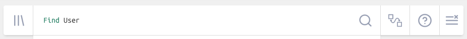
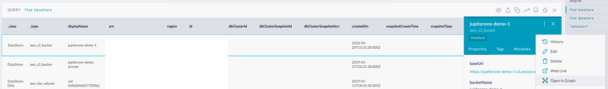
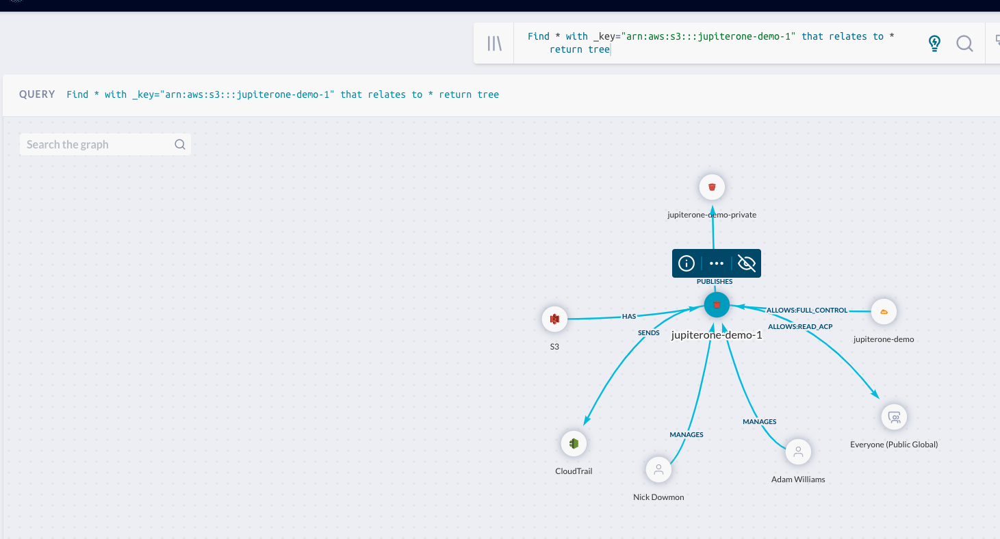
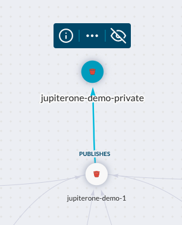
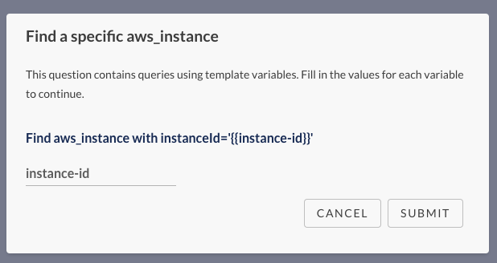
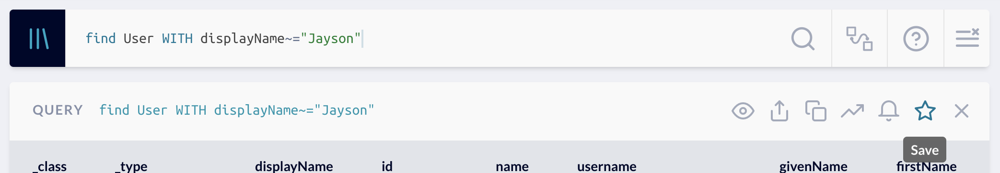
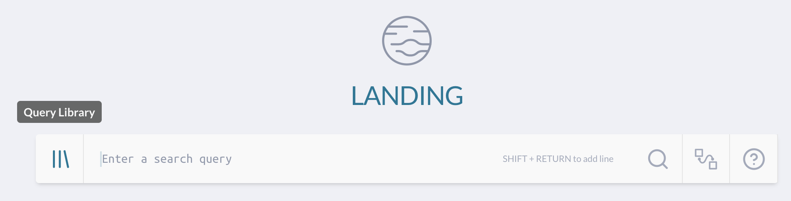
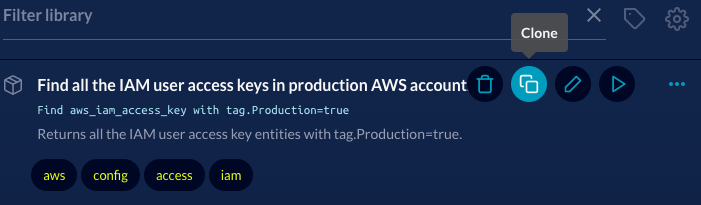

# Guide to Writing Custom J1QL Queries

This guide contains useful topics for creating custom JupiterOne queries within
your own account. We recommend starting with our wide-array of pre-canned
questions, tweaking them as needed, then creating your own from scratch.

## Leveraging the Graph for Context

Before leveraging the graph, check out the [Data Model - Overview](https://support.jupiterone.io/hc/en-us/articles/360022903573-Data-Model-Overview)
document for a comprehensive list of JupiterOne entities, their properties, and their relationships to other entities. The graph is a tool that can be used when these details are unknown.

Also keep in mind that when traversing the graph from a starting node, you may
not see all the possible relationships to other nodes. For a comprehensive list
of entities and their relationships for a specific integration, see the
[integration guides](https://support.jupiterone.io/hc/en-us/sections/360004247473-Integrations).

To start, navigate to the Landing page of JupiterOne and type in a basic query,
replacing `DataStore` with the entity class/type you are interested in.



Click on the specific result you are interested in. 

Click on the vertical ellipses to open additional actions then click **Open in Graph**.



A new browser tab will be opened and will run a query that returns a graph
showing everything related to or mapped to the entity via a relationship.

Click on the queried entity and you will see the relationship verbs for each
mapped entity.



**HINT** You can arrive at the same result using the relationship verb `RELATES
TO` which encompasses all relationship verbs and displays all nodes all nodes
related to the entity. 

```j1ql
Find aws_cloudfront_distribution that RELATES TO *
```

Let's take the following example of understanding who has access to the
resources within an S3 Bucket. In the example above there are a few interesting
relationships that we can further dig into.

- Both Nick and Adam `MANAGE(S)` the bucket
- The bucket `ALLOWS` read access to Everyone
- This bucket `PUBLISHES` to another S3 bucket

We can now update our original query now that we know the relationships that
exist.

```j1ql
Find DataStore that MANAGES Person
Find DataStore that ALLOWS Everyone
Find DataStore that PUBLISHES DataStore
```
**Hint** 
Relationships can be queried bidirectionally. For example, 
`Find DataStore that MANAGES Person` can also be queried as 
`Find Person that MANAGES DataStore` and will return the same results in the graph. However, the list view
will return a list of either `DataStore` or `Person` depending on which entity
you `Find`.

We can continue to add to our query by clicking on and expanding nodes in the
graph. To do this, select any node and click on the ellipses.



From here we see two additional nodes. Both with a class of `AccessPolicy`; an
`aws_iam_policy` and an `aws_s3_bucket_policy`. We can continue to expand these
nodes, taking note of their relationship to the previous nodes as well as the
class/type.

Our final query could be something similar to the following example.

```j1ql
Find DataStore that ALLOWS AccessPolicy that ASSIGNED User
```

## Variable Placeholders

A variable placeholder is used to prompt a user for a specific value to be
injected into a pre-saved query. Variable placeholders can be leveraged in J1QL
using the double curly bracket syntax `{{variable-placeholder-name}}`.

Take the following pre-saved query as an example.

```j1ql
Find aws_instance with instanceId='{{instance-id}}'
```

Running the above query displays a modal that prompts the user to enter a value.
The query will not execute until you enter a value and press the submit button.



### Create a Question that uses a Placeholder

The placeholder double curly bracket syntax cannot be used in the search bar.
There are two ways to create a new question and add a variable placeholder.

1. Save a New Question

- Type a query into the search bar and enter a *temporary* value
- Click the star icon to save
- Type in a Title that describes the query (this is the question name)
- Edit the query, replacing the temporary value with `{{your variable placeholder name here}}`
- Click **Save**



2. Duplicate an Existing Question

- Click on the Library icon
- Find an existing question with query elements similar to your new query  
- Click on the Duplicate icon
- Update the Title
- Update the existing query and add `{{your variable placeholder name here}}`
- Click **Save**




**NOTES**
- One or more placeholders can be used in a single saved query.
- Placeholders are not supported via the J1 API.

## When to Use WITH vs WHERE

`WITH` and `WHERE` are both keywords used to filter the results of your query. 

### WITH

`WITH` is used to filter **node** properties **pre-traversal**. 

Take the following example.

```j1ql
FIND User WITH name~='Erkang'
```

The query will iterate through the graph database finding any `User`
across your environment that have a property of `name` containing the
value 'Erkang'. 

**NOTE** Use `WITH` over `WHERE` when possible as the `WITH` operation is more
efficient.

### WHERE

`WHERE` is used to filter **node** properties **post-traversal**.

Let's continue with the previous example query.

```j1ql
FIND User as u1 that OPENED (PR|Review) WITH approved=true as pr that APPROVED User as u2 WHERE u1.name = u2.name

```

The query finds any `User` that has opened a `PR` or `Review` and the related
`User` that is the approver. The filter `WHERE` must be used because we are
comparing the `name` property of one node against the `name` property of a
different, related node. 

`WHERE` can also be used to filter **edge** properties **post-traversal**.

Let's take a different example.

```j1ql
Find Training as t that assigned as enrollment User as u where enrollment.completedOn = undefined
```

The query evaluates the relationship between a `Training` and a `User`, or the
relationship verb (the edge), in this case `ASSIGNED`. 


