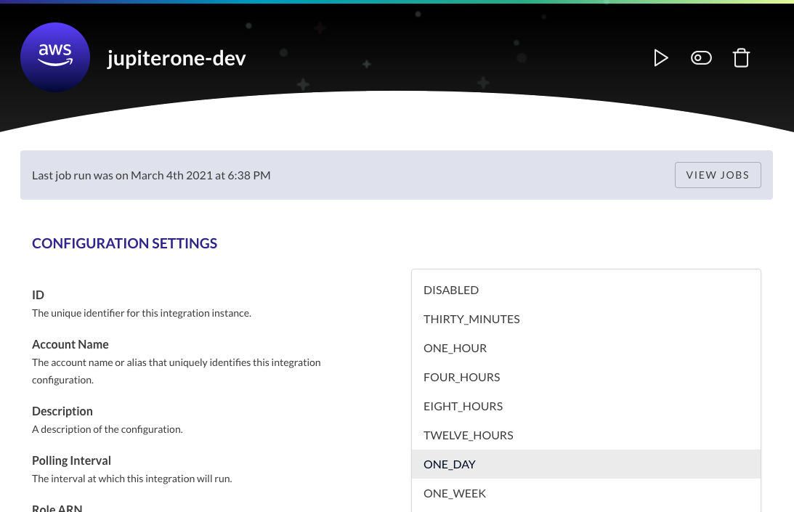
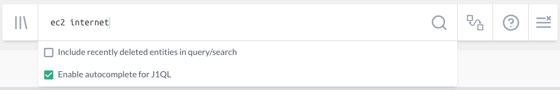
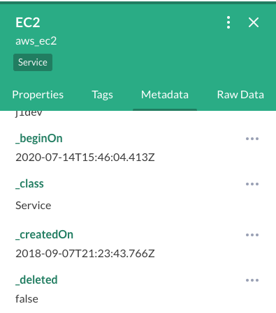

# Troubleshooting and Reporting Common Data Issues

This guide walks through troubleshooting common issues in JupiterOne related to
entities, properties, and relationships returned from queries. If these
suggestions don’t resolve your issue, reach out to the JupiterOne team by
following the steps under **Reporting an Issue**!

## Troubleshooting 

### 1. I don't see recent changes made to my environment

**Example:** You recently updated a rule in a security group attached to an EC2
instance to not allow access to the internet. However, the EC2 instance is still
being returned by the query because the updated configuration in AWS hasn’t yet
been retrieved by the JupiterOne integration.

Depending on the polling frequency of your data, your most recent changes may
not have been ingested. You can check your polling interval and manually trigger
a job by following these steps:

1. Navigate to the Integrations page under Settings.
2. Select the integration type where the change was made.
3. Select the account where the change was made.
4. Your Polling Interval can be found on this page and ranges from thirty
   minutes to one week. It is also possible that polling is set to disabled.
5. Click the Run Integration button to trigger the job.

6. Wait for the job to complete. Click on the View Jobs button to check the status.

**NOTE**: if the build fails, take a screenshot and follow the steps under **Reporting an Issue**.

7. Rerun the query and check the results.

### 2. I’m not sure if my query is written correctly or not

For a general query guide, refer to our 
[J1QL Query Tutorial](https://support.jupiterone.io/hc/en-us/articles/360022720434-4-9-J1QL-Query-Tutorial).

For queries written against any JupiterOne managed integrations, visit our
[Integrations](https://support.jupiterone.io/hc/en-us/sections/360004247473-Integrations) 
guides to understand which entities and properties are ingested
along with the relationships that are configured. 

For queries written against custom integrations, ensure your integration has
been configured properly referring to the
[Node.js Client and CLI](https://support.jupiterone.io/hc/en-us/articles/360022903373-JupiterOne-Node-js-Client-and-CLI)
guide.

For queries written against all integration types, refer to the 
[JupiterOne Graph Data Model](https://support.jupiterone.io/hc/en-us/sections/360002424373-JupiterOne-Graph-Data-Model) 
to understand the class and relationship model.

### 3. I deleted some entities that are still being returned  

**First**, check if you have configured JupiterOne to return recently deleted
entities.

While on the landing page, when you click into the query bar, make sure that
*Include recently deleted entities in query/search* is not checked.

**Second**, verify the entity was actually deleted at the source. 

If a deleted entity/relationship is still being returned after you have verified
that *Include recently deleted entities in query/search* is unchecked, there is
one final check.

1. Click on an entity/relationship in the list view or the info icon in the graph view to see more details
2. Click on the Metadata tab
3. Look for the property _deleted
- If the value is equal to true, continue to the section **Reporting an Issue**
- If the value is equal to false, verify that the entity was deleted at the source

### 4. I have a different issue or the previous suggestions did not resolve my issue

For all other issues, see the section below on **Reporting an Issue**, providing
the JupiterOne team with as much detail as possible.

## Reporting

To report an issue, please reach out to the JupiterOne team via Slack or Email
and provide the following information:

- Your name
- Company name
- Description of the issue
- Steps to reproduce 
- Any error/warnings (if applicable)
- Failing integration build logs (if applicable)
- Any helpful screenshots/screengrab
