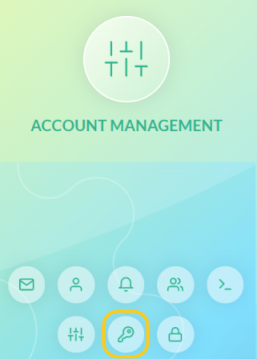
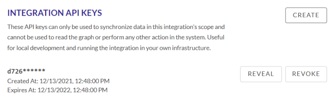

# Creating User and Account API Keys

API keys enable users to use the J1 APIs in queries and with integrations. You can enable the use of API keys for a group of users and create API keys for your organization account.

## Enable User-Level API Key Access

You must have the Administrator permission to enable API key access.

To enable API key access for a group of users:

1. Go to **Settings  > Users & Access** .
2. Select the group for whom you want to enable API access.
3. Select **Enable API key access for users in this group**.


An API key icon appears in the My Profile view for each user in the group that has API key access.


## Create Account-Level API Keys

You can manage user-level keys in the Account Management page. You must have 
administrator permissions  to make changes to account-level API keys.

To generate a new API key or manage existing API keys:

1. Log in to the account you want to manage.
2. Go to **Settings**  **>** **Account Management**.
3. In the left panel, click the key icon.
    
4. In the User API Keys page, click **Add** .
5. In the API Keys modal, enter the name of the key and the number of days 
   before it expires, and click **Create**.

To revoke an API key, in the User API Keys page, go to the key you want to 
revoke and click the trash icon .

## Create Integration API Keys

You must have administrator permissions to be able to create keys and the 
selected integration must have at least one configuration.

To create API keys that you can use with your J1 integration:

1. Go to **Settings  > Integrations**.
2. Select the integration for which you want to create an API key.
3. Select the configuration you want to edit.
4. Scroll down to Integration API Keys and click **Create**.  
5. When prompted, click **Create** again to confirm your action.

The key is now available for you to use to synchronize data in this integrations.



To delete the API key at any time, click **Revoke**.


## Create API Keys in Queries

You can use GraphQL queries to create account-level API keys.

To create an account-level API key, enter:

```j1ql
POST `https://j1dev.apps.dev.jupiterone.io/api/graphql`
```

~~~http
mutation CreateToken($token: TokenInput!) {
  createToken(token: $token) {
    token
    id
    name
    category
    policy
    revoked
    createdAt
    expiresAt
    __typename
  }
}


json
"variables": {
        "token": {
        "name": "Token Name",
        "category": "tags",
        "policy": "{\n\t\"permissions\": [{\n\t\t\"effect\":\"ALLOW\",\n\t\t\"actions\":[ \"dashboard:View\" ],\n\t\t\"resources\": [ \"dashboard:123456\" ]\n\t}]\n}"
    }
}
~~~

The `policy` variable is a JSON object formatted as follows:

~~~json
{
  "permissions": [
    {
      "effect": "ALLOW",
      "actions": ["dashboard:View"],
      "resources": ["dashboard:123456"]
    }
  ]
}
~~~

The effect parameter is ether `ALLOW` or `DENY` and is case-sensitive. Currently, 
J1 only supports fully-qualified actions and resources or the wildcard `*`.

Supported actions include:

````
"compliance:GetStandard",
"compliance:GetSummary",
"dashboard:View",
"persister:GetEntityRawData",
"persister:Synchronize",
"query:GetAccountEntity",
"query:ReadGraphData",
"settings:GetSettings",
"parameters:GetParameter",
"parameters:GetParameterList",
"parameters:SetParameter",
"parameters:DeleteParameter"

"*" // All actions
````

Supported resources include:

````
"account:<resourceId>",
"api:<resourceId>",
"compliance-standard:<resourceId>",
"dashboard:<resourceId>",
"entity:<resourceId>",
"integration:<resourceId>",
"powerup:<resourceId>",
"settings-category:<resourceId>",
"parameter:<resourceId>"

"*" // All resources
````

### Revoke Account-Level API Keys

To revoke an account-level key, enter:

```j1ql
 POST `https://j1dev.apps.dev.jupiterone.io/api/graphql`
```

~~~gql
mutation RevokeToken($id: String!) {
  revokeToken(id: $id) {
    token
    id
    name
    category
    policy
    revoked
    createdAt
    expiresAt
    __typename
  }
}

"variables": {
        "id": "<tokenId>"
    }
}
~~~

