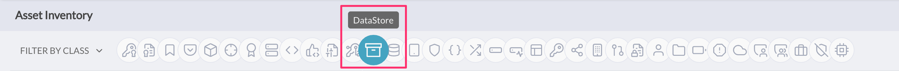
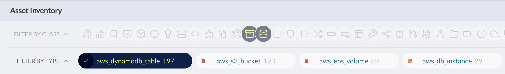
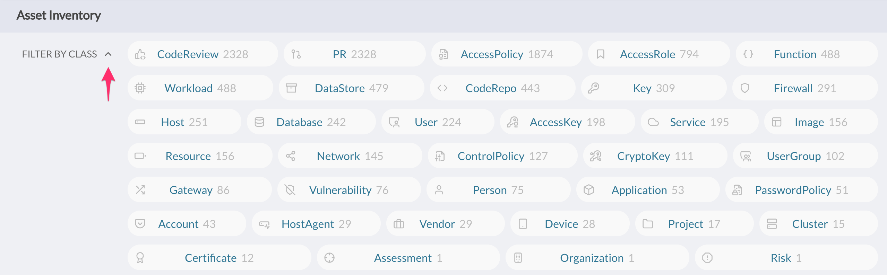
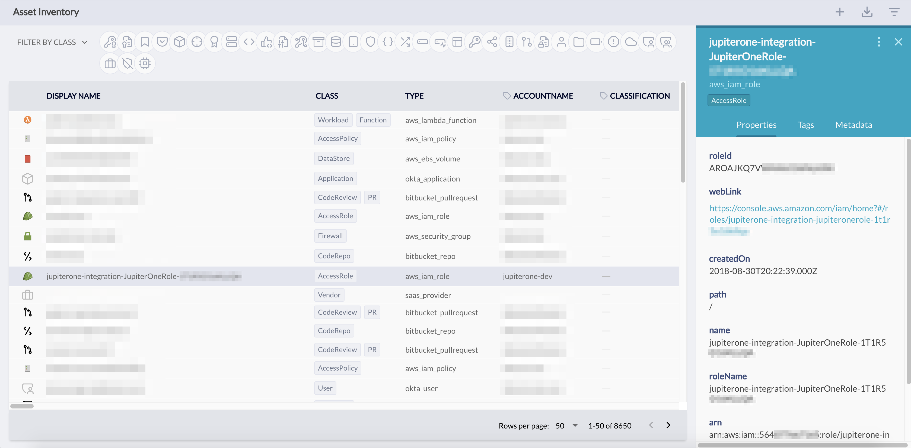

# How to use filters in the Asset Inventory app

There are two ways to filter the thousands of digital assets (i.e. Entities) you
may have from the Asset Inventory app:

- **Quick Filters by Class and/or Type**
- **Granular Filters by Properties**

## Quick Filters by Class and/or Type

You can quickly filter the entities/assets by **Class**, by selecting one or
multiple of the icons that represent each class. The tooltip displays the class
label when you move over it:

_The **Class** of an entity is an abstract label that defines what the entity is
within the concept of security operations. For more details, see the JupiterOne
Data Model documentation._

Once you select one or more class, you can further filter the entities/assets by
**Type**:

_The **Type** of an entity represents the specific type of entity as defined by
its source. For more details, see the JupiterOne Data Model documentation._

You can also expand the Class filter to get a more detailed, dashboard-like view
of the entites/assets with a count for each class.

The data will respond correspondingly to the selection in the table below the
quick filters. Note the pagination control at the bottom of the table:

Selecting an entity in the table will bring up its detailed properties in a
side panel on the right.

## Granular Filters by Properties

You can apply granular filters by selecting specific property values.

Open up the **Filter Panel** using the control icon near the top right corner:

Look for the property or properties you'd like to filter on to select one or
multiple values to apply the filter. Clicking on a previously selected value
from the property dropdown box will unselect it.

**Tips**: We recommend selecting Class/Type using the quick filter first, before
apply more granular property filters. This will reduce the number of properties/values and make it a lot easier for selection.
