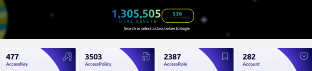
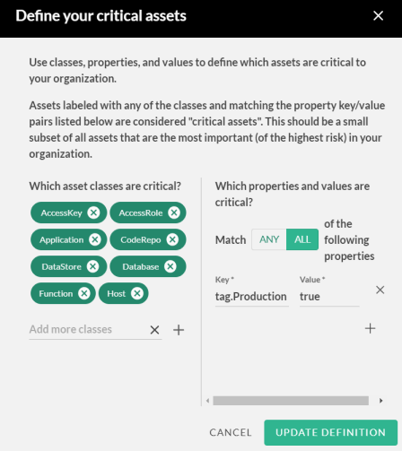
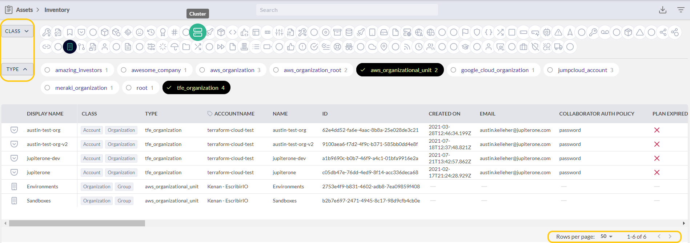
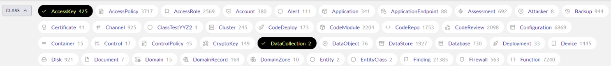
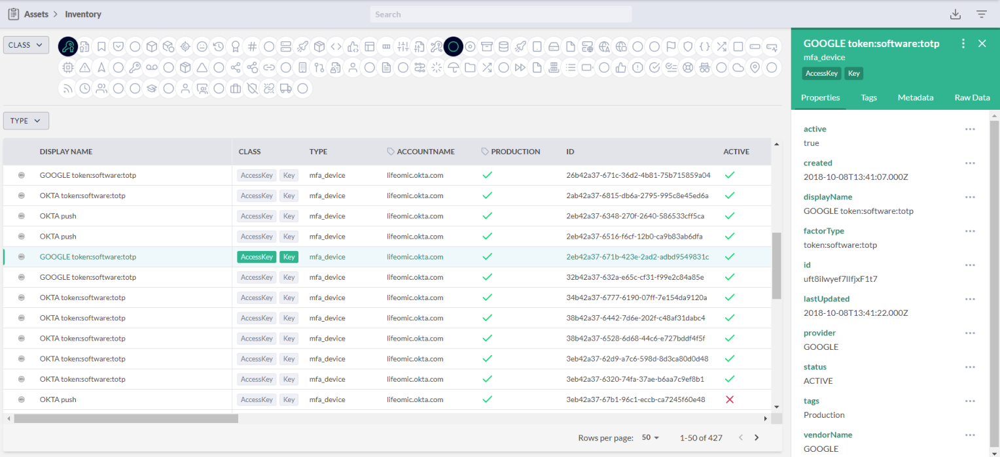
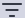

# Using Filters in the Asset Inventory App

To see all the digital assets (entities) you have, in JupiterOne, go to **Apps > Assets**. 

There are several ways to filter the large list of entities displayed in the Assets app:

- Quick filter the critical assets
- Additional filters by class and/or type
- Granular filters by properties

## Quick Filtering the Critical Assets

Click **Critical Assets** in the top banner to go directly to the most important of your entities.

Critical assets is a class of asset for which you can create queries and alerts to quickly access
the most crucial data. By default, JupiterOne determines which criteria defines an asset as 
the most important and, therefore, the most at risk but an administrator can edit this definition.

Click  to edit the critical asset definition default values. You can use classes, properties, and values 
to define what is critical.

Add asset classes and properties that your organization comprises a critical
asset, and click **UPDATE DEFINITION**.

## Quick Filtering by Class and/or Type

Click **CLASS** to display all the possible asset classes. The class of an asset is an 
abstract label that defines what the asset is within the concept of security operations. 
For more details, see the [JupiterOne Data Model documentation](../docs/jupiterone-data-model.md).

Click **CLASS** again to toggle from the icon view to a more detailed, dashboard-like view
of the assets with a count for each class. Select the classes you want to filter on. The data 
responds correspondingly to the selection in the table below the quick filters. The pagination 
control at the bottom of the table enables you to jump.

In addition, you can click **TYPE** to further filter the assets by their type. The type of 
an asset represents its specific type of entity as defined by its source. For more details, 
see the [JupiterOne Data Model documentation](../docs/jupiterone-data-model.md).

When you select any of the assets in the filtered results table, its detailed properties 
side panel opens on the right.

## Granular Filtering by Properties

After you have filtered on class and type, you can apply granular filters by 
selecting specific property values.

To apply granular filters to your class and type filtered results:

1. Click **Filter**  in the top-right corner. 
2. Find all the properties you want to filter on.
3. Select the required value for each property. 
4. Click **Filter**  at the bottom. 
                                                                                                                
