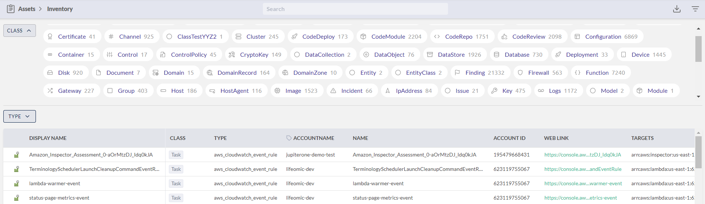
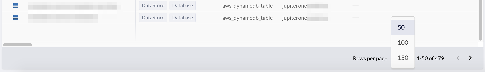
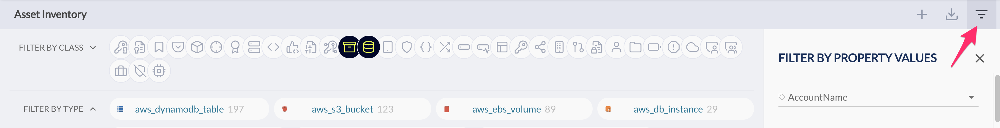

# How to Use Filters in the Asset Inventory App

To see all the digital assets (entities) you have, in JupiterOne, go to **Apps > Assets**. 

There are several ways to filter the large list of entities displayed in the Assets app:

- Quick filter the critical assets
- Additional filters by class and/or type
- Granular filters by properties

## Quick Filter the Critical Assets

Click **Critical Assets** in the top banner to go directly to the most important of your entities.

Critical assets is a class of asset for which you can create queries and alerts to quickly access
the most crucial data. By default, JupiterOne determines which criteria defines an asset as 
the most important and, therefore, the most at risk but an administrator can edit this definition.

Click to edit the critical asset definition default values. You can use classes, properties, and values 
to define what is critical.

Add asset classes and properties that your organization comprises a critical
asset, and click **UPDATE DEFINITION**.

## Quick Filters by Class and/or Type

You can quickly filter your assets by **Class**, by selecting one or
more icons that represent each class. The tooltip displays the class
label when you move over it.

The class of an entity is an abstract label that defines what the entity is
within the concept of security operations. For more details, see the JupiterOne
Data Model documentation.

After you select one or more classes, you can further filter the entities/assets by
**Type**:

_The **Type** of an entity represents the specific type of entity as defined by
its source. For more details, see the JupiterOne Data Model documentation._

You can also expand the Class filter to get a more detailed, dashboard-like view
of the entities/assets with a count for each class.

The data will respond correspondingly to the selection in the table below the
quick filters. Note the pagination control at the bottom of the table:

Selecting an entity in the table will bring up its detailed properties in a
side panel on the right.

## Granular Filters by Properties

You can apply granular filters by selecting specific property values.

Open up the **Filter Panel** using the control icon near the top right corner:

Look for the property or properties you'd like to filter on to select one or
multiple values to apply the filter. Clicking on a previously selected value
from the property dropdown box will unselect it.

**Tip: It is recommended that you select Class/Type using the quick filter first, before
applying more granular property filters. This action reduces the number of
properties/values and makes the selection process easier.
