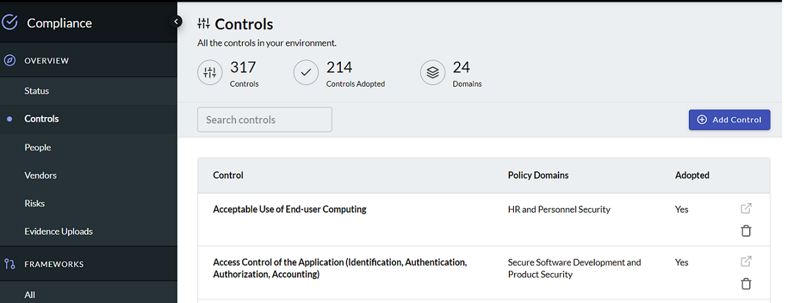
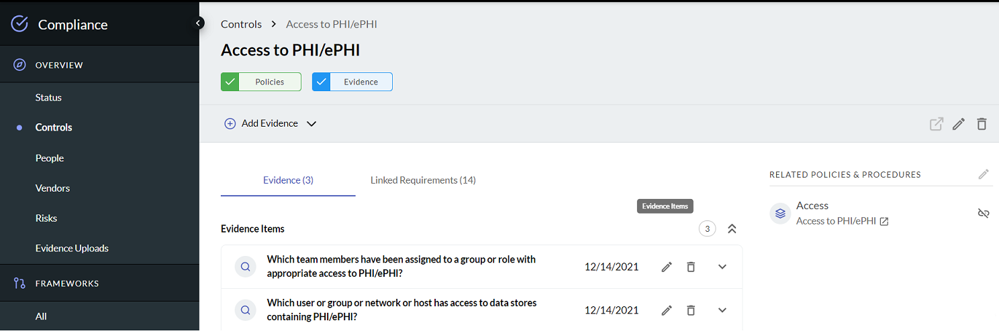
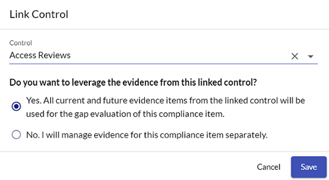
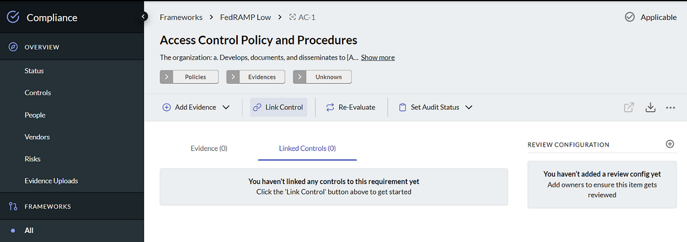

# Linking Controls to Compliance Requirements

Compliance controls are a series of policies and guidelines that your organization 
uses to reduce risk and help attain compliance. The J1 centralized 
controls library provides a single location to manage and use controls across frameworks. 

At the top of the controls library, you can see the total number of controls in your 
environment, as well as a snapshot of total adopted controls, and the number of policy 
domains using those controls. 

Click a control to add evidence, see how many compliance requirements currently link to it, and any 
[linked policies and procedures](./compliance-mapping-policies.md).

When you link a control, you are given the option of using all the current and future evidence items from the linked control for the gap evaluation of this compliance item. If you select this option, J1 automatically monitors the control in the context of the linked evidence for the requirement.

You can also link controls from the framework details view.

