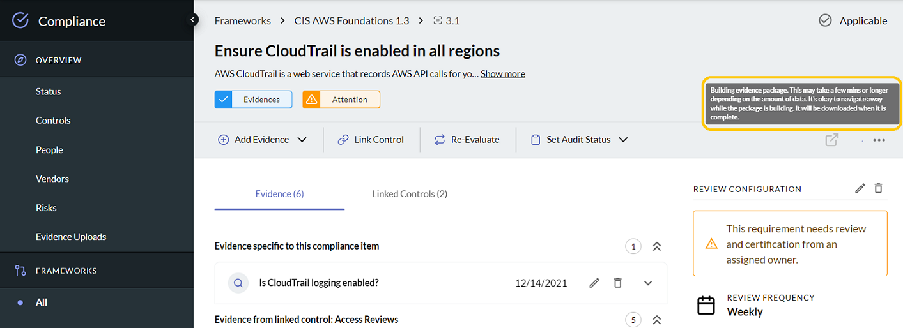

# Export Compliance Artifacts

J1 provides an compliance artifacts summary package for you to download. 

From the details view of a security framework in the J1 Compliance app, click the ![][../../assets/icons/download.png]
download button. J1 builds an evidence package that can take several minutes to
prepare. You can navigate away from the



- **Summary**
- **All Evidence**

> Compliance artifact export is an asynchronous background job. The ![download][download-icon] download
> turns green when the evidence package finishes building in the background, and J1 downloads
> the zip file to your computer. You can leave the app while J1 is generating the package.

## Compliance Summary

The summary artifact is a zip package containing these two files:

- `complete-policies-and-procedures-listing.csv`

  A list of all policies and procedures, and the summary text of each procedure.

- `summary.csv`

  A list of all compliance requirements / controls and the status of each item.

## All Evidence

The **All Evidence** artifact is a zip package containing the summary and the
evidence output, in this folder structure:

```text
<standard_name>_evidence.zip
  |____<standard_name>_evidence
  | |____<standard_name> Requirements
  | | |____<section_title>
  | | | |____<ref> <title>
  | | | | |____policies-and-procedures.csv
  | | | | |____links.md
  | | | | |____note_0_<timestamp>.md
  | | | | |____note_1_<timestamp>.md
  | | | | |____0_<title_of_first_mapped_question>
  | | | | | |____0_<first_query_in_question>.csv
  | | | | | |____1_<second_query_in_question>.csv
  | | | | |____1_<title_of_second_mapped_question>
  | | | | | |____0_<first_query_in_question>.csv
  | | | | | |____1_<second_query_in_question>.csv
  | | | | |____...
  | | | | | |____...
  | |____complete-policies-and-procedures-listing.csv
  | |____summary.csv
```

Note: the output of each query is limited to a sample of up to 250 results.
