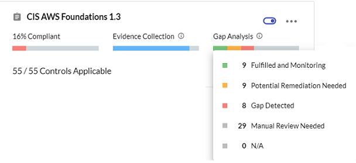
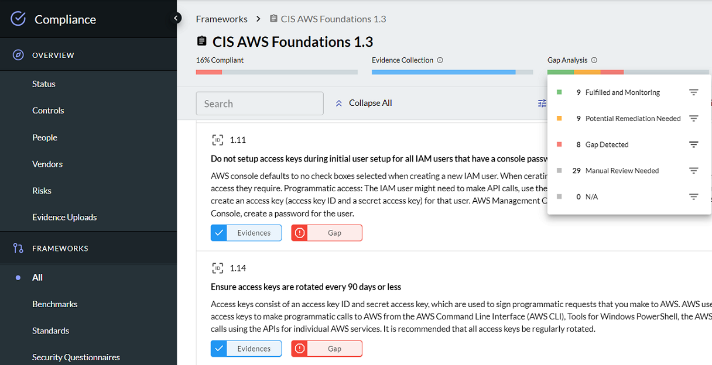
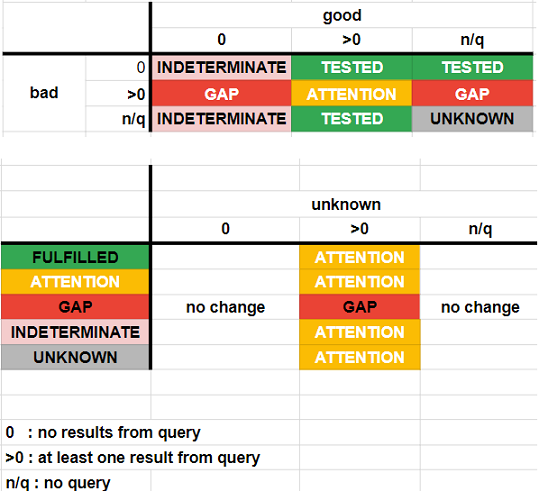

# Compliance Gap Analysis

The J1 Compliance app performs automated gap analysis based on the queries saved 
in questions that you have added as evidence to meeting compliance.

At any time, you can review where the gaps are in your compliance but clicking the
information icon next to gap analysis in a selected framework.




From the selected framework details view, click the filter icon next to the gap category
to see where the gaps are in your compliance status. 



Each query in a saved question has a property to indicate whether the results
from the query are good, bad, unknown, or informative. You can configure this in the 
J1Query Language app UI or via the API.

At the API level, this is set with the `resultsAre` property. For example:

```yaml
- id: managed-question-access-password-policy
  title: Show me the current password policy and compliance status.
  queries:
    - name: Compliant policies
      resultsAre: GOOD
      query: |
        Find PasswordPolicy with
          minLength >= 8 and
          requireLowercase = true and
          requireUppercase = true and
          requireSymbols = true and
          maxAgeDays <= 90 and
          historyCount >= 12
    - name: Non-compliant policies
      resultsAre: BAD
      query: |
        Find PasswordPolicy with
          minLength < 8 or
          requireLowercase != true or
          requireUppercase != true or
          requireSymbols != true or
          maxAgeDays > 90 or
          historyCount < 12
```

## Gap Analysis

Queries with `resultsAre` property in a question that is mapped to a compliance
requirement trigger automated gap analysis, as follow:

- `GOOD`:

  Results from a "good" query indicates **expected configuration is present**.

  For example, a list of critical data stores that are encrypted.

  ```j1ql
  Find DataStore with classification='critical' and encrypted=true
  ```

- `BAD`:

  Results from a "bad" query indicates **gaps or misconfigurations**.

  For example, a list of critical data stores that are _not_ encrypted.

  ```j1ql
  Find DataStore with classification='critical' and encrypted!=true
  ```

- `UNKNOWN`:

  Results from an "unknown" query indicates **resources with an unknown scope or state**.

  For example, a list of data stores that do _not_ have classification tags.

  ```j1ql
  Find DataStore with classification=undefined
  ```

`INFORMATIVE` queries are not used in compliance gap analysis.

A question can have one or all of the above named queries.

## Gap Analysis Status

The gap analysis status of each requirement of control may be one of the
following:

- `TESTED`

  The requirement is fulfilled and monitoring.

- `ATTENTION`

  Potential remediation is needed because J1 has detected a potential gap, 
  with a mix of properly configured resources and misconfigurations, such 
  as partially fulfilled.

- `GAP`

  A control gap is detected with no properly configured resources identified.

- `UNKNOWN`

  Manual review is needed because J1 was unable to auto-determine the
  status with the queries provided.

  This status appears also when the requirement or control has no mapped query question _and_ no external evidence provided.

The status is determined by the presence and output of the named queries in the
mapped questions, as shown in this matrix:




**Note**: A single query in a question without the `resultsAre` property set is implicitly interpreted as a `GOOD` query.