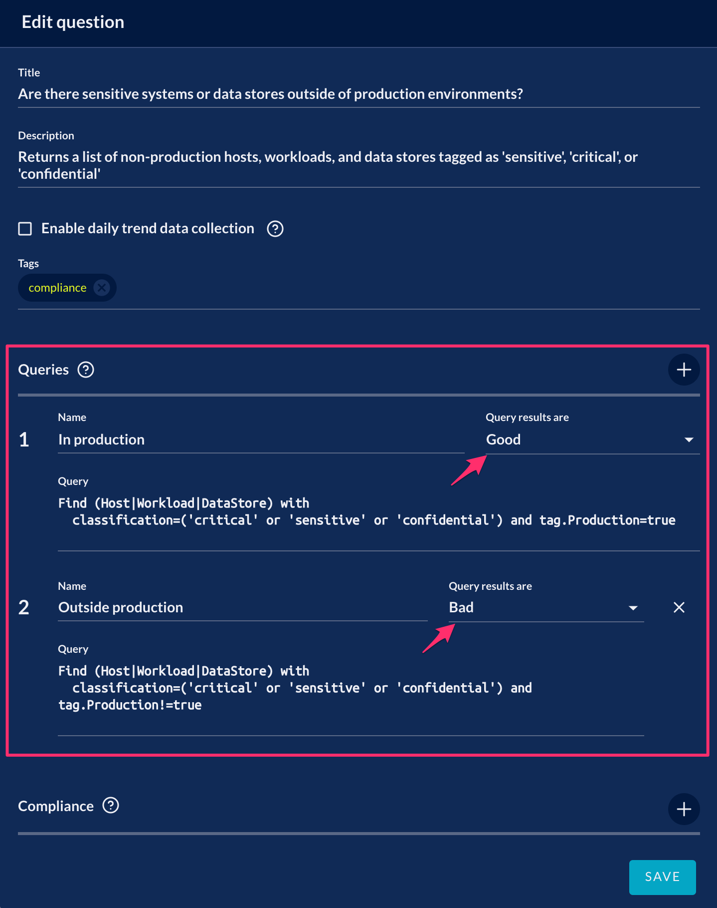
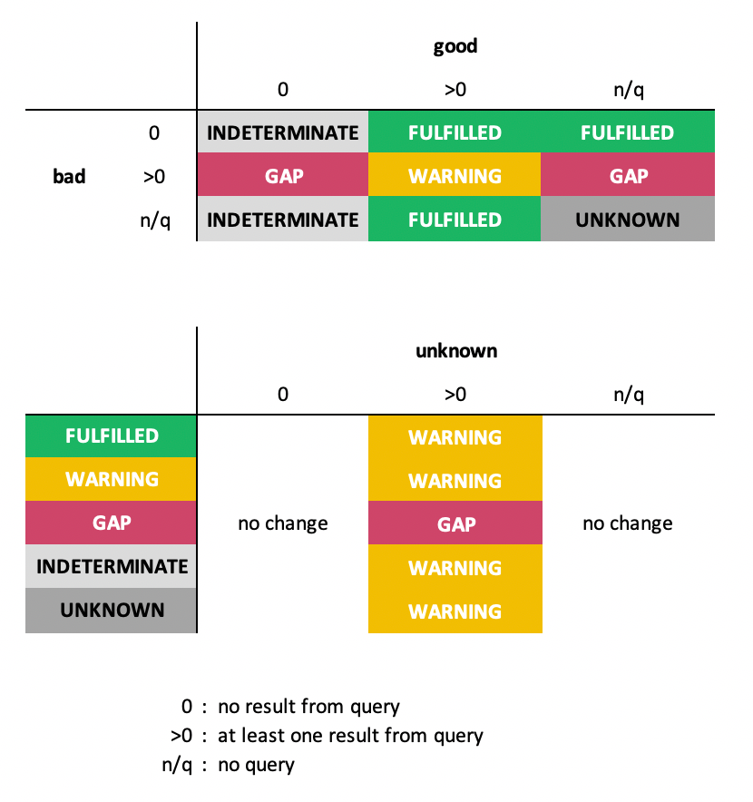

# Compliance Gap Analysis

JupiterOne compliance platform is capable of performing automated gap analysis
based on the query or queries saved in mapped questions. Here is how it works.

## Query Results Indicator

Each query in a saved question has a property to indiciate whether the results
from the query are good, bad, unknown, or informative. This can be configured
either in the app UI or via the API.

Here is a screenshot of the app UI configuration:



At the API level, this is set with the `resultsAre` property. For example:

```yaml
- id: managed-question-access-password-policy
  title: Show me the current password policy and compliance status.
  queries:
    - name: Compliant policies
      resultsAre: GOOD
      query: |
        Find PasswordPolicy with
          minLength >= 8 and
          requireLowercase = true and
          requireUppercase = true and
          requireSymbols = true and
          maxAgeDays <= 90 and
          historyCount >= 12
    - name: Non-compliant policies
      resultsAre: BAD
      query: |
        Find PasswordPolicy with
          minLength < 8 or
          requireLowercase != true or
          requireUppercase != true or
          requireSymbols != true or
          maxAgeDays > 90 or
          historyCount < 12
```

## Gap Analysis

Queries with `resultsAre` property in a question that is mapped to a compliance
requirement trigger automated gap analysis, as follow:

- `GOOD`:

  Results from a "good" query indicates **expected configuration is present**.
  
  For example, a list of critical data stores that are encrypted.

  ```j1ql
  Find DataStore with classification='critical' and encrypted=true
  ```

- `BAD`:

  Results from a "bad" query indicates **gaps or misconfigurations**.

  For example, a list of critical data stores that are _not_ encrypted.

  ```j1ql
  Find DataStore with classification='critical' and encrypted!=true
  ```

- `UNKNOWN`:

  Results from an "unknown" query indicates **resources with an unknown scope or state**.

  For example, a list of data stores that do _not_ have classification tags.

  ```j1ql
  Find DataStore with classification=undefined
  ```

> `INFORMATIVE` queries are not used in compliance gap analysis.

_A question can have one or all of the above named queries._

## Gap Analysis Status

The gap analysis status of each requirement of control may be one of the
following:

- `FULFILLED`:

  Requirement is "fulfilled and monitoring".

- `WARNING`:

  "Attention - potential remediation needed" because a potential gap has been
  detected, with a mix of properly configured resources and misconfigurations
  (i.e. _partially fulfilled_).

- `GAP`:

  "Gap detected" with no properly configured resources identified, indicating a
  _full control gap_.

- `UNKNOWN` or `INDETERMINATE`:

  "Manual review needed" because the platform was unable to auto-determine the
  status with the queries provided.

  > This status appears also when the requirement or control has no mapped query
    question _and_ no external evidence provided.

The status is determined by the presence and output of the named queries in the
mapped question(s), as seen in the following matrix:



> Note: A single query in a question without the `resultsAre` property set is
  implicitly interpreted as a `GOOD` query.
