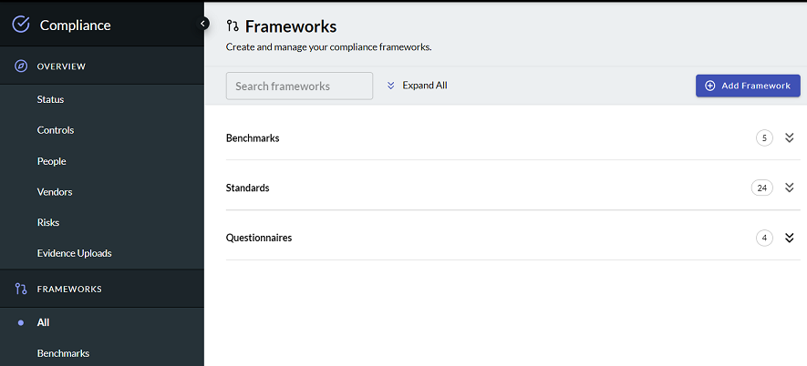

# Adding Compliance Frameworks

A security compliance framework is a structured set of guidelines that details the processes 
and procedures your organization implements to be in accordance with established 
regulations, specifications or legislation. Frameworks can include communication 
processes, risk controls, and governance practices for maintaining compliance.

The first step in compliance management is to select the frameworks with which 
you want to be compliant. You can select the preset standards provided by J1 or 
import your own configuration. 

#### Prerequisite

You must have the adminCompliance permission to be able to import standards 
and frameworks.

Open the J1 Compliance app by clicking and select Compliance.  To add a framework:

1. Select **Frameworks** from the left navigation panel and click **Add Framework**.
   ​
   
2. Choose one of the templates that J1 provides, or click **Import JSON/CVS** and 
   paste your compliance framework file in JSON or CSV format. 
   ​
   J1 provides [community example files](https://github.com/JupiterOne/security-policy-templates/tree/main/templates/standards) for to use as references.

**Note**: You must have the necessary license and permission to use a framework for 
your organization. **Licensing is not provided by JupiterOne**, except for CIS Controls 
and Benchmarks.

### JSON Structure

If you want to import a JSON file, follow [this schema](../../docs/schemas/policies-compliance.md).

### CSV Import

If you want to import a compliance standard specification from a CSV file, the
CSV header must contain the following as column headers:

- `ID`
- `Requirement` or `Control`
- `Section` or `Domain`
