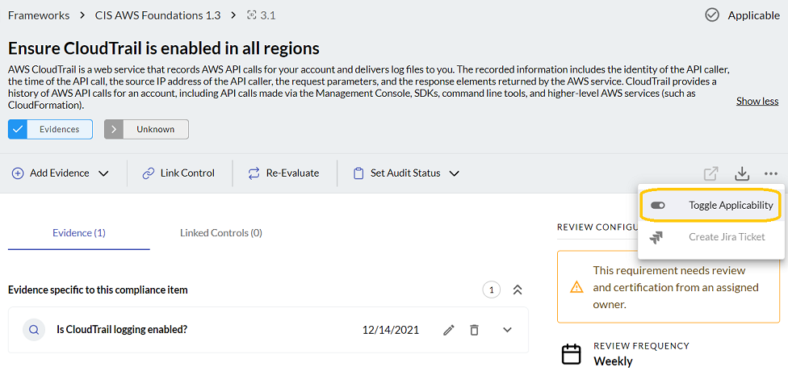

# Adding Compliance Evidence

Each framework has sets of requirements that are grouped into categories such as logging 
or access control and management. By default, all the requirements are applied to the framework. 
If you do not want to apply a specific requirement, you can toggle it off from the requirement 
details view.

After you have reviewed the requirements for your framework, you can click **Add Evidence** in 
the requirement details view and provide any of the following items as evidence.

- Query questions: 
- External evidence
- Additional notes

#### Query Questions

You can add an existing query question or write a new one.  It is recommended 
that you write queries about your assets and their relationships that can provide 
data-driven compliance evidence.

Each question can have one or more queries. You can name the queries so that they 
trigger [automated compliance gap analysis](../compliance/compliance-gap-analysis.md).

#### External Evidence

In some cases, compliance evidence cannot be provided using the data available in
J1. There are two ways to provide external evidence for a given control: 

- External links to a document hosted outside of JupiterOne, such as on SharePoint 
  or Google Docs
- Direct uploads, such as a screenshot or PDF

Both external evidence types require a name and you can provide an optional description.

[Watch this video](https://try.jupiterone.com/blog/video-evidence-collection-with-the-compliance-app) to see examples of queries you can use to collect and link 
evidence to controls.

#### Notes and Attestations

Additionally, you can add free-form notes or attestations to any compliance requirement 
or control to provide more details or context, as needed. Each note, when saved, captures 
the author and timestamp.