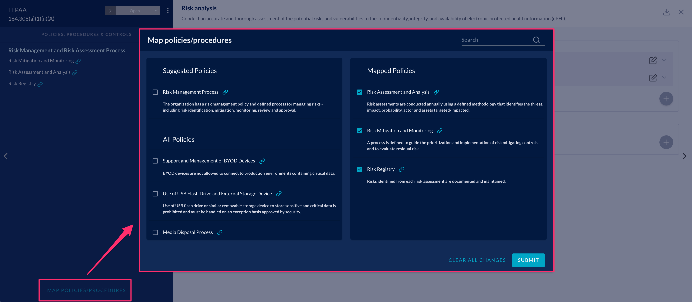

# Linking Compliance Policies

In the J1 Compliance app, you can link related policies and procedures from the J1 Policies app
to controls. J1 uses this data structure to make connections between written policies and compliance standards:

```text
          |-- IMPLEMENTS -> security_policy
          |
security_procedure
          |
          |-- IMPLEMENTS -> compliance requirement or control
```

See [this article](../../docs/data-model/org-grc.md) for the full GRC graph data model.

When you link a policy and procedure, J1 creates a link between a security procedure to a 
compliance control. Policies are very high-level descriptions, that provide details on what 
you should do. Procedures explain how you can implement a control.

You can link security procedures for a specific compliance control in the details view 
of that control.



[Watch this video](https://try.jupiterone.com/blog/how-to-map-grc-policies-and-procedures) to learn more about linking policy or procedure documents.
