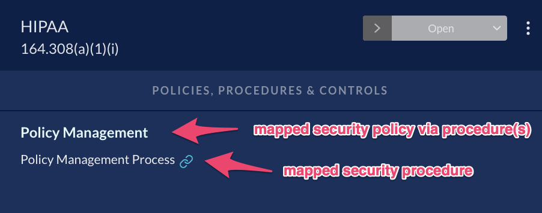

# Compliance Mapping - Policies

JupiterOne platform follows this data structure to make connections between
written policies and compliance standards:

```text
          |-- IMPLEMENTS -> security_policy
          |
security_procedure
          |
          |-- IMPLEMENTS -> compliance requirement or control
```

See [this article](../../docs/data-model/org-grc.md) for the full GRC graph data model.

> Mapping is created only between security procedures to a compliance
requirement/control. Policies are indirectly mapped via procedures. This is
because policies are very high-level descriptions (such as principal statements)
and principals cannot directly implement a compliance requirement/control. Only
details on what you do and how you do it (the procedures) can implement a
requirement/control.
>
> 

## Edit Mapping of an Individual Compliance Requirement or Control

Mapped security procedures of a specific compliance requirement or control can
be selected via the UI in the requirement details view:


- In **Compliance app**, select a standard
- Select a requirement or control
- Click on **Map Policies/Procedures** button near the bottom left of the view
- In the mapping modal view, check one of more policy procedures from the left
  (mapped policy procedures are listed on the right)
- Click **Submit** when done

[Watch this video](https://try.jupiterone.com/blog/how-to-map-grc-policies-and-procedures) to learn more about mapping policy or procedure documents.

## Edit full mapping in JSON

The complete mapping between a security procedure (such as written 
documentation describing a security control or process) and a compliance 
requirement is can be edited via a JSON configuration file.

An example mapping is provided here:

<https://github.com/JupiterOne/security-policy-templates/blob/master/templates/standards/controls-mapping.json>

This JSON can be edited to meet your organization's policy procedures and
compliance specifications, and then uploaded to the JupiterOne Compliance app:

- Go to https://apps.us.jupiterone.io/compliance
- Click  **Edit mapping**
- Copy/paste your "Policy Procedures to Compliance Mapping" JSON

### JSON Structure

See the schema documented [here](../../docs/schemas/policies-compliance.md).

