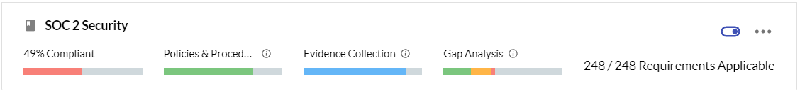

# Compliance Management in JupiterOne

JupiterOne provides a flexible platform for users to import and manage any
compliance standard / framework as a set of controls or requirements. The
platform provides the following capabilities:

- [Import a compliance standard or security questionnaire][1]

- [Map policy procedures to each control or requirement][2]

- [Map data-driven compliance evidence by query questions][3]

- [Perform automated gap analysis based on query results][4]

- [Export compliance artifacts (summary or full evidence package)][5]

[1]: ../compliance/compliance-import.md
[2]: ../compliance/compliance-mapping-policies.md
[3]: ../compliance/compliance-mapping-evidence.md
[4]: ../compliance/compliance-gap-analysis.md
[5]: ../compliance/compliance-export.md

## Compliance Status and Maturity

JupiterOne compliance app provides measurements and status indicators at three
different maturity levels for each compliance standard and its requirements /
controls:

1. Has documented policies and procedures
2. Has implementation evidence (either via data-driven queries or external evidence)
3. Continuous monitoring and remediation

Here is an example screenshot:

