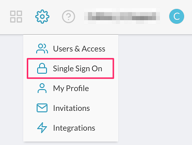
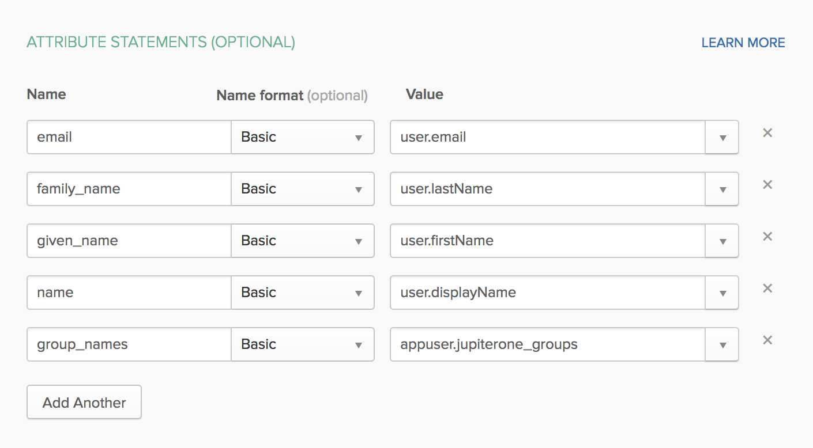
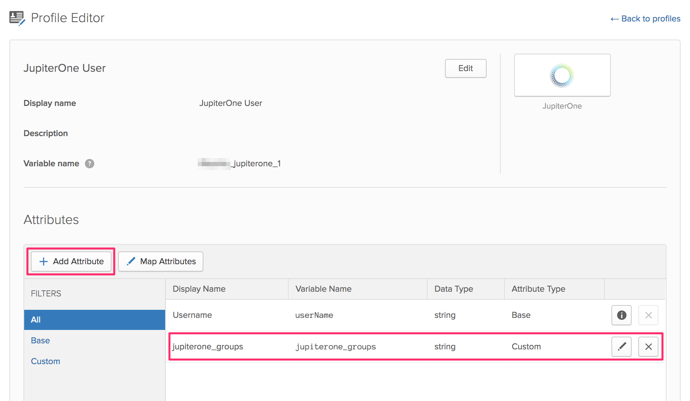
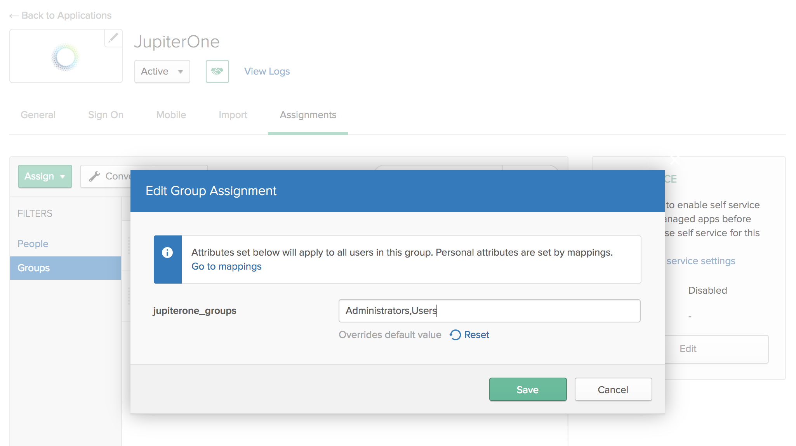
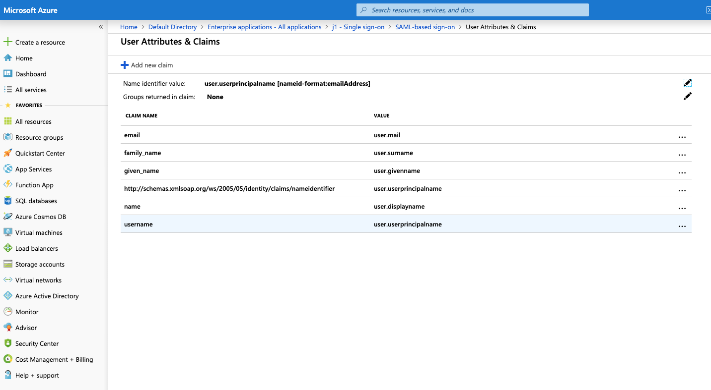
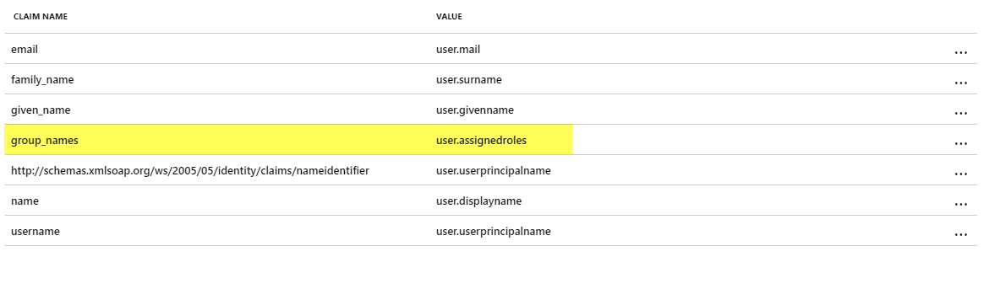
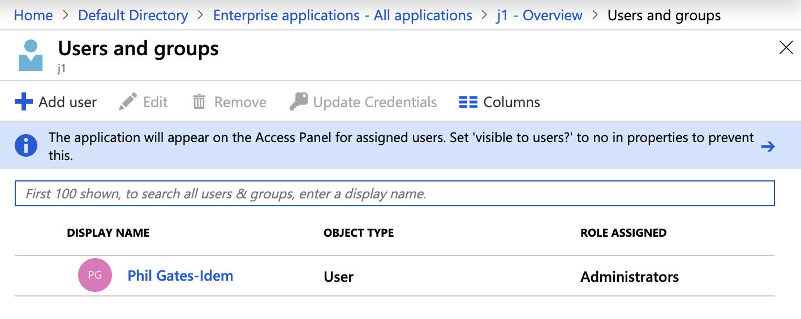
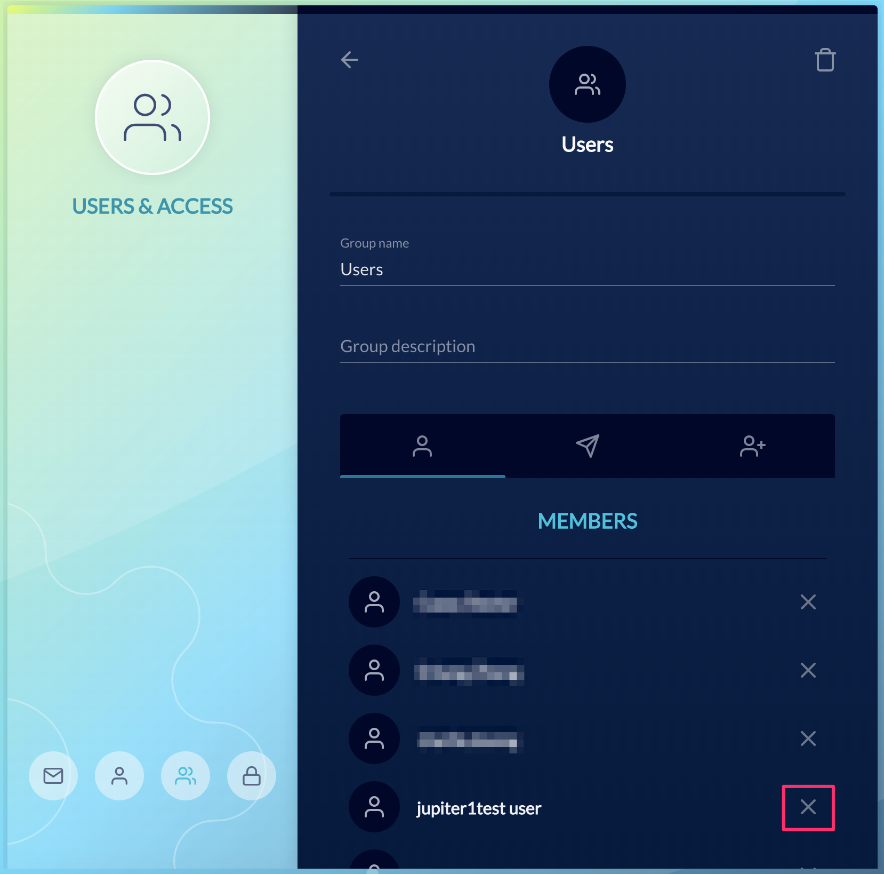

# How to configure SAML SSO integration with JupiterOne

Single Sign On is supported via a custom authentication client configured within
a JupiterOne account. This feature is available to all enterprise customers.

## Supported Features

- **SP-initiated SSO**

  Service Provider Initiated (SP-initiated) SSO means when SAML authentication
  is initiated by the Service Provider (SP). This is triggered when the end user
  tries to access a resource in JupiterOne or login directly to the JupiterOne
  account.

- **JIT (Just In Time) Provisioning** a;lsdkjflajsdfk

  Users are created/updated on the fly using the SAML attributes sent as part of
  the SAML response coming from the Identity Provider (IdP). The user is created
  during initial login to JupiterOne and updated during subsequent logins.

_IdP-initiated SSO is currently unsupported due to a limitation of Amazon Cognito._

## Configuration Steps

1. Log in to your JupiterOne account -- your user must be a member of the
   *Administrators* group.

1. Go to the **Single Sign On** setup from the configurations menu.

   

1. Click on **Configure**.

   

1. In the client configuration screen, copy the following two variables to be
   used when adding JupiterOne as an application in your SAML IdP account:

    - **Single Sign On URL**
    - **Audience URI (SP Entity ID)**

1. In your IdP Account, add a new SAML Application and name it "JupiterOne".

    - Copy/paste the previous two variable values in the SAML settings.
    - Use the same **Single Sign On URL** string value for **Recipient URL** and
      **Destination URL**.
    - Leave the **Default Relay State** blank.
    - Select *EmailAddress* for **Name ID Format**.
    - Select *Email* or *Username* for **Application Username**.
    - See next section for details on **Attribute Mappings**.

1. Complete setup of the SAML application within your IdP account, and copy
   the **Identity Provider Metadata** link.

   In Okta, this link can be found on the **Sign On** tab of the application,
   under **View Setup Instructions**, as shown below:

   

1. Go back to **JupiterOne Auth Client Settings** screen, paste the above link
   to the **SAML Metadata Document URL** field.

1. Enter a **Client Name**, such as "Okta".

1. Check **Authorization code grant** and **Implicit Grant** under "Allowed
   OAuth Flows".

   

   Save and you are all set. Next time you access your JupiterOne account via
   the vanity URL (e.g. https://your_company.apps.us.jupiterone.io), you should
   be redirected to your SAML IdP for authentication.

## Attribute Mappings

The following attribute mappings are supported:

- `email`: User's email address
- `family_name`: User's last name
- `given_name`: User's first name
- `name`: User's display name
- `group_names`: Dynamically assigns user to specified groups within JupiterOne.
  Use a comma to separate multiple group names (without spaces). Users without
  `group_names` mapping are assigned to the **Users** group within your
  JupiterOne account by default.

**NOTE:** Provisioning users with `group_names` attribute mapping is *OPTIONAL*.
Users without `group_names` mapping are assigned to the **Users** group within
your JupiterOne account by default.

### Okta Example

Here's an example of attribute mapping configuration in Okta:



We highly recommend adding a custom *group attribute* to the JupiterOne app
profile in your IdP account (e.g. Okta). This is typically added using the
**Profile Editor** for the app. You can name the attribute something like
`jupiterone_groups`.

Below is an example within Okta:



You can then use this custom app attribute to assign group memberships to your
users based on their IdP group assignments. The actual value for the attribute
is typically configured on the group(s) assigned to the app.

Below is an example within Okta:



### Azure AD Example

Here's an example of attribute mapping configuration in Azure AD:


Below is an example of group assignment within Azure AD:



By adding the `user.assignedroles` -> `group_names` mapping to Azure AD,
the app roles assigned to the user will be mapped to groups
in JupiterOne by the name of the group/role. Review the document at
<https://docs.microsoft.com/en-us/azure/active-directory/develop/howto-add-app-roles-in-azure-ad-apps>
for more information on adding app roles and assigning them to users and groups.

In particular, in Azure AD go to
<https://portal.azure.com/#blade/Microsoft_AAD_IAM/ActiveDirectoryMenuBlade/RegisteredApps>
and click on the app for JupiterOne and then click **Manifest**. Add an entry to
`appRoles` that is similar to:

```json
{
  "allowedMemberTypes": [
    "User"
  ],
  "description": "Administrators",
  "displayName": "Administrators",
  "id": "e6421657-3af5-4488-831f-7989175e3e35",
  "isEnabled": true,
  "lang": null,
  "origin": "Application",
  "value": "Administrators"
}
```

Assigning an app role to a user in Azure AD is shown in the following
screen shot:


## Removing Users

When you unassign / remove a user from the JupiterOne app within your IdP, the
user will no longer be able to log in to your JupiterOne account because the
authentication happens with your IdP. However, the user memberships will remain
in the Groups. You can manually remove them from the groups within JupiterOne.



## Current Limitations

### IdP-initiated sign on flow is not supported

JupiterOne uses Amazon Cognito service to manage authentication including SSO.
Cognito currently does _not_ support IdP-initiated sign on. That is, you will
_not_ be able to click on the app icon on your IdP account (e.g. JumpCloud,
Okta, OneLogin). Instead, you will need to initiate single sign on by going to
your JupiterOne account URL:

```text
https://<your_j1_account_id>.apps.us.jupiterone.io
```

This will redirect to your configured SSO provider for authentication.

You can find your J1 account id by running the following query:

```j1ql
Find jupiterone_account as a return a.accountId
```

**Workaround**

If your SSO provider supports configuring a "Bookmark" or "secure web
authentication (SWA)" app, you can workaround this limitation by doing the
following:

- **Hide** the app icon to users for the configured JupiterOne SAML SSO app
- Configure a **Bookmark / SWA** app with your JupiterOne account URL and
  assigned it to the same users/groups that have been assigned the JupiterOne
  SAML app
