# How to configure SAML SSO integration with JupiterOne

Single sign-on is supported using a custom authentication client configured within
a JupiterOne account. This feature is available to all Enterprise customers.

## Supported Features

- **SP-initiated SSO**

  Service Provider-Initiated (SP-initiated) SSO means when the service provider
  (SP) initiates SAML authentication. It is triggered when the enduser
  tries to access a resource in JupiterOne or log in directly to a JupiterOne
  account.

- **JIT (Just In Time) Provisioning**

  Users are created and updated instantly using the SAML attributes sent as part of
  the SAML response coming from the Identity Provider (IdP). The user is created
  during the initial login to JupiterOne and updated during subsequent logins.

_IdP-initiated SSO is currently unsupported due to a limitation of Amazon Cognito._

## Configuration Steps

You must be a member of the Administrators group to perform configurations.

1. Log in to your JupiterOne account.

1. Go to the **Single Sign On** setup from the Configurations menu ![settings-icon] (../assets/icons/gear.png).

   

1. Click **Configure**.

   

1. In the configuration screen, copy the following two variables to use
   when adding JupiterOne as an application in your SAML IdP account:

   - **Single sign on URL**
   - **Audience URI (SP Entity ID)**

   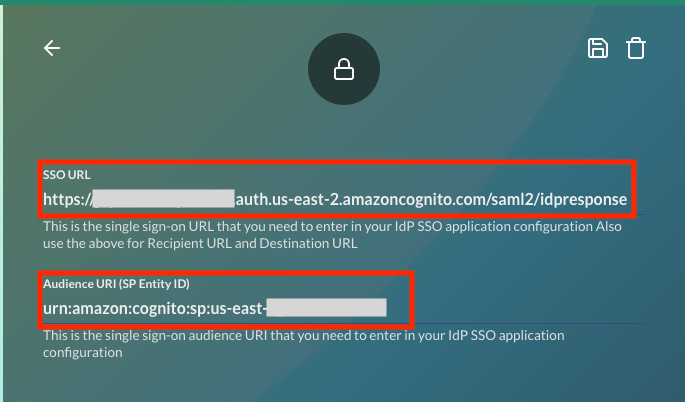

1. In your IdP Account, add a new SAML application and name it JupiterOne.

   - Copy the previous two variable values in the SAML settings.
   - Use the same single sign-on URL string value for Recipient URL and
     Destination URL.
   - Leave the Default Relay State field empty.
   - Select _EmailAddress_ for the name ID format.
   - Select _Email_ or _Username_ for the application username.
   - See the next section for details on attribute mappings.

1. Complete the setup of the SAML application in your IdP account, and copy
   the identity provider metadata link.

   In Okta, you can find this link on the **Sign On** tab of the application,
   under View Setup Instructions.

   

1. Go back to the JupiterOne Auth Client Settings screen, and paste the
   identity provider metadata link in the SAML Metadata Document URL field.

1. Enter a client name, such as Okta.

1. Under Allowed OAuth Flows, select the **Authorization code grant** and
   **Implicit Grant** checkboxes.

   

   Save your settings to complete the configuration. Next time you access your
   JupiterOne account using your organization custom URL (for example,
   https://your_company.apps.us.jupiterone.io), you are redirected to your
   SAML IdP for authentication.

## Attribute Mappings

JupiterOne supports the following attribute mappings:

- `email`: User email address
- `family_name`: User last name
- `given_name`: User first name
- `name`: User display name
- `group_names`: Dynamically assigns the user to the specified groups within JupiterOne.
  Use a comma to separate multiple group names (without spaces).

**NOTE:** Provisioning users with a `group_names` attribute mapping is OPTIONAL.
Users without `group_names` mapping are assigned to the **Users** group within
your JupiterOne account by default.

## Okta Configuration

To configure SSO for Okta, you must have administrator access. In addition, ensure you
can access the SSO URL and your Audience URI before proceeding.

1. From the Okta Applications menu, select **Create App Integration**.

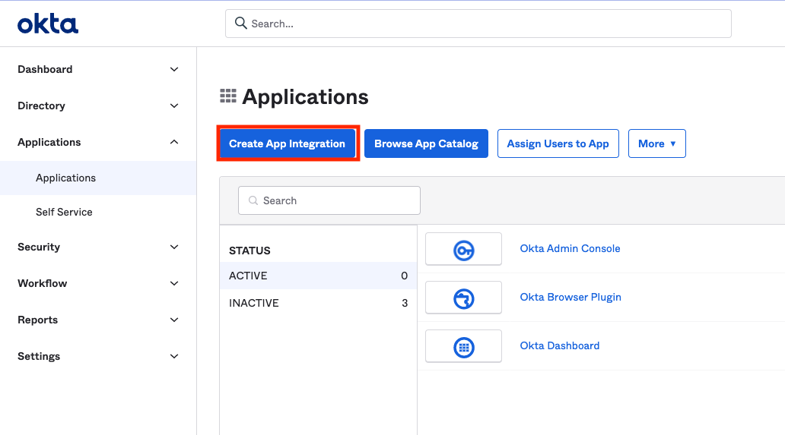

2. Select **SAML 2.0** and click **Next**.

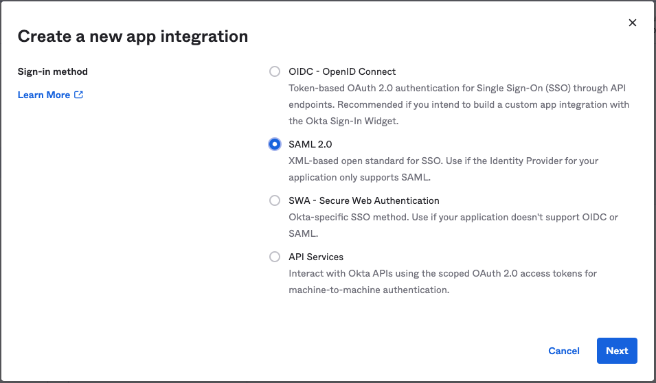

3. Enter a name in the **App Name** field. The name JupiterOne is used in the example below.
   Click **Next**.


4. In the SAML Settings sections:
   - In the Single sign on URL field, enter your SSO URL.
   - In the Audience URI (SP Entity ID) field, enter your Audience URI.
   - In the Name ID format field, select **EmailAddress**.
   - In the _Application username_ field, select **Email**.

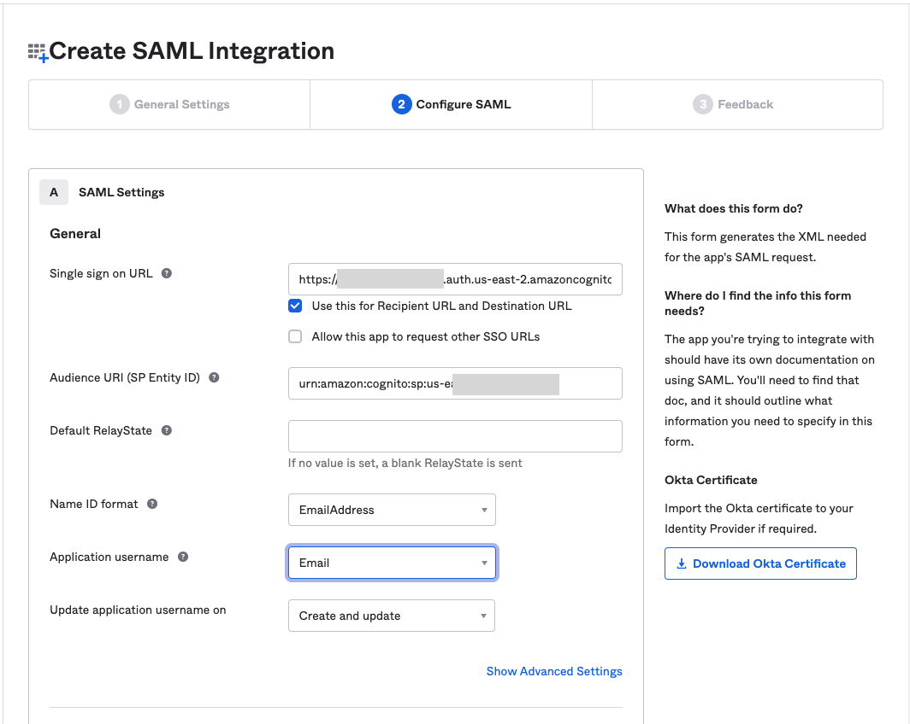

5. Configure the attribute mappings in the Attribute Statements section.
   Only the email attribute is mandatory.

   - `email` > `user.email`
   - `family_name` > `user.lastName`
   - `given_name` > `user.firstName`
   - `name` > `user.displayName`
   - `group_names` > `appuser.jupiterone_groups` where `jupiterone_groups` is optional naming.
     - You must configure the group attribute in the Profile Editor in the **Directory** menu,
       and then assign it after completing the configuration.

   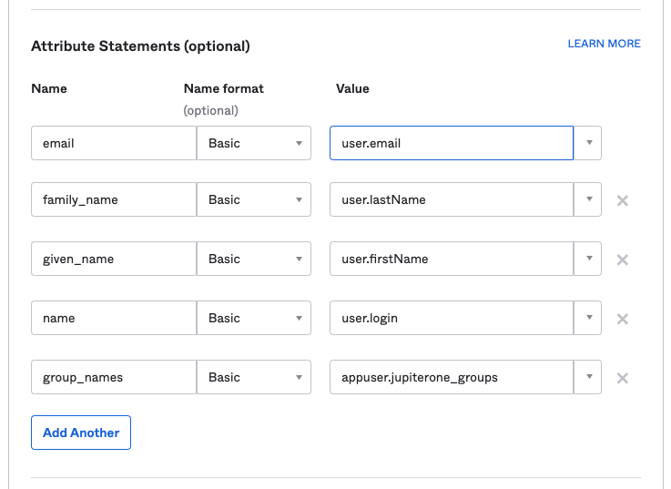

6. After mapping the attributes, click **Next**.

   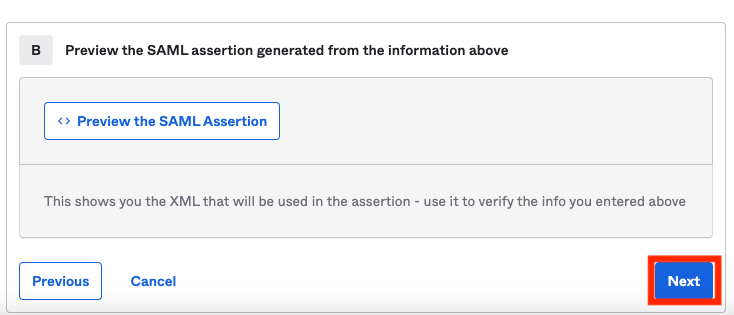

7. In the Feedback menu, select _I'm an Okta Customer adding an internal app_, and click **Finish**.

   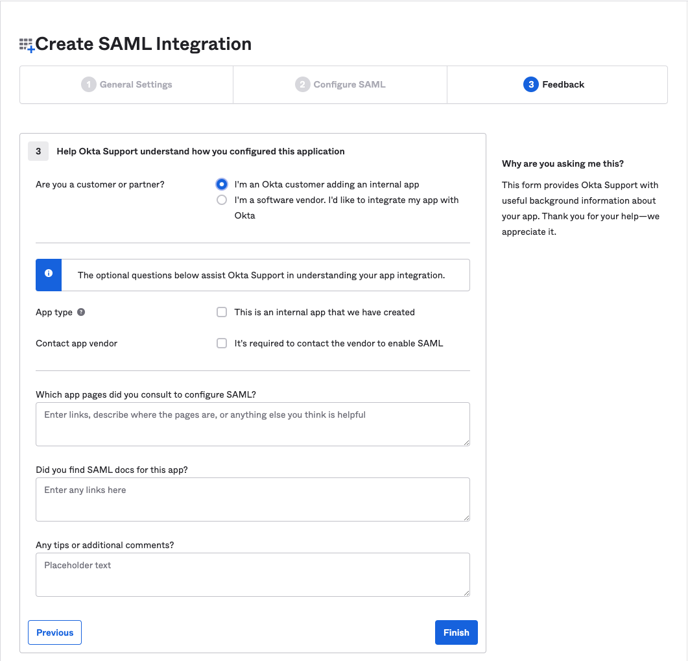

8. In the Settings section of the Sign On menu, right-click the **ddd** link and select **Copy Link Address**.

   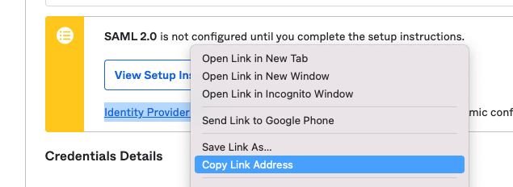

9. Paste the link into the SAML Metadata Document URL field.

   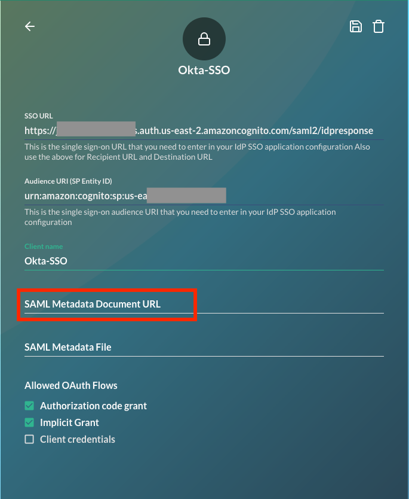

10. Click the floppy disk icon to save your configuration. A green confirmation message displays in the lower-left
    corner of the screen.

    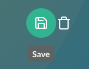
    

### Okta Group Attribute Configuration

JupiterOne recommends adding a custom group attribute to the JupiterOne app
profile in your IdP account (such as Okta). You can add the attribute with the
Profile Editor for the app. Provide a name for the custom group attribute such  
as jupiterone_groups.

An example in Okta:


You can then use this custom app attribute to assign group memberships to your
users based on their IdP group assignments. The actual value for the attribute
is typically configured on the groups assigned to the app.

An example in Okta:


## Azure AD Example

An example of an attribute mapping configuration in Azure AD:


An example of group assignment in Azure AD:


By adding the user.assignedroles -> group_names mapping to Azure AD,
the app roles assigned to the user are mapped to the groups
in JupiterOne that have the same name as the group/role. Read
<https://docs.microsoft.com/en-us/azure/active-directory/develop/howto-add-app-roles-in-azure-ad-apps>
for more information on adding app roles and assigning them to users and groups.

In Azure AD, go to <https://portal.azure.com/#blade/Microsoft_AAD_IAM/ActiveDirectoryMenuBlade/RegisteredApps>,
click the JupiterOne app, and then click **Manifest**.

Add an entry to appRoles that is similar to:

```json
{
  "allowedMemberTypes": ["User"],
  "description": "Administrators",
  "displayName": "Administrators",
  "id": "e6421657-3af5-4488-831f-7989175e3e35",
  "isEnabled": true,
  "lang": null,
  "origin": "Application",
  "value": "Administrators"
}
```

Assigning an app role to a user in Azure AD:


## Google Workspace Configuration

Before beginning a configuration through Google Workspace, ensure you have access to the SSO URL
and your Audience URI. Go to the Google Admin Console:

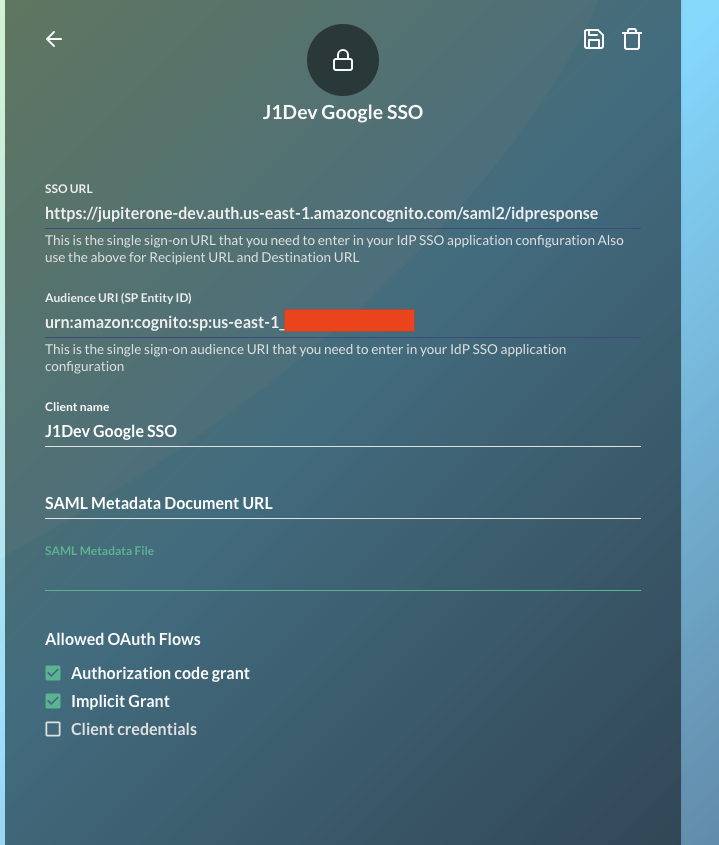

The IdP configuration page on the Google Admin Console is at: <https://admin.google.com/ac/apps/unified?hl=en>

1. From the **Add App** dropdown menu, select **Add custom SAML app**.

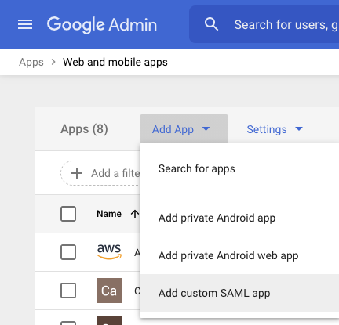

2. In the App name field, enter JupiterOne.

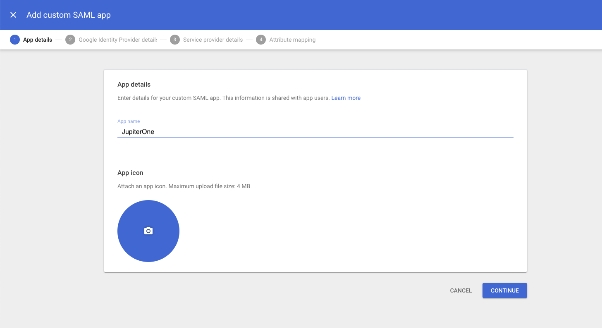

3. Click **DOWNLOAD METADATA** to download an XML metadata file to use later.

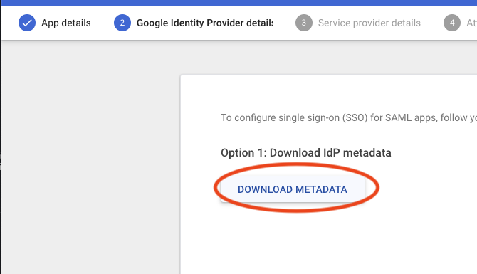

4. Paste your SSO URL in the ACS URL field.

5. In the _Entity ID_ field, paste your Audience URI. In the Name ID format field, select
   **EMAIL**, and select **Primary email** in the Name ID field.

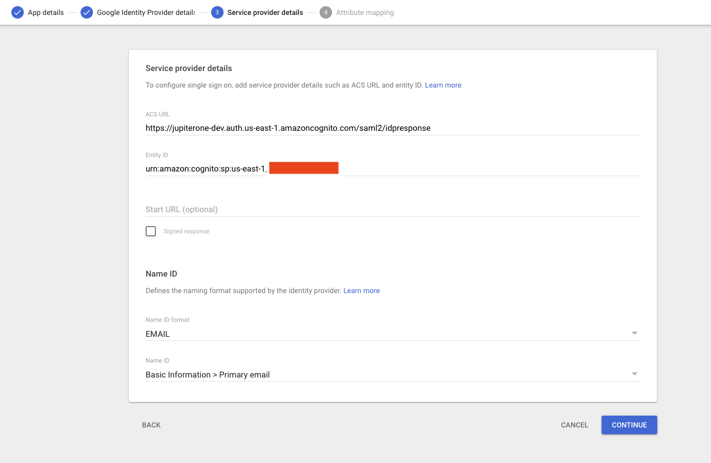

5. When mapping directory attributes, ensure you use the following names in the App attributes fields. group_names is optional.

   - _Primary email_ > `email`

   - _Last name_ > `family_name`

   - _First name_ > `given_name`

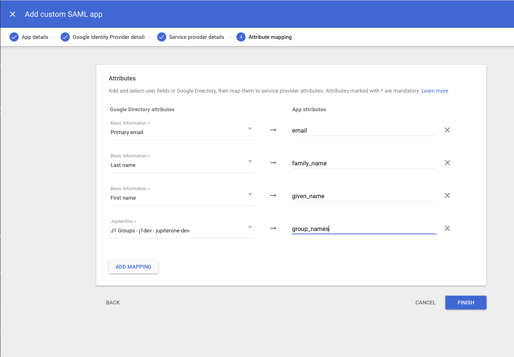

5. Paste the downloaded XML metadata file contents into the SAML Metadata File field.

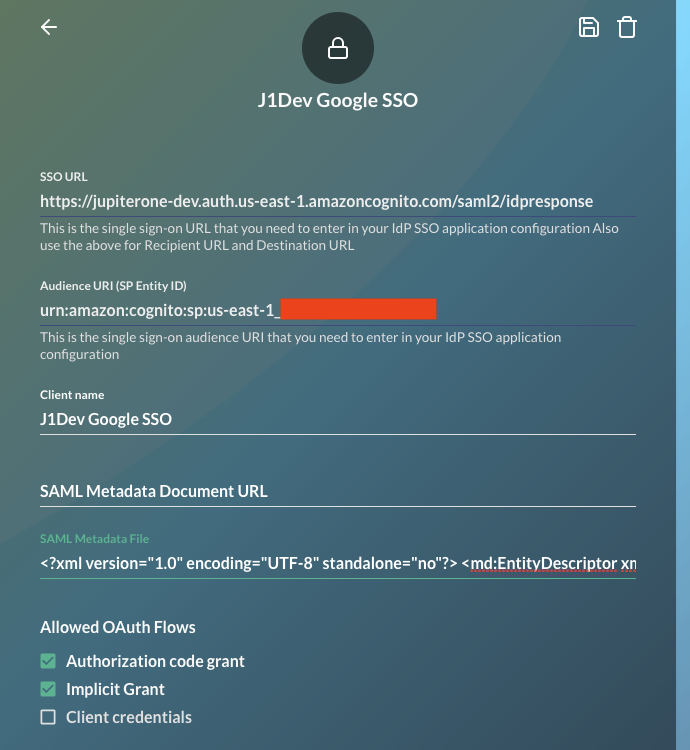

## Removing Users

When you unassign or remove a user from the JupiterOne app within your IdP, the
user can no longer log in to your JupiterOne account because the
authentication is done by your IdP. However, the user memberships remain
in the Groups. You can manually remove them from the groups in JupiterOne.


## Current Limitations

### IdP-initiated sign-on flow is not supported

JupiterOne uses Amazon Cognito service to manage authentication, including SSO.
Cognito currently does _not_ support IdP-initiated sign-on. This means you can
_not_ click on the app icon in your IdP account (such as JumpCloud,
Okta, OneLogin). Instead, you must initiate single sign-on by going to
your JupiterOne account URL:

```text
https://<your_j1_account_id>.apps.us.jupiterone.io
```

This URL redirects to your configured SSO provider for authentication.

You can find your J1 account ID by running the following query:

```j1ql
Find jupiterone_account as a return a.accountId
```

**Workaround**

If your SSO provider supports configuring a bookmark or secure web
authentication (SWA) app, you can work around this limitation by doing the
following:

- Hide the app icon to users for the configured JupiterOne SAML SSO app.
- Configure a Bookmark/SWA app with your JupiterOne account URL and
  assign it to the same users and groups that are assigned the JupiterOne
  SAML app.

## Troubleshooting

While different SSO providers have varying UI's and nomenclature ultimately the SAML response and attribute statement should look similar.

**Common Problems:**

- Infinite Redirect Loop
  - An infinite redirct loop can occur it the SAML subject is incorrect or not present or if the required SAML attribute `email` (case sensitive) is not present

**SAML Subject**

A common problem during SSO configuration is an incorrect SAML subject.
An example of a correct subject is bellow:

```xml
<saml2:Subject>
    <saml2:NameID Format="urn:oasis:names:tc:SAML:1.1:nameid-format:emailAddress">john.smith@example.com</saml2:NameID>
    ...
</saml2:Subject>
```

**SAML Attribute Statement**

Another common problem during SSO configuration is an incorrect SAML attribute statement.
An example of a correct attribute statement is:

```xml
<saml2:AttributeStatement>
    <saml2:Attribute Name="email">
        <saml2:AttributeValue xmlns:xs="http://www.w3.org/2001/XMLSchema" xmlns:xsi="http://www.w3.org/2001/XMLSchema-instance" xsi:type="xs:anyType">john.smith@example.com</saml2:AttributeValue>
    </saml2:Attribute>
    <saml2:Attribute Name="family_name">
        <saml2:AttributeValue xmlns:xs="http://www.w3.org/2001/XMLSchema" xmlns:xsi="http://www.w3.org/2001/XMLSchema-instance" xsi:type="xs:anyType">Smith</saml2:AttributeValue>
    </saml2:Attribute>
    <saml2:Attribute Name="given_name">
        <saml2:AttributeValue xmlns:xs="http://www.w3.org/2001/XMLSchema" xmlns:xsi="http://www.w3.org/2001/XMLSchema-instance" xsi:type="xs:anyType">John</saml2:AttributeValue>
    </saml2:Attribute>
    <saml2:Attribute Name="group_names">
        <saml2:AttributeValue xmlns:xs="http://www.w3.org/2001/XMLSchema" xmlns:xsi="http://www.w3.org/2001/XMLSchema-instance" xsi:type="xs:anyType">Administrators,Users</saml2:AttributeValue>
    </saml2:Attribute>
</saml2:AttributeStatement>
```

**Viewing the SAML Response**

In order to view the SAML response, browser plugins can be used to capture the POST to `/saml2/idpresponse`.
For example in the Chrome browser the plugin [SAML-tracer](https://chrome.google.com/webstore/detail/saml-tracer/mpdajninpobndbfcldcmbpnnbhibjmch?hl=en) can be used to decode and view the SAML response and therefore the SAML attribute statement.

Here is an example of what SAML-tracer looks like after following a login by SSO. Notice the `SAML` tab is active to view the XML.
Calls that have SAML will also be marked with a yellow `SAML` tag on the right of the http request.

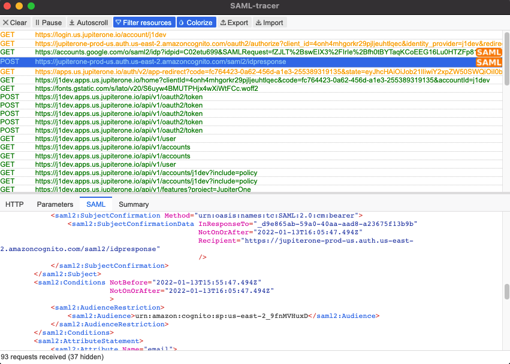
