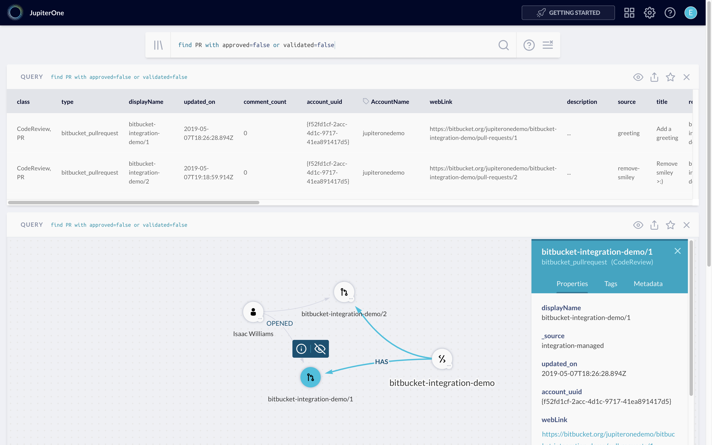

# Detect Suspicious Code Commits in Pull Requests

Security of software development and code is more important than ever.
JupiterOne can detect suspicious code commits and git behavior in Bitbucket and
GitHub pull requests (PRs). For example:

- Commits self-approved by the code author
- Commits made by a user unknown to the organization
- Rewritten commit history

## Enable Detection

For the detection to work, you will need to:

- Enable Pull Request (PR) and commit analysis in the integration configuration
  in JupiterOne. This is automatically enabled for GitHub integrations but must
  be explicitly turned on in Bitbucket integrations.

- Configure branch permissions in your git source control system to prohibit
  directly committing to the main branch (e.g. `master`) and to require pull
  request reviews before merging.

  _This option is typically found under the repo settings. This allows PR
  analysis to catch the suspicious activities._

When enabled, JupiterOne sets the `approved`, `validated`, and
`approvedCommitsRemoved` flags on each merged PR entity.

You can run a J1QL query to detect "PRs with suspicious activities":

```j1ql
Find PR with approved = false or validated = false
```



You can also set up an alert with the above query. You can also integrate this
analysis into your DevOps pipeline to check for suspicious commits in PRs before
deploying code to production.

## How does it work?

### Detecting self-approved commits

At the time of integration execution, or when requested via the API, JupiterOne
will analyze the activities on a PR to determine if there is any code commit on
the PR that was not approved by someone other than the code author.

_Isn't this already configured via branch protection/permissions?_

Consider the following scenario:

- Bob writes some code and commits them to a feature branch
- Bob opens a PR with those changes and requests review from Alice
- Alice makes another commit to the same branch and updates the PR
- Alice approves the PR

The PR is considered approved by a reviewer because Bob opened the PR and Alice
reviewed it. However, Alice technically approved her own code associated with
the commit she made to the branch after Bob opened the PR.

JupiterOne will detect this condition a sets the `approved` flag on the PR
entity to `false`.

The commit hash of the detected suspicious commit is added to the
`commitsNotApproved` list property.

### Detecting commits by unknown/external authors

Additionally, JupiterOne checks the commit author against known users that are
part of your organization. If a commit was made by an unknown/external author,
JupiterOne sets the `validated` flag on the PR entity to `false`.

The commit hash of the detected suspicious commit is added to the
`commitsByUnknownAuthor` list property.

### Detecting rewritten history

JupiterOne will check commits going in to master to ensure that they're
approved, regardless of Bitbucket's or GitHub's approval statuses. This means
that rewriting history in a way that invalidates previous approvals (for
example, squash merging) is flagged by setting the `approved` property to
`false` and the `approvedCommitsRemoved` property to `true`.

If you still want to squash merge for a beautiful git history, but also want to
avoid merging commits into master that are not explicitly approved, you can
rebase before having your code approved and then merge normally.

## Combine suspicious commits checking and vulnerability checking for CI/CD

You can use the following J1QL query to detect open vulnerability findings that
are associated with certain code repos, and use this in conjunction with the
PR analysis query previously discussed to make automated decisions for promoting
code to production in your CI/CD pipeline.

For example, you can query JupiterOne via API for:

```j1ql
Find Finding with open=true and severity=('Critical' or 'High')
  that relates to CodeRepo with name='my-new-project'

Find PR with id=55 as PR that relates to CodeRepo with name='my-new-project'
  return PR.approved, PR.validated
```

And block production deploy if the first query above returns a finding or if
the second query returns `false` for `approved` or `validated` status.
