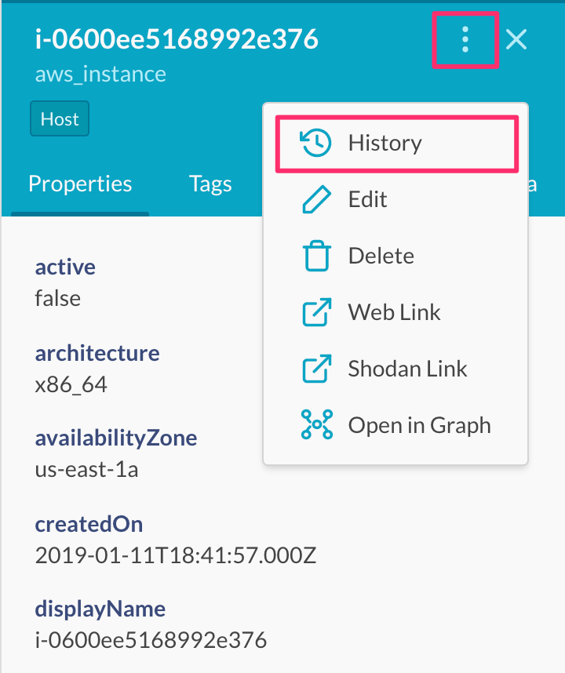
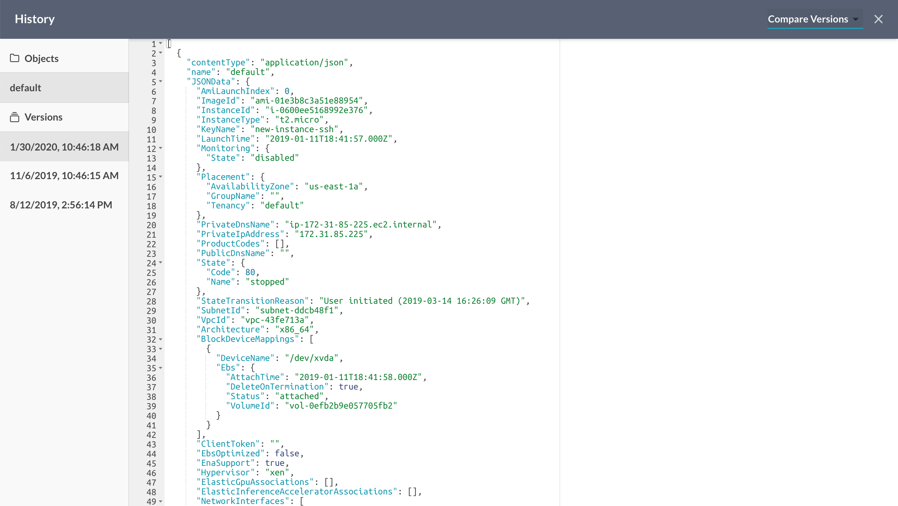
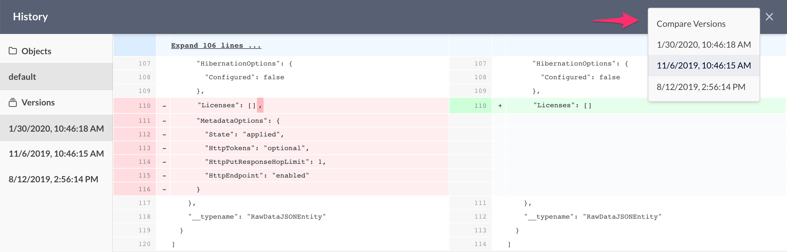

# View Entity History Data and Compare Versions

The majority of managed integrations in JupiterOne would capture raw data in
JSON format for the entity resources ingested as part of each integration
execution. Changes to the raw data is preserved as history associated with each
entity. This history can be access by following these steps:

* From the **Asset Inventory** table, or **Query Result**, or **Graph Viewer**,
  select an entity to open its property panel.

* Click on the **menu icon** (three vertical dots) near the top right to open
  the menu, and select **History**:

    

* This will bring up the **History** view showing the latest version of the
  entity's raw data:

    

* If there is more than one version of the entity raw data, you can select
  another version from the **Compare Versions** dropdown menu near the top
  right corner to see a side-by-side "git style diff" of the two selected
  versions:

    
