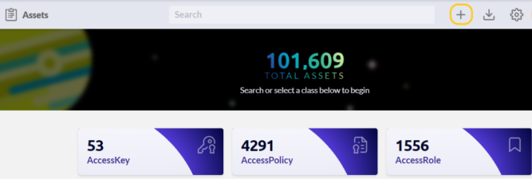

# Importing Your Data into JupiterOne

If J1 does not have an integration for a product in which your data is located, 
you can still import it into J1. You can also enrich current data in your J1 account. 
There are three steps to importing: gather the data, classify the data, import 
the data.

## Gather the Data

The power of J1 is that it stores the data in a graph database. Not only can 
you store an asset (such as a user record) with properties (such as ID, first name, 
last name, email address, and manager), but you can also define relationships 
between assets in the database. When you then look at user records, you see
all the user data as well as which AWS profiles they are assigned, which 
applications they have access to, and other information.

The data you want to add to J1 can come from different sources. For example, 
you can:

- Export it as a CSV file from another application. 
- Get the data from an API that a tool provides. 
- Generate the data by combining data from multiple sources. 

The data should include the:

- Assets you want to import to J1, such as a user or device.
- Include the properties for each asset, such as user first name or 
  device MAC address.

## Classify the Data

Classifying the data ensures that what you import is useful. 

Depending on the application from which you are importing, you must first
identify which assets you want to import. In addition, you must identify
the properties, type, and class of the assets.  For example, when J1 imports 
data from Salesforce, it imports the following assets: Group, PermissionSet, 
Profile, User, and UserRole

You must also identify the relationships between the assets from the application. 
In the Salesforce example, some of the relationships J1 creates include:

- `salesforce_user` assigned `salesforce_permission_set`
- salesforce_user assigned salesforce_user_role
- `salesforce_group` has `salesforce_user`

In addition, you may need to identify the relationships between assets in Salesforce 
and assets in other applications that you have in your J1 account.

[The J1 data model](../docs/jupiterone-data-model.png) is a reference model that describes as an entity-relationship graph 
the digital resources and complex interconnections among all the resources 
in a technology organization. It represents a reference model, not a strict or rigid structure.

## Import the Data

There are several different ways to get data into J1:

- Add or update a single asset using the Assets app in the J1 UI. This method is useful 
  for adding low volumes of data. You can add a new asset and its associated properties 
  one at a time. You can also add or update the properties on an existing asset in the UI. 
  
- Bulk upload assets using the Assets app in the J1 UI. 
  
  
  You format your data in JSON or YAML and then upload the file to your J1 account. You
  must have the Assets Admin and GraphViewer Admin roles.
  
- Use the J1 CLI with a script. This tool is for those knowledgeable with the command line 
  and how to create scripts to import data to the `JupiterOneNode.js` API client wrapper. 

- Use the JupiterOne Platform API, which is what J1 uses in the integrations. You can access 
  all the data in your account and add or update data using a graphQL endpoint. 

- Use the JupiterOne SDK. The SDK allows you to build a complete integration for J1. It is the most sophisticated way to import data into J1. It features the best practices that 
  J1 uses to build integrations with other applications.

More details are available in the [JupiterOne documentation](https://support.jupiterone.io/hc/en-us).