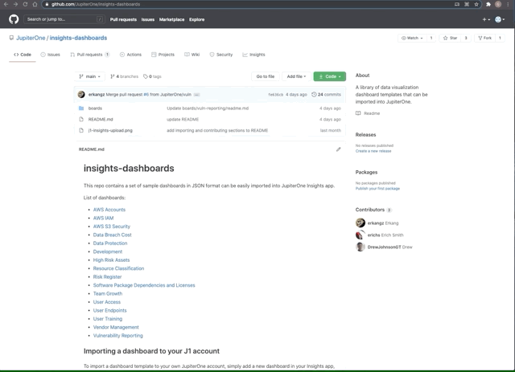
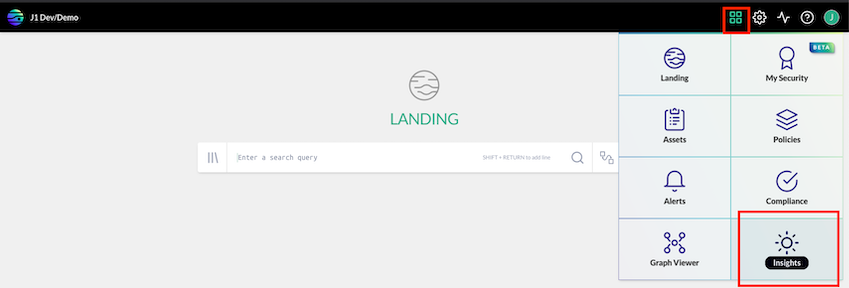
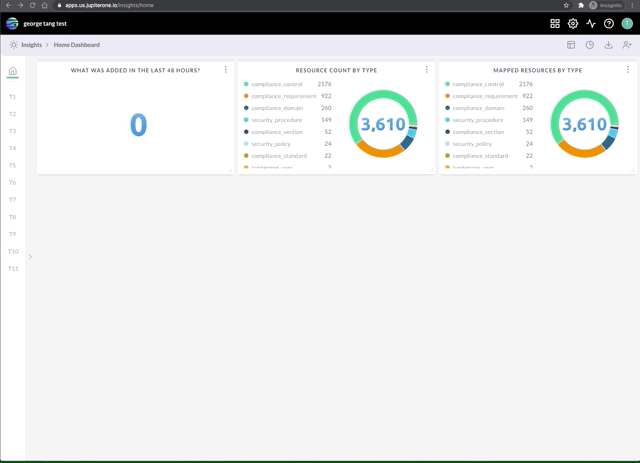
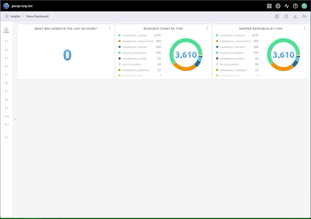
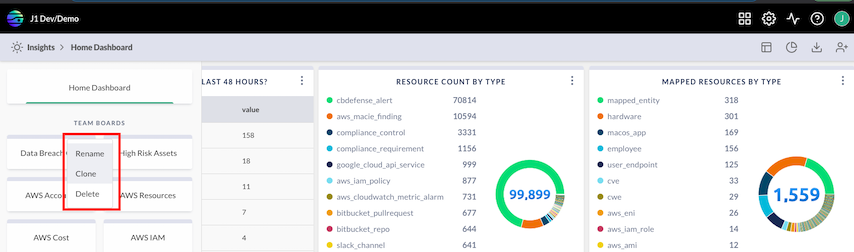
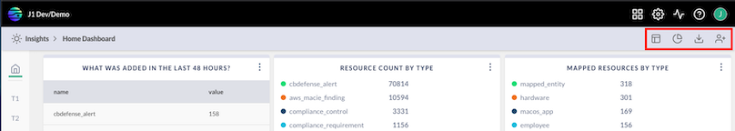
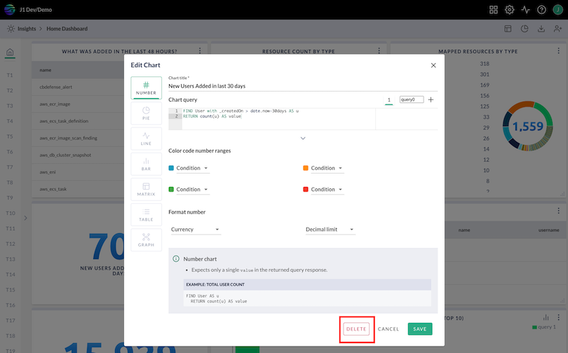
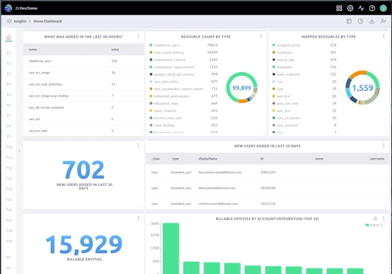

# Getting Started With Insights Dashboards

This guide will walk through how to:

1. Import prebuilt Insights Dashboards
1. Create your own custom Insight dashboard

JupiterOne Insights app allows users to build reporting dashboards using J1QL
queries.

Each dashboard can be configured as either a Team board that is shared with
other account users or a Personal board for the individual user. 

The layout of each board is individually saved per user, including the layout
for Team boards, so that each user may configure layouts according to their own
preferences without impacting others. Administrators can save a Team board
layout as "default" for other users.

You can build your own custom dashboards or utilize any of the existing boards
that have already been built.

Here are a few example boards and their configurations:
[https://github.com/JupiterOne/insights-dashboards](https://github.com/JupiterOne/insights-dashboards)

## 1. Import prebuilt Insights Dashboards (from GitHub)

1. Navigate to the specific prebuilt dashboard you’d like to import into your
   JupiterOne account:

   <https://github.com/JupiterOne/insights-dashboards>

1. Pick the specific board, e.g., "AWS Accounts"

1. Click into ‘board.json’

1. Right click on **Raw** -> **Save File**

   

1. Navigate within JupiterOne to **Apps** -> **Insights** to add a board

   

1. Expand the left sidebar by hitting the **>** carrot 

1. Hit the **Add** button + choose whether you want a personal or team board

1. Click **Upload From JSON Schema** + select the file you previously saved

   

## 2. Creating a custom Insights dashboard with custom charts based on queries

You can build your own custom dashboard with customized individual charts. Each
chart is powered by one or more J1QL queries under the hood.

1. Navigate within JupiterOne to **Apps** -> **Insights** to add a board

   

1. Expand the left sidebar by hitting the ‘>’ carrot 

1. Hit the **Add** button’ + choose whether you want a personal or team board

1. Click **Start Adding Charts**. This will open up the **Add Chart** workflow where
   you can customize the details of your query/chart, which include, but aren't
   limited to:
   
   - type of visual chart, e.g., number, pie, line, bar, etc.
   - the chart’s query or queries
   - formatting options 
   
     

### Additional support documentation/resources for writing queries:

[J1QL query tutorial](https://support.jupiterone.io/hc/en-us/articles/360022720434-4-9-J1QL-Query-Tutorial)\
[Search quickstart](https://support.jupiterone.io/hc/en-us/articles/360022705414-2-9-Search-Quickstart)\
[J1QL language specs](https://support.jupiterone.io/hc/en-us/articles/360022722014-J1QL-Language-Specs)\
[All questions + queries](https://ask.us.jupiterone.io/filter?tagFilter=all)

## General Insights dashboard functionality: 

- Rename, clone, or delete boards:

  

- Download board schema, share boards (create public links), save or reset board
layout, add charts:

  

- Delete charts:

  

- Reorder either charts within a specific board, or the board within the
sidepanel by dragging the chart or board to the desired spot:

  

