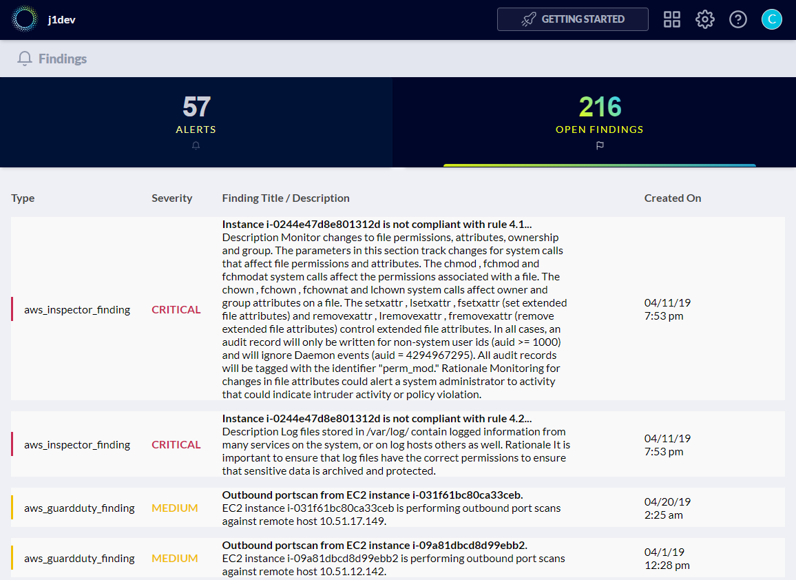
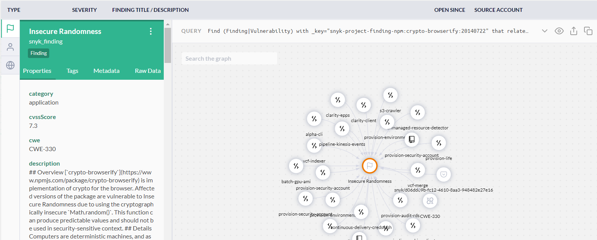

# Using JupiterOne for Active Vulnerability and Threat Monitoring in AWS

Active threats within an organization's AWS environments typically arise from
these two main sources:

1. System and application vulnerabilities on EC2 instances.
2. Malicious network activities, API activities and resource operations.

AWS provides two native services -- [AWS Inspector][1] and [AWS GuardDuty][2] --
to address the above, respectively.

Inspector performs automated scans of active EC2 instances to identify exposure
and vulnerabilities.

GuardDuty continuously analyzes network events (VPC Flow Logs and DNS logs) and
API events (CloudTrail logs) to identify malicious/unauthorized activity and
behavior.

JupiterOne integrates with both AWS Inspector and GuardDuty out-of-the-box to
provide a consolidated UI to manage, visualize and correlate the findings from
these services.

## Accessing the Findings in the Alerts app

You can see all **open findings** in the **Alerts** app.



Expanding a finding will give you a visual graph showing the resources the
selected finding is related to. You can interact with the graph and drill down
to see additional relationships and context to perform further analysis.



> Note that JupiterOne also integrates with several other security scanners,
including **Tenable**, **Veracode**, and **WhiteHat**. All security findings are
aggregated in the above centralized dashboard for easy management, filtering and
reporting. You can also import **manual pen test findings**. See [this doc][3]
for more details.

## Correlation and Alerting

Using J1QL, you can easily perform correlation of Inspector and GuardDuty
findings and the resources they impact. For example, the following query
identifies suspicious activities against any EC2 instance that also has high
severity vulnerability findings.

```j1ql
Find aws_guardduty_finding that relates to aws_instance
  that has aws_inspector_finding with numericSeverity > 7 return tree
```

Here is an example graph returned by the above query:


You can correlate Inspector and GuardDuty findings with other security scanner
findings as well, if you have those integrations configured.

You can also set up alerts and receive notification on certain findings. For
example, the following query can be used to set up an alert rule for high risk
findings that impact production resources:

```j1ql
Find (Host|DataStore|Application|CodeRepo|Account|Service|Network)
  with tag.Production=true
  that has Finding with severity='High' or numericSeverity>7
```

See this alert rule in the JupiterOne `common-alerts` rule pack on [Github][4].

[1]: https://docs.aws.amazon.com/inspector/latest/userguide/index.html
[2]: https://docs.aws.amazon.com/guardduty/latest/ug/what-is-guardduty.html
[3]: secops-artifacts-in-j1.md
[4]: https://github.com/JupiterOne/jupiterone-alert-rules/blob/master/rule-packs/common-alerts.json