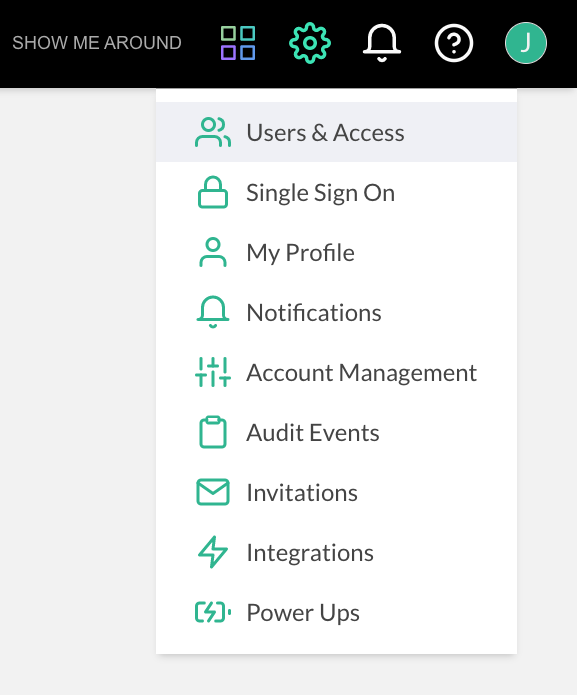
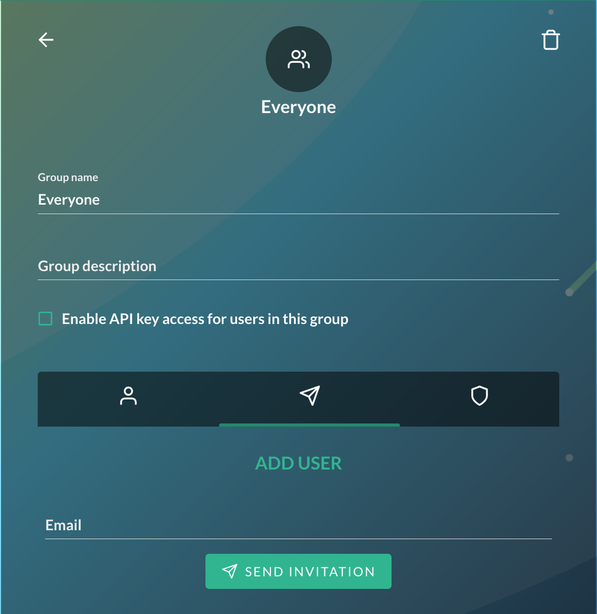
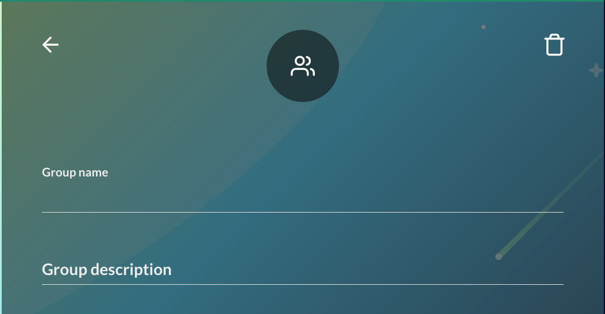
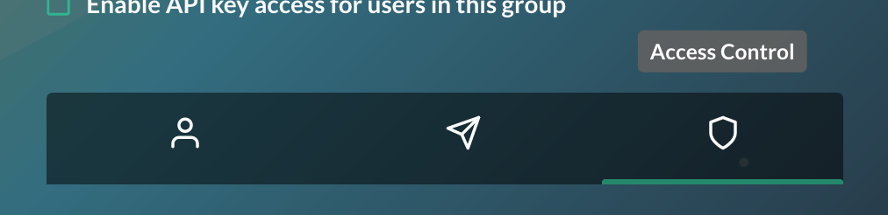
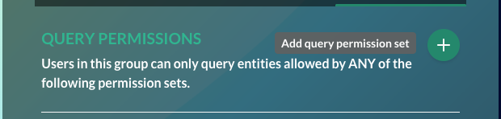
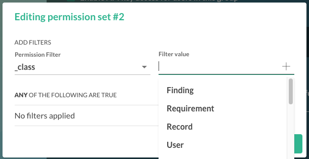
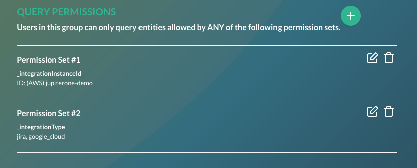
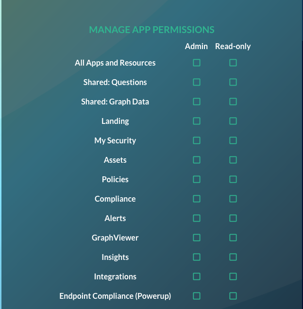
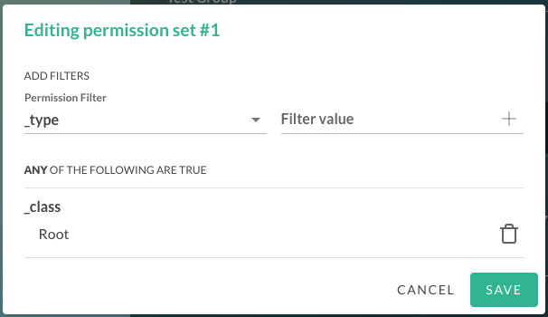

# JupiterOne Platform Account Management

For additional information relating to SSO account administration, please refer to our [SAML configuration guide](https://support.jupiterone.io/hc/en-us/articles/360022903353-Configure-SAML-SSO-Integration).

## Inviting Users

Inviting users to your JupiterOne account can be performed using through the “Users & Access” menu.

You can then choose which group the user will be invited to.

User's email can entered in the _Email_ field, then press **SEND INVITATION** to invite the user.

## Creating Groups and Best Practices 

Groups can be created using the **Add Group** button:

The _Group name_ field and _Group description_ field can be filled to name and describe the group.

Once a group is created, permissions should be created in the **Access Control** menu.

### Query Permission Sets

When creating and configuring a group it is highly recommended to configure a _Query Permissions_ set.  If a set is not configured, the default filter allows all assets to be available to group members. 

If a user is a member of multiple groups, they will receive the _Query Permissions_ set for both groups, along with the _App Permissions_

#### Editing Permission Set

Permission Sets can be edited by clicking the **Add query permission set** button.  

The Permission Filter configured will enable access to any assets scoped in the query.  Permission Filters are limited to `_class`,` _type`, `_integrationClass`, `_IntegrationType`, and `_integrationInstanceId` for pre-populating filter values.  A custom filter may be used as well. Make sure to click the **+** button and **Save** to add filters.

Multiple filters can be used to expand or limit scopes for groups.  Each _Filter_ and _Set_ added will provide the disjunction of the sets. 

### Manage App Permissions

App Permissions are configured in **Manage App Permissions** 

The default **App Permissions** for the _User_ Group does not provide any **App Permissions** to Users

Selection of permissions provide Read-only or Admin access for each App. 

### Recommended Permissions

#### Default User Group

For the _Users_ group with most limited access, it is recommended to set a minimum **Query Permission Set**. The miminum recommended group is `_class`:`Root`. This permission group will only include the Root organization:

The _Read-only_ permission for **Policies** should be set in **App Permissions** to allow users to _Review & Accept_ organizations policies

#### Compliance and Audit Group

For a group of users focused on Compliance and Audit processes, Integrations in scope for the audit are recommended for **Query Permissions**.  Recommended **App Permissions** for this group include _Admin_ access to _Compliance_ and _Policies_, as well as _Read-only_ access to _Assets_.

#### Integration Service Admin

For a group where configuration of integrated services is necessary, the recommended **App Permissions** for this group include Admin access to _Integrations_. In cases were _Endpoint Compliance_ is utilized, _Admin_ access will be necessary for this **App Permission** as well. The minimum **Query Permission Set**, `_class`:`Root`, is recommended for this group, but may be necessary to expand on special cases.

It may be necessary to expand access for this group in cases where SAML and SSO configuration must be configured.

