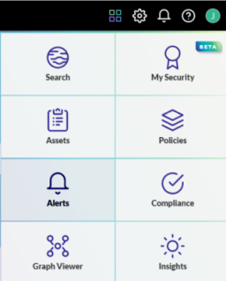
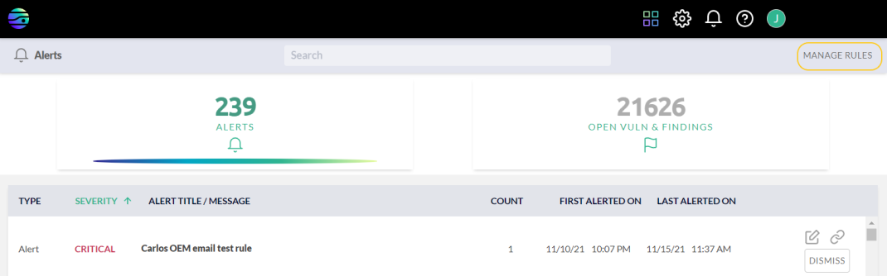
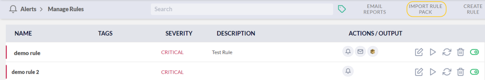
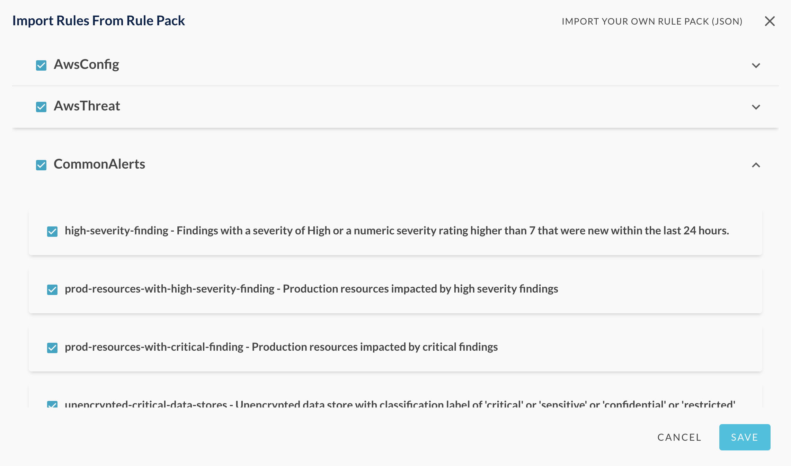
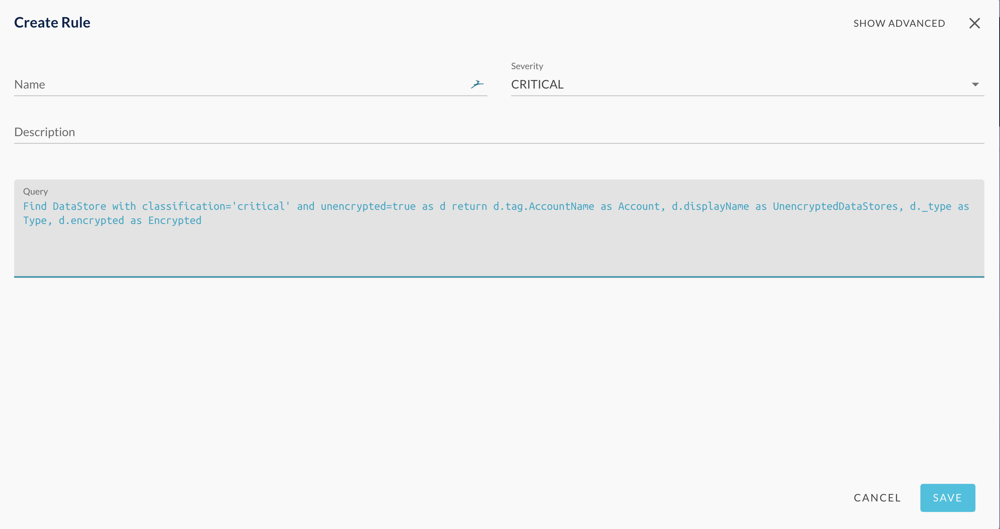
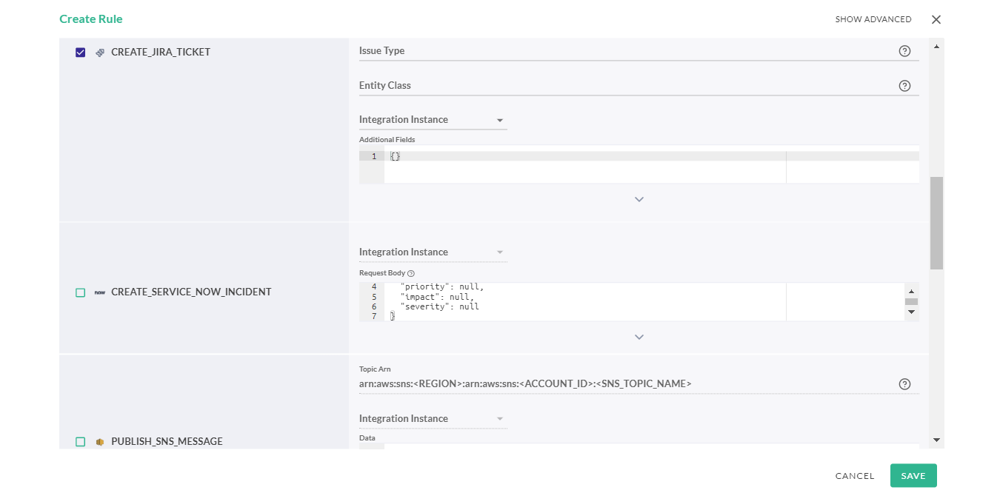
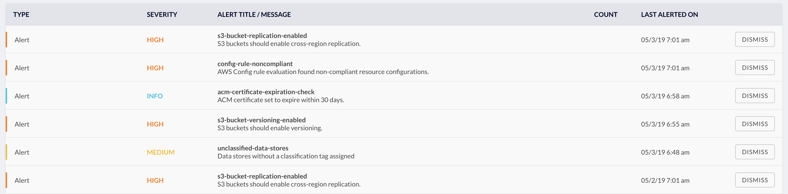
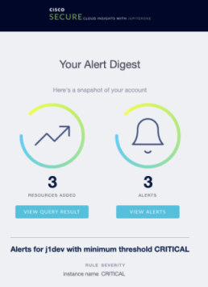

# Alerts and Alert Rules

JupiterOne allows you to configure alert rules using any J1QL query for
continuous auditing and threat monitoring. You do this in the **Alerts** app.

## Import Alert Rules from Rule Pack

You must have at least one active alert rule to trigger any alert. The
easiest way to add some rules is to import rule packs.

1. From the apps menu , select **Alerts**.
  
   

1. Click **MANAGE RULES**.
   
   
1. Click **IMPORT RULES PACK**.
   
1. From the Import Rules from Rule Pack window, select the rule packs or 
   individual rules within a rule pack, and click **Save**.
   
   

## Create Custom Alert Rules

To create your own custom alert rule:

1. From the apps menu , select **Alerts**.

1. Click **MANAGE RULES**.

1. Click **CREATE RULE**.

1. Enter the following details for the custom rule and click **SAVE**:

   - Name
   - Severity (select from drop-down list)
   - Description
   - Tags
   - Query (any J1QL query)
   
   

The custom rule you have added is evaluated daily, hourly, or with 
streaming evaluation for Enterprise customers. If the query you have 
specified in the rule returns at least one match, it triggers an alert.

## Additional Alert Options

J1 provides the ability to trigger the following workflows from alerts:

- Slack: You must configure the Slack integration for 
  JupiterOne by [following these instructions](https://support.jupiterone.io/hc/en-us/articles/360046977154-Slack). Ensure that
  you specify the channel in the format `#channel`.
- JIRA: You must configure the JIRA integration for JupiterOne 
  by [following these instructions](https://support.jupiterone.io/hc/en-us/articles/360022721154-Jira)
- SNS: The AWS account you want to send to must be configured 
  as an AWS Integration, and the J1 IAM role for the AWS account you 
  want to publish to must have the `SNS:Publish` permission.
- SQS: The AWS account you want to send to must be configured 
  as an AWS Integration, and the J1 IAM role for the AWS account you want 
  to publish to must have the `SQS:SendMessage` permission.

To trigger any of these workflows, when creating a custom rule, 
scroll down to the Additional Alerts section. Select the one you want 
and provide the required information.

## Managing Alerts

J1 evaluates the alert rules you create each day, or at the custom 
interval of every 30 or 60 minutes, if specified.

Active alerts that match the evaluation criteria of the alert rules appear
in the **Alerts** app in a data grid.

Use the icons in the rows to edit, run, delete, or disable a rule.

## Configure Daily Notification Email

To receive daily notification of new and active alerts:

1. In the Alerts app, go to **MANAGE ALERTS > EMAIL REPORTS**.
2. Enter the email addresses of the users or teams in the daily and 
   weekly recipients fields, with one address per line.
3. Ensure that `@jupiterone.io` and`@us.jupiterone.io` 
   are in the allowlist in your email configuration.

> 
