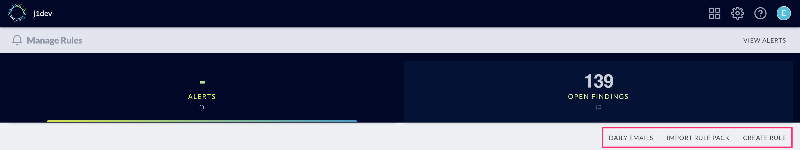

# Alerts

JupiterOne allows you to configure alert rules using any J1QL query for
continuous auditing and threat monitoring. This is done in the **Alerts** app.

## Import Alert Rules from Rule Pack

You will need to have at least one active alert rule to trigger any alert. The
easiest way to add some rules is to import rule packs, following these steps:

1. Go to **Manage Rules** from the Alerts app
  
   

1. Click **Import Rule Pack** action button

   

1. This will bring up the **Import Rules from Rule Pack** modal window, where
   you can select the rule packs or individual rules within a rule pack. Click
   **Save** to import the selected rules.

   

## Create Custom Alert Rules

Creating your own custom alert rule is easy:

1. Go to **Manage Rules** from the Alerts app

1. Click **Create Rule** action button to bring up the modal window

1. Enter the following details for the custom rule and hit **SAVE**:

   - **Name**
   - **Description**
   - **Severity** (select from drop down list)
   - **Query** (any J1QL query)

   

The custom rule will be added and be evaluated daily, hourly, or with streaming evaluation for Enterprise customers. 
If the query you have specified in the rule returns at least one match, it will trigger an alert.

## Additional Alert Options

We provide the ability to trigger workflows from alerts.

Check the box on the option you would like to utilize and fill in the required information via the drop downs and fields.

**Some alert options require additional integrations/permissions:**
1. Slack: You must configure the Slack integration for JupiterOne by [following these instructions](https://support.jupiterone.io/hc/en-us/articles/360046977154-Slack)
   Be sure to include specify the channel in the format `#channel`.
1. JIRA: You must configure the JIRA integration for JupiterOne by [following these instructions](https://support.jupiterone.io/hc/en-us/articles/360022721154-Jira)
1. SNS: The AWS Account you wish to sned to must be configured as an AWS Integration, and the 
   JupiterOne IAM Role for the AWS Account you want to publish to must have the `SNS:Publish` permission
1. SQS: The AWS Account you wish to sned to must be configured as an AWS Integration, and the 
   JupiterOne IAM Role for the AWS Account you want to publish to must have the `SQS:SendMessage` permission

## Managing Alerts

The alert rules are evaluated _daily_ by default, or at the custom interval --
_hourly_ or _every 30 minutes_ -- you have specified for a specific rule.

Active alerts that matched the evaluation criteria of the alert rules will show
up in the **Alerts** app in a data grid that looks like this:

- Click on an individual alert row will expand it to show the alert details.
- Click on the **DISMISS** button to dismiss an alert.

If an alert is not dismissed, you will not recieve a follow up alert notification unless there are new query results.

## Configure Daily Notification Email

To receive daily notification of new/active alerts, select:

- **Manage Rules**
- **Daily Emails**
- Enter the email addresses of the users or teams in the **Recipients** field

Your **JupiterOne Daily Alert Report** will look like this:

> 

To ensure delivery of these reports, please whitelist `@jupiterone.io` and
`@us.jupiterone.io` in your email configuration.
