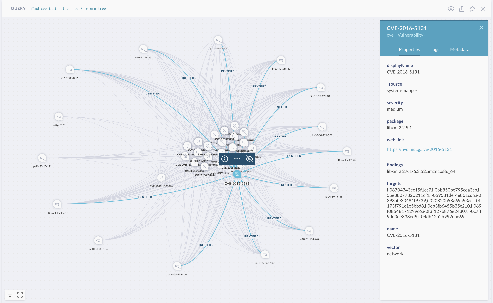

# Security Findings

JupiterOne provides a centralized repository and dashboard to enable
you to manage security findings from different sources, including:

- AWS Inspector findings
- AWS GuardDuty findings
- Veracode static and dynamic analysis findings
- WhiteHat application security findings
- Tenable.io scanning findings
- HackerOne report findings
- CVEs and other vulnerability findings
- Manual penetration testing findings imported via [the J1 API](./secops-artifacts-in-j1.md).

J1 is adding more vulnerability scanner integrations on a regular basis.

## Managing Findings

You can access the consolidated findings using the Alerts app, under the
**Findings** tab. The header tab shows a total count of currently open findings.
Selecting it will bring you to the detailed findings view:


J1 automatically maps resources impacted by or related to each
finding, based on the available attributes from the finding source.

Selecting a finding from the list shows you a graph of those relationships.
This view enables you to visualize the context to further analyze the impact 
of the finding and determine the type of remediation.


## Creating Alerts for Findings

You can create custom alert rules to notify you on specific findings, using J1QL
to filter and correlate.

### Examples

The following three rules are included in the J1 Common Alerts Rule Pack:

- **high-severity-finding**

  Alerts on findings with a severity of High or a numeric severity rating
  higher than 7 that were new within the last 24 hours.

  ```j1ql
  Find Finding with
    (severity='High' or severity='high' or numericSeverity>7) and
    _createdOn > date.now-24hours
  ```

- **prod-resources-with-high-severity-finding**

  Alerts when production resources are impacted by high-severity findings.

  ```j1ql
  Find (Host|DataStore|Application|CodeRepo|Account|Service|Network)
    with tag.Production=true
    that has Finding with severity=('High' or 'high') or numericSeverity=(7 or 8)
  ```

- **prod-resources-with-critical-finding**

  Alerts when production resources are impacted by critical findings.

  ```j1ql
  Find (Host|DataStore|Application|CodeRepo|Account|Service|Network)
    with tag.Production=true
    that has Finding with severity=('Critical' or 'critical') or numericSeverity=(9 or 10)
  ```

The following rule is included in the J1 AWS Threat Rule Pack:

- **aws-guardduty-inspector-finding-instance-correlation**

  Identifies vulnerable EC2 instances (such as with medium or higher rated, open
  Inspector finding) that are also targets of suspicious activities (such as with
  medium or higher rated open GuardDuty finding).

  ```j1ql
  Find aws_guardduty_finding with numericSeverity>5 and open=true as guardduty
    that relates to aws_instance as i
    that has aws_inspector_finding with numericSeverity>5 and open=true as inspector
    return i.*, guardduty.*, inspector.*
  ```

## Visualizing Findings with J1 Query and Graph

You can execute J1QL queries to generate graph visualizations that help you
analyze the relationships among findings, the agents/scanners/services that
identified them, and the resources they impact.

### Example

```Find cve that relates to (Host|HostAgent) with active=true return tree```

This query displays a visual similar to this. You may have to move the nodes around to
adjust their positioning.



