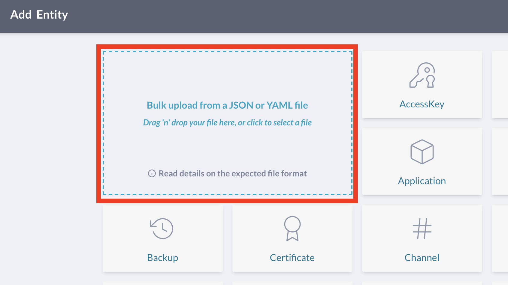

# Creating `Team` entities and mapping team members
 
This guide walks through the process of creating `Team` entities and mapping 
team members to the `Person` entities (that are already integrated via SSO/IdP 
providers) to each team.

This can be accomplished by uploading a JSON/YAML document containing the
`Team` entities either via the JupiterOne app UI or the platform API.

## UI 

Under the Assets section of the application, click the + button in the upper right corner.


Click the tile "Bulk upload from a JSON or YAML file".



 Use the following JSON as an example:

```json
{
 "entities": [
   {
     "_key": "my_team:1",
     "_type": "my_team",
     "_class": "Team",
     "displayName": "Team One",
     "name": "Marketing Team",
     "description": "One person team",
     "email": "james@jupiterone.com",
     "members": [
       "james@jupiterone.com"
     ]
   },
   {
     "_key": "my_team:2",
     "_type": "my_team",
     "_class": "Team",
     "displayName": "Team Two",
     "name": "Solutions Team",
     "description": "Customer facing team",
     "email": "solutions@jupiterone.com",
     "lead": "cindy@jupiterone.com",
     "members": [
       "cindy@jupiterone.com",
       "james@jupiterone.com",
       "mark@jupiterone.com"
     ]
   }
 ]
}
```

## API

This process can also be accomplished via the JupiterOne API using the JSON example above. 
See the document [Bulk Upload][bulk-upload-api] for more info.

### Some key things to note:

- The `_key` must be unique for each team
- `"members"` are mapped to `Person` entities by email, creating `Team -HAS-> Person` relationships
- `"lead"` or `"manager"` or `"supervisor"` is also mapped to a `Person` 
entity by email, creating `Person -MANAGES-> Team` relationships
- Currently JSON/YAML are the only supported formats to define custom entities/Teams. [^1]

[^1]: CSV support will be available soon to allow users to modify a spreadsheet instead.

[bulk-upload-api]: ./schemas/bulk-upload.md
