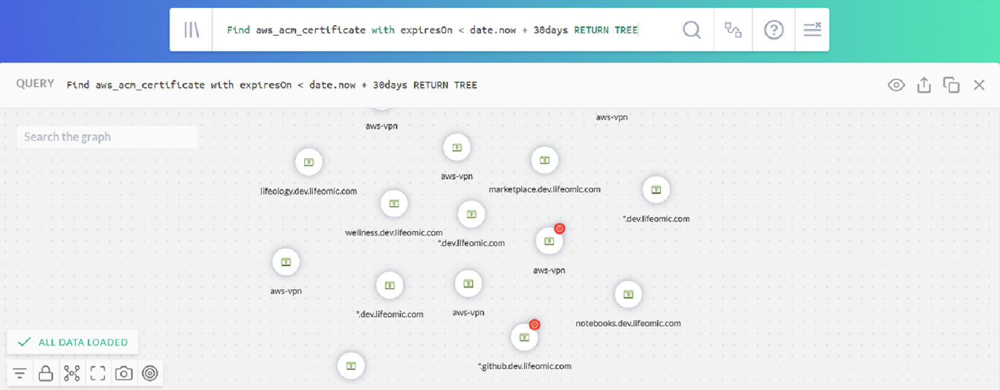
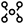
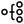

# Navigating the JupiterOne Graphs

J1 is built on a data-driven graph platform. For the story that inspired J1 to build it, 
read [the J1 blog](https://jupiterone.com/blog/three-dimensional-security/).

JupiterOne Query Language (J1QL) is designed to traverse this graph and return a
subgraph, or data from the nodes (assets) and edges (relationships) of a subgraph. 
You can view and interact with the subgraph from any J1QL query result.

This documentation focuses on interacting with the graph component. For more 
details on J1QL, read the [J1QL tutorial](tutorial-j1ql.md) and [technical doc](../docs/jupiterone-query-language.md).

This is an example result graph from a query in the Search for Anything app:

The first set of controls in the upper-right corner comprises:

|                     Control                     | Function                                                     |
| :---------------------------------------------: | :----------------------------------------------------------- |
|      | Switch views between `Table`, `Graph`, `Raw JSON`, and `Pretty JSON`. |
|  | Export and share the query by sharing a link or downloading as a CSV or JSON file. |
|    | Copy the query to the clipboard to reuse.                    |
|    | Save the query shows a modal popup where you can provide a title, description, and, optionally, some tags to save it to your own query library. |
|  | Close and remove the results for this specific query/question from the page view. |

Selecting any node on the graph displays a set of controls directly on top of 
it that allows you to interact with the node. The controls provide the
following functions:

|                          Control                          | Function                                                     |
| :-------------------------------------------------------: | ------------------------------------------------------------ |
|  | Open the side panel to show the detailed properties, tags, and metadata of the selected asset. You can select an edge and see the relationship properties in the side panel as well. |
|    | Display additional asset nodes that are directly connected to the selected asset but are not yet loaded into the graph. |
|              | Hide the asset from the graph to reduce clutter. You can unhide all hidden assets from the bottom-left control. |
|          | Expand grouped nodes of the same type that have the same parent nodes. This option may not be always available depending on the data in the graph. |
|      | Collapse nodes of the same type that have the same parent nodes into a group. This option may not be always available depending on the data in the graph. |

The last set of controls are at the bottom-left of the graph, and they provide the 
following functions:

| Control | Function|
|:-------:| --------|
|  | Open the filter panel to show or hide assets on the graph by account and/or type. |
|  | Lock the movement of connected assets. |
|   | Toggle the layout between these three types. |
|  | Maximize the graph in full-screen mode. |
|  | Exit full-screen mode. |
|  | Download the image. |
|  | Center the graph. |
|  | Undo the action. |
|  | Unhide hidden asset nodes. This control icon only displays when there are hidden nodes on the graph. |

Here's a screenshot of a graph with the side property panel and filter panel
open:

**Zoom and Move**

|                           Control                            | Function                                                     |
| :----------------------------------------------------------: | ------------------------------------------------------------ |
|   | Scroll using your mouse/touchpad to zoom in/out on the graph. |
|                 | Click and drag on a blank spot on the graph using your mouse/touchpad to move the graph. Click and drag on a selected asset node to move that particular node. |

The Graph Viewer app uses the same sets of controls.

To learn more about queries and graphs, read the [J1QL tutorial](tutorial-j1ql.md).
