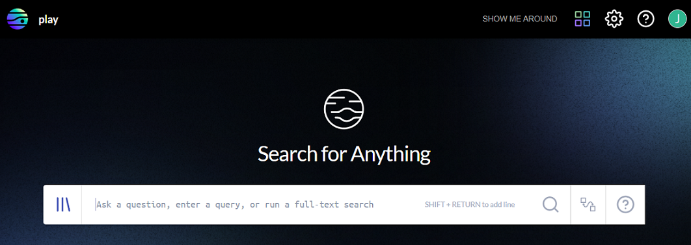

# Practice with the J1 Playground

Before you start working with your organization data, you can use the J1 playground
to get to know the features and functionality.

## Access the Playground

To access the J1 playground:

1. From the J1 landing page, go to Resources  **> Onboarding**.
2. In the top-right of the onboarding page, click Sample Data .
   
3. On the Enable J1 Playground page, click **Get Access** to receive an invitation to the playground.
    
       ​
4. When you receive the invitation email, click **Signup** or **Login** to get started, and follow the instructions on the Accept Invitation page to get to the playground.
5. You know you are in the playground when the you see a J1 landing page with play as its title in the top-left corner.
   
   ​

You access all of the J1 apps from the home page by clicking . If you need more assistance learning about the J1 user interface, read the [introduction documentation](./j1-what-is-it.md).

## Discover Your Assets

Your assets are operational entities such as code repositories, data stores, IAM policies and roles, security controls, people, and even vulnerability findings.

Modern security and visibility requires in-depth knowledge of your cyber assets and the insights that come from the relationships that connect them. J1 Assets provides meaningful context that you can use to strengthen your security program.

Look around at the playground data in J1 Assets by selecting a class and type of asset to filter on. and read more in the [product documentation](./asset-inventory-filters.md). 

## Try Some Queries

J1 provides a [questions library](https://ask.us.jupiterone.io/filter?tagFilter=all) that updates on a regular basis. Have a look and try the queries associated with the questions. 