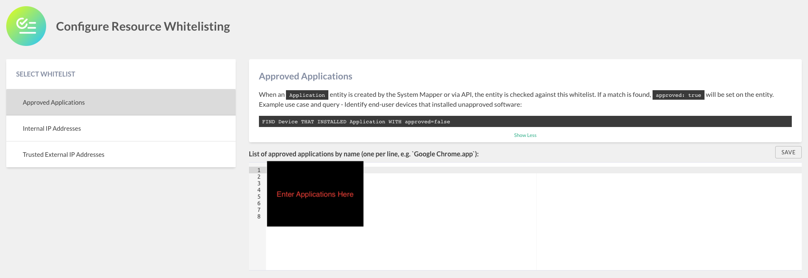
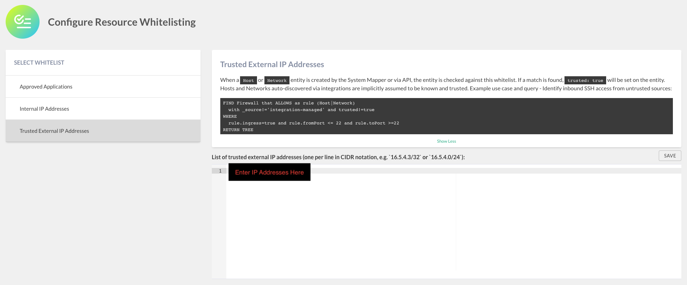

# JupiterOne Resource Whitelist

JupiterOne provides a resource whitelisting tool as a "Power Up" for all
Enterprise customers and all Premium customers that have added the *Power Up
Pack*.

This Power Up allows users of JupiterOne to list out the applications, internal
IP addresses, and external IP addresses that are approved, in-use, and trusted
by the organization. When an entity is created by the System Mapper (created by
JupiterOne during the analysis of roles and policies in your account, most
likely external entities) or uploaded via API, the entity is checked against the
whitelist. When a match is found, the entity is updated with an additional
property for querying purposes.

## Setup

Click on the gear/settings icon and select *Power Ups*. Select *Configure
Resource Whitelisting* (See screenshot below). Populate each whitelist following the instructions in
the corresponding section below.


## Configure Approved Applications Whitelist

When an `Application` entity is created in JupiterOne, the property `approved`
is set equal to `true` if the `name` of the application matches a value listed
under the Whitelist **Approved Applications**.



Once configured, you can then run the following query to find non-approved
applications installed on any device:

```j1ql
Find Device 
    that installed Application with approved=false
```

## Configure Internal IP Addresses Whitelist

When a `Host` or `Network` entity is created in JupiterOne, the property
`internal` is set equal to `true` if the `ipAddress` or `privateIpAddress`
of the host or network matches a value listed under the Whitelist
**Internal IP Addresses**.


Once configured, you can then run the following query to find a list of external
IP hosts and networks in your account:

```j1ql
FIND (Host|Network) 
    with _source!='integration-managed' and internal!=true
```

## Configure Trusted External IP Addresses Whitelist

When a `Host` or `Network` entity is created in JupiterOne, the property
`trusted` is set equal to `true` if the `ipAddress` or `privateIpAddress`
of the host or network matches a value listed under the Whitelist
**Trusted External IP Addresses**.



Once configured, you can then run the following query to see a graph of
untrusted sources that have inbound SSH access to your environment:

```j1ql
FIND Firewall that ALLOWS as rule (Host|Network)
  with _source!='integration-managed' and trusted!=true
WHERE 
  rule.ingress=true and rule.fromPort <= 22 and rule.toPort >=22
RETURN TREE
```