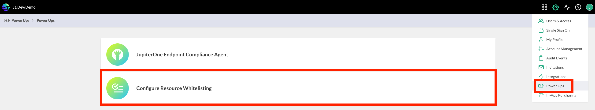

# JupiterOne Resource Allowlist

JupiterOne provides a resource allowlisting tool as a Power Up for all
Enterprise customers and all Premium customers who have added the 
Power Up Pack.

This Power Up enables you to list the applications, internal IP addresses, 
and external IP addresses that are approved, in use, and trusted
by the organization. When an asset is created by the System Mapper, 
during the analysis of roles and policies in your account, or uploaded 
via API, the asset is checked against the allowlist. When a match is found, 
the asset is updated with an additional property for querying purposes.

## Configuration

To configure the resource allowlist:

1. Click the settings icon and select **Power Ups**. 
2. Select **Configure Resource Whitelisting**. 
3. Populate each allowlist, following the instructions in the corresponding section.



### Configure the Approved Applications Allowlist

When you create an `Application` asset  in J1, the property `approved`
is set equal to `true` if the `name` of the application matches a value listed
under the allowlist **Approved Applications**.

You should add applications you approve to the list by name, for example:

```json
Google Chrome.app
zoom.us.app
```

After you have configured the allowlist, your application data is automatically 
enriched, and you can run useful queries such as the following to find 
non-approved applications installed on any device:

```j1ql
Find Device 
    that installed Application with approved=false
```

### Configure the Internal IP Addresses Allowlist

When you create a `Host` or `Network` asset in J1, the property `internal` 
is set equal to `true` if the `ipAddress` or `privateIpAddress` of the host or 
network matches a value listed under the **Internal IP Addresses** allowlist.

You should add internal IP addresses that you own to the list in CIDR notation,
for example:

```json
16.5.4.3/32
16.5.4.0/24
```

After you have configured the allowlist, your application data is automatically 
enriched, and you can run useful queries to find a list of external IP hosts and 
networks in your account, such as the following:

```j1ql
FIND (Host|Network) 
    with _source!='integration-managed' and internal!=true
```

### Configure the Trusted External IP Addresses Allowlist

When you create a `Host` or `Network` asset in J1, the property `trusted` is set 
equal to `true` if the `ipAddress` or `privateIpAddress` of the host or network 
matches a value listed under the **Trusted External IP Addresses** allowlist.

You should add the external IP addresses you trust to the list in CIDR notation,
for example:

```json
16.5.4.3/32
16.5.4.0/24
```

After you configure the list, your application data is automatically enriched, and you
can run useful queries to see a graph of untrusted sources that have inbound SSH 
access to your environment, such as the following:

```j1ql
FIND Firewall that ALLOWS as rule (Host|Network)
  with _source!='integration-managed' and trusted!=true
WHERE 
  rule.ingress=true and rule.fromPort <= 22 and rule.toPort >=22
RETURN TREE
```