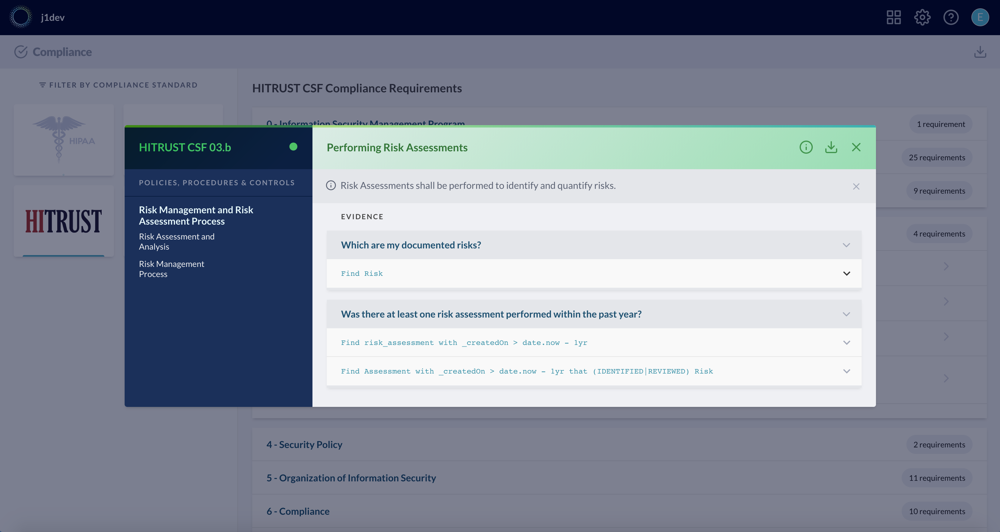

# Using JupiterOne as a central repository for SecOps and compliance artifacts

JupiterOne integrates with and consolidates data from several security and
compliance solutions right out of the box (for example, ingesting security
assessments and findings from AWS Inspector, GuardDuty, Veracode, WhiteHat, and
more).

However, there will inevitably be operational and compliance artifacts produced
outside of automated tools, such as **Assessments** performed manually
(E.G. risk assessments or penetration tests) and the **Findings** and **Risks**
identified by those assessments.

These efforts are typically documented in unstructured formats (Word or PDF) or
are maintained in a separate repository such as a governance, risk and
compliance (GRC), or vulnerability management system/software/service (VMS).

JupiterOne serves as a lightweight GRC and VMS so that no separate, siloed tools
are needed, allowing teams to manage security and compliance artifacts as code.

## Security artifacts as code

Instead of writing security documents in Word, which are difficult to track and
maintain, you should create and store artifacts and records as code. You can
then easily upload these artifacts to JupiterOne for querying and
reporting. Check out the examples below!

Note that the following properties are common across all entity types:

- `entityId`

  The JupiterOne API does not require this property. If it is not provided,
  JupiterOne will create a new entity for the document. If it is provided,
  JupiterOne will update the existing entity for that id.

- `entityKey`

  This property is required and must be unique. The JupiterOne entity creation
  API will update any existing entity with an identical key.

- `entityType`, `entityClass`, `name`, `displayName`

  These properties are required.

All other properties listed in the examples are recommended but not required.

You can create documents to upload to JupiterOne in either JSON or YAML
format. We use YAML in the examples below because it makes dealing with long,
multi-line text much easier.

### **Assessment** Entity Example

```yaml
---
  - entityId:
    entityKey: assessment:hipaa:2018
    entityType: risk_assessment
    entityClass: Assessment
    properties:
      name: HIPAA Risk Assessment 2018
      displayName: company-hipaa-risk-assessment-2018
      summary: 2018 Annual HIPAA Risk Assessment
      description:
        (sample text)
        Organization's security and compliance team assessed policies, controls
        and procedures to ensure they meet and exceed
        the requirements specified by HIPAA privacy rule and security rule.
      details:
        additional report details
      category: risk-assessment
      status: complete
      assessors:
        - security.staff@yourcompany.com
        - internal.audit@yourcompany.com
      open: false
      classification: confidential
      completedOn: 2018-07-23
      reportURL: <link to full report>
      webLink: <link to full report>

  - entityId:
    entityKey: assessment:pentest:2019q1
    entityType: penetration_test
    entityClass: Assessment
    properties:
      name: internal-pen-test-2019q1
      displayName: Company Internal Penetration Test 2019Q1
      summary: Company Internal Penetration Test Q1 2019 conducted between Mar 18th - Mar 29th
      description:
        (sample text)
        Performed a thorough security assessment of the company product line.
        Scope includes product A, B and C.
      details:
        additional report details
      category: penetration-testing
      status: complete
      assessors:
        - pen.tester1@yourcompany.com
        - pen.tester2@yourcompany.com
      open: false
      classification: confidential
      completedOn: 2019‑04‑05
```

The above example contains an array of two assessment objects - one HIPAA Risk
Assessment and one Internal Penetration Test. If there is a more detailed report
stored elsewhere, such as on your company's SharePoint or Google Docs account,
you can link to it using the `reportURL` and `webLink` properties. The `webLink`
property is known by the JupiterOne UI and will render a hyperlink.

We recommend also writing a full report in Markdown and storing that in source
code control. The `reportURL` / `webLink` in that case will be something like
this:

```text
https://bitbucket.org/yourorg/security-assessments/src/master/2018/hipaa-risk-assessment-report.md
```

When you specify the email address(es) of the assessor(s), JupiterOne looks
up those individuals (the `Person` entities) and creates the following mapped
relationship:

```text
Person (with matching email address) - PERFORMED -> Assessment
```

### **Risk** Entity Example

```yaml
---
  - entityId:
    entityKey: risk:endpoint-management-gaps
    entityType: technical_risk
    entityClass: Risk
    properties:
      name: Endpoint management gaps
      displayName: Endpoint management gaps
      summary: Lack of visibility on how user endpoint systems/devices are configured
      description:
        (sample text)
        Endpoint systems should be configured according to the company's IT and
        security standards. Because currently all enduser systems (e.g. laptops)
        are self managed, there is a lack of centralized visibility into how
        each system is configured and if they meet the compliance requirements

      details:
        'Systems should be configured with at least the following:'

          1. Disk encryption enabled
          2. Screensaver protection/screen lock on
          3. Local firewall enabled
          4. Remote login disabled
          5. Auto install OS security patches enabled
          6. (if it is Windows) Has Windows Defender or equivalent malware protection running

      category: technical
      threats: malware
      targets: enduser devices
      probability: 2
      impact: 2
      score: 4
      status: open
      reporter: security@yourcompany.com
      open: true
      mitigation:
      jiraKey: SEC-112
      webLink: https://yourcompany.atlassian.net/browse/SEC-112
```

Notes:

- The Risk `score` = `probability` times `impact`

  - Both `probability` and `impact` are numeric values, between 0-3.
    (you may choose to use a different scale)

  - Probability rating:

    - 3: high/certain
    - 2: medium/likely
    - 1: low/unlikely
    - 0: none/negligible

  - Impact rating:

    - 3: high/severe
    - 2: medium/moderate
    - 1: low/minor
    - 0: none/insignificant

- Example valid Risk `status`:

  - `accepted`
  - `mitigated`
  - `transferred`
  - `reported`
  - `planned`
  - `acknowledged`
  - `prioritized`

- The Risk is considered `open` unless it is `accepted`, `mitigated` or
  `transferred` status.

- When uploaded to JupiterOne, Risks will automatically map to an
  employee/Person using the email address specified in the `reporter` property:

  ```text
  Person (with matching email address) - REPORTED -> Risk
  ```

- Similarly, specify the assessment name in the `assessment` property to create
  the following mapping:

  ```text
  Assessment (with matching name) - IDENTIFIED -> Risk
  ```

- The `webLink` property is optional.

- Note the `jiraKey` property and the `webLink` URL in the example point to a
  Jira issue since Jira is used to track the workflow of this Risk item.

### **Finding** Entity Example

A vulnerability finding is similar to a risk item:

```yaml
---
  - entityId:
    entityKey: finding:pentest:2019q1:appcode-1
    entityType: pentest_finding
    entityClass: Finding
    properties:
      name: XSS in application {appname}
      displayName: XSS in application {appname}
      summary: Stored cross side scripting identified in application {appname}
      targets:
        - appname
      description:
        description of the finding
      stepsToReproduce:
        - '1 - Sign in to application... navigate to page...'
        - '2 - Enter <script>alert(1)</script> in textbox...'
        - '3 - Hit save...'
      impact:
        Attacker may store malicious javascript...
      recommendation:
        Perform input validation in the code...
      severity: high
      priority: 2
      remediationSLA: 30
      status: open
      assessment: internal-pen-test-2019q1
      open: true
      classification: confidential
      jiraKey: SEC-99
      webLink: https://yourcompany.atlassian.net/browse/SEC-99
```

Again, the `assessment` property here is used to connect the finding to the
assessment that identified it.

Additionally, if the `targets` property contains one or more entries that match
the `name` of an `Application`/`CodeRepo`/`Project` entity, this finding
will be linked to that matching entity, so that you can easily run a query like:

```j1ql
Find (Application|CodeRepo|Project) that has Finding with severity='high'
```

Also note the `remediationSLA` property. This specifies the number of days your
team has left to address this finding per your company policy.

## Uploading to JupiterOne

Once you have created your artifacts, you can easily upload them to JupiterOne
using the CLI. Just follow these three simple steps:

1. Obtain an API Key from your JupiterOne account

1. Install JupiterOne client/CLI:

  ```bash
  npm install @jupiterone/jupiterone-client-nodejs -g
  ```

1. Upload the artifacts (entities) to the LifeOmic account on JupiterOne:

  ```bash
  export J1_API_TOKEN={api_key}
  j1 -o create --entity -a lifeomic -f ./risks.yml
  j1 -o create --entity -a lifeomic -f ./assessments.yml
  j1 -o create --entity -a lifeomic -f ./findings.yml
  ```

  If you have several YAML files to upload, you might use a command like:

  ```bash
  export J1_API_TOKEN={api_key}
  find . -name \*.yml | while read yml; do j1 -o create --entity -a <j1_account_id> -f $yml; done
  ```

We highly recommended you use a source code control system such as Github or
Bitbucket to maintain these artifacts. This way, you can easily set up your CI
system (e.g. Travis CI or Jenkins) to run the above commands and automatically
keep the entities up to date in JupiterOne with every approved code change (i.e.
when a PR is merged into master).

### Reporting and Visualization

You can see and export these Assessments, Risks, and Findings from the Asset
Inventory app in JupiterOne or query and visualize them on the Landing page.

**Query:**

```j1ql
Find Person that performed Assessment that identified (Risk|Finding) return tree
```

**Graph:**


Lastly, these artifacts are automatically tracked and mapped to the supported
compliance requirements as evidences for conducting the necessary assessments.


