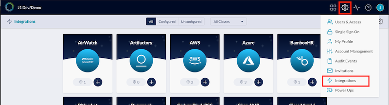
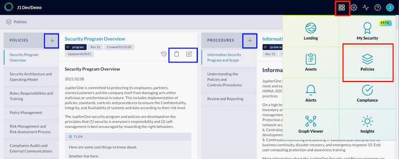
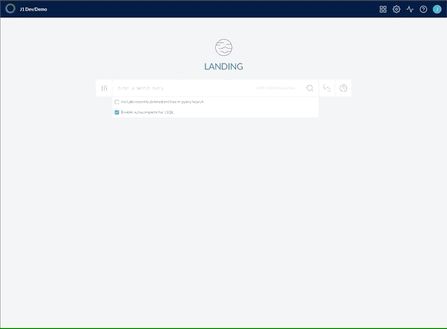
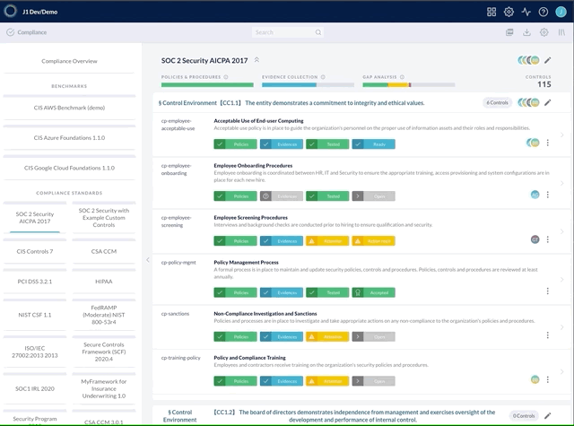

# SOC 2 using JupiterOne

## 1. Configure integrations

Ensure all relevant managed integrations are properly configured to be working; for SOC 2, you’ll need to make a determination as to which integrations are necessary based on your in-scope environment, e.g., the relevant system components, infrastructure, tooling, etc. that are necessary to provide your service or product to your customers. 

Link within the app: [https://j1.apps.us.jupiterone.io/integrations](https://j1.apps.us.jupiterone.io/integrations)

Existing support documentation:

[Configure integrations](https://support.jupiterone.io/hc/en-us/articles/360022884813-1-9-Configure-Integrations)

## 2. Policies + procedures

Review all of the templated, out-of-the-box policies + procedures, ensuring they accurately represent your organization’s principles/processes, tailoring and/or adding your own documentation where relevant. 

Out of the box, the policies app comes with templated policies + procedures that can be edited/modified. Additionally, you can add your own policies + procedures + remove/delete documents that aren’t relevant to your organization.

Reviewing + tailoring instructions are provided for the default, templated policies + procedures in the UI.

Link within the app: [https://j1.apps.us.jupiterone.io/policies](https://j1.apps.us.jupiterone.io/policies)

Existing support documentation:

[Managing policies + procedures](https://support.jupiterone.io/hc/en-us/articles/360041809413-Managing-Policies-and-Procedures-on-JupiterOne)\
[Using the policy builder CLI](https://support.jupiterone.io/hc/en-us/articles/360041809453-Using-the-Policy-Builder-CLI)\
[Policies + procedures structure](https://support.jupiterone.io/hc/en-us/articles/360041337654-JupiterOne-Policies-and-Procedures-Structure)

## 3. Import compliance framework

Import the **SOC 2 Security Controls** compliance framework within the Compliance app. 

Link within the app: [https://j1.apps.us.jupiterone.io/compliance](https://j1dev.apps.us.jupiterone.io/compliance)

Existing support documentation:

[Import compliance standard or security questionnaire](https://support.jupiterone.io/hc/en-us/articles/360042682773-Import-Compliance-Standard-or-Security-Questionnaire)

### Adding, editing, removing controls (control mapping)

There is the functionality within JupiterOne to add controls, remove controls, and/or update control wording by editing the JSON (or CSV) framework specification.

## 4. Review control/requirement policy + procedure mapping

Within the imported SOC 2 framework, all of the templated policies + procedures are already mapped to the standard controls in the framework. If this meets your requirements, feel free to move on to the next step. 

However, if you wish to update the default mapping, e.g, if you want to add in your own policies or procedures, you can review any/all of the controls for their existing mapping to make updates or changes.

Existing support documentation:

[Compliance policies mapping](https://support.jupiterone.io/hc/en-us/articles/360042195394-Compliance-Policies-Mapping)\
[Policies + procedures structure](https://support.jupiterone.io/hc/en-us/articles/360041337654-JupiterOne-Policies-and-Procedures-Structure)

## 5. Review evidence mapping

For each control, the desired outcome is the corresponding evidence will suffice to demonstrate reasonable assurance the control has been designed + implemented (SOC 2 Type I) + operating effectively over the review period (SOC 2 Type II). 

By default, for the standard controls within the SOC 2 framework in JupiterOne, more than half the controls have partial to full evidence already mapped, by way of JupiterOne query language (J1QL) managed queries.

1. For each control, review default mapped evidence, if applicable.
    1. If the evidence is satisfactory (as you'd expect for output), move on to the next control.
    2. If the evidence isn’t satisfactory, i.e., incorrect or incomplete:
        1.  Review the mapped queries + tailor the queries so the returned output is as expected.

Existing support documentation: 

[J1QL query tutorial](https://support.jupiterone.io/hc/en-us/articles/360022720434-4-9-J1QL-Query-Tutorial)\
[Search quickstart](https://support.jupiterone.io/hc/en-us/articles/360022705414-2-9-Search-Quickstart)\
[J1QL language specs](https://support.jupiterone.io/hc/en-us/articles/360022722014-J1QL-Language-Specs) 

### Add additional queries
1. Adding a new query, or,

Existing support documentation: 

[J1QL query tutorial](https://support.jupiterone.io/hc/en-us/articles/360022720434-4-9-J1QL-Query-Tutorial)\
[Search quickstart](https://support.jupiterone.io/hc/en-us/articles/360022705414-2-9-Search-Quickstart)\
[J1QL language specs](https://support.jupiterone.io/hc/en-us/articles/360022722014-J1QL-Language-Specs)

2. Mapping a prewritten, templated query (over 400 are in our library)

Existing support documentation:

[Common questions + queries](https://support.jupiterone.io/hc/en-us/articles/360024909073-Common-Questions-and-Queries)

[All questions + queries](https://ask.us.jupiterone.io/filter?tagFilter=all)

### Adding additional evidence
1. Link additional evidence, i.e., hyperlink
2. Upload additional evidence, e.g., spreadsheets, compressed files, etc.
3. Add notes/attestations

## 6. Reporting on/monitoring SOC 2 progress/readiness + workflows

### Reporting/monitoring

For visibility, the default SOC 2 compliance framework landing page has the status of both evidence collection + a gap analysis to quickly identify which controls require your attention.

Hovering over any of the three (3) progress bars will provide a more detailed summary, with any of the reported details, clickable to quickly filter all of the controls with the same status:

### Internal + auditor workflows

With the Compliance app in JupiterOne, you can enable workflow functionality that will allow your team to internally track workflow status, along with the ability to invite your external auditors to use JupiterOne to conduct the assessment with the same workflow functionality.

#### Managing access

You can invite internal team members or external users, e.g., auditors, into your JupiterOne instance/environment.

- Access is managed by RBAC groups
- Users are invited via email address
- Granular access permissions are available

Existing support documentation:

[Invite your team members](https://support.jupiterone.io/hc/en-us/articles/360023317474-9-9-Invite-Your-Team-Members)

#### Recurring review configuration

For ongoing/continuous compliance monitoring, you can set the recurring review configuration workflow to assign specific team members to receive notifications to review/maintain individual controls, groups of controls, or entire frameworks.

## 7. Exporting compliance artifacts

JupiterOne provides the capability to export compliance artifacts, e.g, control evidence, policies + procedures, reports, etc.

- Exporting evidence for a single control
- Exporting evidence across all controls within the SOC 2 framework, either as a summary, or the entire evidence output
- Exporting a SOC 2 summary report

