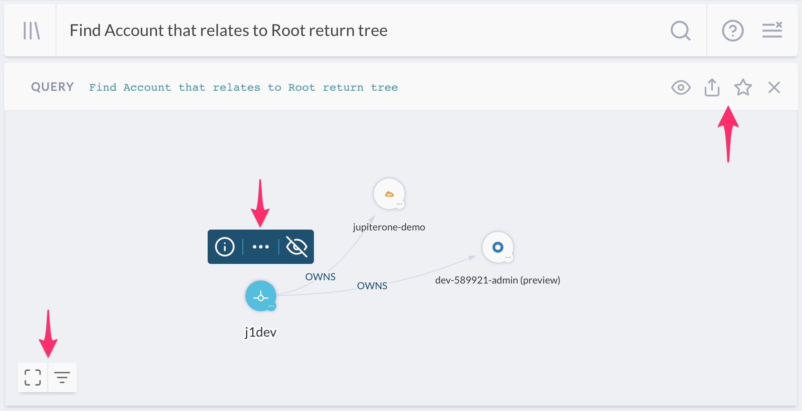
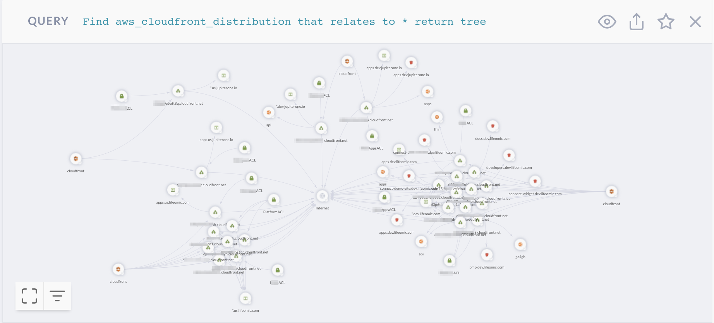

# JupiterOne Query Language Tutorial

Querying can be the most challenging, yet the most fun and rewarding part of the
JupiterOne experience. Once you become familiar with the query language, we are
certain that you will find yourself uncovering all sorts of previously
undiscovered insight from your data.

The JupiterOne Query Language (aka “J1QL”) is a query language for finding the
entities and relationships within your digital environment. J1QL blends together
the capabilities of asking questions, performing full text search, or querying
the complex entity-relationship graph.

There are plenty of pre-packaged queries you can easily use in the **Landing**
app or browse in **Query Library**. This tutorial focuses instead on helping you
construct custom queries yourself.

## Part 1 - Simple Root query

First, let’s try this query:

```jiql
Find Account that relates to Root return tree
```

Please note the noun that immediately follows the verb is case sensitive:

- A `TitleCase` word tells the query to search for entities of that **class** (e.g.
`Account`, `Firewall`, `Gateway`, `Host`, `User`, `Root`, `Internet`, etc.);
- A `snake_case` word tells the query to search for entities of that **type**
  (e.g. `aws_account`, `aws_security_group`, `aws_internet_gateway`,
  `aws_instance`, `aws_iam_user`, `okta_user`, `user_endpoint`, etc.)

You should get a result that looks like this (the `return tree` part of the query
tells it to show the graph view by default):



The selected node in the above example is the special `Root` node, which
represents your organization. Depending on the number of integration
configurations you have, you'll see different number of accounts connected,
showing that the `Root` entity `OWNS` these `Account` entities.

See the three sets of controls in the result panel. Starting from top right to
bottom left --

The first set of controls (next to the query) allows you to:

- Switch views between **Table**, **Graph**, **Raw JSON**, and **Pretty JSON**.

- Share the query -- shows a popup box with the weblink to copy and share.

- Save the query -- give it a title, description, and optionally some tags to
  save it to your own query library.

- Close / remove this result panel from the page.

The second set of controls (above the selected entity node) allows you to:

- Show the detailed properties, tags and metadata of the selected entity.
- Expand the entity to see more of its connected neighbors - this will bring in
  additional data that may not have been returned by the original query,
  allowing you to further the search and analysis.

- Hide the selected entity node from the graph view - once you've hidden an
  entity, an unhide button will show up in the third set of controls at the
  bottom left of the graph, allowing you to unhide all currently hidden
  entities.

The last set of controls (at the bottom left corner) allows you to:

- Toggle the full screen mode.

- Opens up the filter panel to show/hide entities in the graph by account or
  entity type.

- Unhide all currently hidden entities (not shown in the above screenshot -- it
  only shows up when there is at least one hidden entity).

## Part 2 - Infrastructure Analysis

*Examples in this section require at least one AWS integration configuration.*

If you've configured an AWS integration, you are now ready to try something a
lot more interesting. Type in, or copy/paste the following query:

### 2a - SSH Key Usage Examples

```j1ql
Find AccessKey with usage='ssh'
```

> This should find a set of `aws_access_key` entities used for SSH access into
> your EC2 instances, assuming you have some of those and they are configured to
> allow SSH access.

You can also query by the entity type instead of its class. The following query
will get you the same result - unless you also have SSH Keys you've added from
other integrations (non-AWS) or from the UI / API.

```j1ql
Find aws_key_pair
```

Now expand the search a little bit with the following:

```j1ql
Find Host as h
  that uses AccessKey with usage='ssh' as k
  return
    h.tag.AccountName,
    h._type,
    h.displayName,
    h.instanceId,
    h.region,
    h.availabilityZone,
    h.publicIpAddress,
    h.privateIpAddress,
    h.platform,
    h.instanceType,
    h.state,
    k._type,
    k.displayName
```

> This finds the `Host` entities that `USES` each `AccessKey` and returns a set
> of specific properties. You can add or remove properties returned as desired.
>
> Note the keyword `that` is what tells the query to traverse the graph to find
> connections/relationships between entities, followed by a _verb_ that
> represents :) the relationship class.
>
> Also keep in mind you can switch to the **Graph** view to get a more visual
> result, and continue to drill down interactively.

Again, you can query using the more specific entity types. For example:

```j1ql
Find aws_instance that uses aws_key_pair
```

Or mix and match them:

```j1ql
Find Host that uses aws_key_pair
```

> Note that the relationship keyword/verb is *not* case sensitive.

### 2b - EBS Volume Examples

First, let's see if there are any unencrypted EBS volumes:

```j1ql
Find aws_ebs_volume with encrypted != true
```

> Note in the above query, the `with` keyword binds to the entity noun
immediately to its left, and allows you to filter results on that entity's
property values.

If the above query finds some unencrypted EBS volumes, it'll be interested to
see what's using them:

```j1ql
Find Host that uses aws_ebs_volume with encrypted != true
```

> You can view the `aws_ebs_volume` entities and their relationships in the
> **Graph** mode, and further inspect the properties on each entity node or
> relationship edge. You can also expand to see more connected entities and
> relationships.

Are these actively in use? And in production?

```j1ql
Find Host with active = true and tag.Production = true
  that uses aws_ebs_volume with encrypted != true
```

What subnets are these instances in? Let's also just return a few key properties
from type of entities related in this search:

```j1ql
Find Network as n
  that has Host as h
  that uses aws_ebs_volume with encrypted != true and tag.Production = true as e return
    n.displayName, h._type, h.displayName, e.displayName, e.encrypted
```

OK. How about any EBS Volumes _not_ actively in use? Perhaps some of them can be
removed...

```j1ql
Find aws_ebs_volume that !uses Host
```

> You may notice the above query feels backwards. That's okay. The query will
> work the same way regardless of the direction of relationship. Because the
> query by default returns all properties from the initial set of entities,
> it is sometimes easier to reverse the query direction so that you get the
> data you're looking for more easily.
>
> Technically, `Find Host that !uses aws_ebs_volume as v return v.*` may feel
> more correct, but it is definitely a bit more to type out.

### 2c - Unencrypted Data

There are many types of data stores you may have in AWS. For example, **EBS
Volumes**, **S3 Buckets**, **RDS Clusters and Instances**, **DynamoDB Tables**,
**Redshift Clusters**, to name a few. You likely want them to be encrypted if
they store confidential data.

How do you find out if that's the case?

```j1ql
Find (aws_s3_bucket|aws_rds_cluster|aws_db_instance|aws_dynamodb_table|aws_redshift_cluster) with encrypted!=true
```

The above query will certainly do the job, but it's quite complicated. This is
where the abstract class labeling automatically assigned by JupiterOne serves
its purpose. Querying by class makes it a whole lot simpler:

```j1ql
Find DataStore with encrypted != true
```

Now, you can start adding a few property filters to make the results much more
focused, to help cut down the noise or to prioritize remediation. For example:

```j1ql
Find DataStore with
  encrypted != true and
  tag.Production = true and
  (classification = 'confidential' or classification = 'restricted')
```

### 2d - Tagging Resources

As you can see from some of the earlier examples, tagging resources can be very
useful operationally. That's why we highly recommend tagging your resources at
the source. These tags will be ingested by JupiterOne and you can use them in
your custom queries.

By default, the packaged queries provided by JupiterOne, as seen in the **Query
Library** from the **Landing** app and used in the **Compliance** app, rely on
the following tags:

- `Classification`
- `Owner`
- `PII` or `PHI` or `PCI` (`boolean` tags to indicate data type)
- `AccountName`
- `Production`

All custom tags ingested by JupiterOne integrations are prefixed with
`tag.<TagName>`. They need to be used as such in the query.

The `Classification` and `Owner` tags are automatically captured as properties
so they can be used directly in the query without the `tag.` prefix - in all
lower case: `classification = '...'` or `owner= '...'`.

The `tag.AccountName` (`string`) and `tag.Production` (`boolean`) tags can be
added by JupiterOne as part of the Advanced Options in each integration
configuration.

### 2e - Network Resources and Configurations

You may have a number of questions to ask or confirm about your network
resources and their configurations. Here are a few examples.

Let's start with finding a few network resources and their connections:

```j1ql
Find (Gateway|Firewall) with category='network'
  that relates to *
  return tree
```

> Keep in mind you can toggle the result back to **Table** view if you'd like.

How about networks and subnets?

```j1ql
Find Network that contains Network return tree
```

Or resources in a VPC:

```j1ql
Find Network that has (Host|Cluster|Database) return tree
```

> The result looks like this (you may have a lot more going on than what's shown
> here from the demo environment):
>
> 
>
> Note that the properties panel for the selected `aws_subnet` has a `webLink`
> that will allow you to quickly get to the source directly in the AWS web
> console.

In AWS, you most likely have set up **CloudFront distributions** to distribute
traffic to your API Gateways or static websites hosted in S3. What does that
look like?

```j1ql
Find aws_cloudfront_distribution that relates to * return tree
```

> Here, the result looks a little busier, from a J1 account with multiple AWS
> integration configurations and quite a few `aws_cloudfront_distribution`
> entities and relationships.
>
> 
>
> This graph shows you the **origins** connected to the **distributions**: both
> **S3 buckets** (for static website/contents) and **API Gateways**.
> Additionally, the graph shows you the **ACM Certificate** being used by them
> and the **WAF ACL**, if any, configured to protect them.
>
> Keep in mind you can select any entity node in the graph to inspect its
> detailed properties, or find a web link to quick get to the source in AWS
> web console.

If you use **AWS Transfer for SFTP**, you can find the **Transfer Servers**,
**Users**, which **IAM Roles** are assigned to them, and which **S3 Buckets**
the users have access to.

```j1ql
Find aws_account
  that HAS aws_transfer
  that HAS Host
  that HAS User
  that RELATES TO *
  return tree
```

> You'll get a visual that looks like this:
>
> 

### 2f - Serverless Functions

Are you using serverless (lambda functions)? If you are, here are a few things
that may help you see how they are set up.

Let's start with a listing of your lambda functions:

```j1ql
Find aws_lambda_function
```

Simple. Now, what triggers each function?

```j1ql
find aws_lambda_function as function
  that TRIGGERS * as trigger
  return
    trigger._type, trigger.displayName, trigger.arn, trigger.webLink, function.functionName, function.arn, function.webLink
```

Are there lambda functions with access to resources in a VPC?

```j1ql
Find aws_lambda_function that has aws_vpc return tree
```

> The above query will give you a visual graph of the lambda functions and
> the VPC they are configured to run inside.
>
> It is actually a best practice to **not** run lambda functions without access
> to a VPC unless they need direct access to resources within one -- for
> example, EC2 instances, RDS databases, or ElasticSearch/ElastiCache.

**Is inbound SSH allowed directly from an external host or network?**

```j1ql
Find Firewall as fw
  that ALLOWS as rule (Host|Network)
    with internal=false or internal=undefined as src
  where rule.ingress=true and (rule.fromPort<=22 and rule.toPort>=22)
  return
    fw._type,
    fw.displayName,
    rule.fromPort,
    rule.toPort,
    src.displayName,
    src.ipAddress,
    src.CIDR
```

> Keep in mind you can toggle to **Graph** View to see the above results more
> visually and interactively.

**What production resources are directly connected/exposed to the Internet/everyone?**

```j1ql
Find (Internet|Everyone)
  that relates to *
    with tag.Production=true and _class!='Firewall' and _class!='Gateway'
  return tree
```

**What are my network layer resources?**

```j1ql
Find (Firewall | Gateway) with category='network'
```

**What about Security Group protection?**

```j1ql
Find aws_security_group that PROTECTS aws_instance return tree
```

> Pro Tip: selecting an edge in the graph to see the security group rule details
> (i.e. properties on the edge)

## Part 3 - User and Access Analysis

Once you have an Okta or OneLogin integration configured, try some of these
example queries yourself.

### 3a - IdP users and access

*Examples in this section require an identity provider integration (Okta or
OneLogin)*

**Are there system accounts do not belong to an individual employee/user?**

```j1ql
Find User that !is Person
```

> `User` entities in JupiterOne are automatically mapped to a corresponding
> `Person` (`_type: 'employee'`) entity, when there is at least one Identity
> Provider (IdP) integration configuration - such as Okta or OneLogin.
>
> Pro Tip 1: set the `userType` property of the user profile in your IdP account
> to `'system' or 'generic' or 'bot'` will prevent JupiterOne from creating a
> `Person` entity for that user.
>
> Pro Tip 2: set the `username` or add a `username` Tag to your `aws_iam_user`
> or other non-IdP users to be the email address of a Person / employee will
> allow JupiterOne to automatically map that User to its corresponding Person.

**Which active user accounts do not have multi-factor authentication enabled?**

```j1ql
Find User with active = true and mfaEnabled != true
  that !(ASSIGNED|USES|HAS) mfa_device
```

> Depending on the specific IdP integration, a `User` entity may have a
> relationship mapping to an `mfa_device` instead of the `mfaEnabled` flag
> directly as a property.
>
> Therefore, The above queries finds all `User` entities with the `active` flag
> but not the `mfaEnabled` flag set to true on its properties, and additionally,
> checks for the existence of an relationship between that `User` and any
> `mfa_device` assigned or in use.

**Are there users accessing my 'AWS' application without using MFA?**

```j1ql
Find User with active = true and mfaEnabled != true
  that ASSIGNED Application with displayName = 'Amazon Web Services'
```

> Replace the string value of the `displayName` to check for another application.
>
> You can also use `shortName = 'aws'`, which will check for all AWS application
> instances, if you have more than one AWS SAML app configured with your IdP.

**Find all contractors and external users in the environment.**

```j1ql
Find User that IS Person that !EMPLOYS Root
```

> The above query finds user accounts belong to any individual not directly
> employed by your organization (`Root` entity).

```j1ql
Find User as u that IS Person as p
  where u.userType='contractor' or p.employeeType='contractor'
```

> The above query finds contractor users.

### 3b - Cloud users and access

*Examples in this section require at least one AWS integration configuration.*

**Who has been assigned full Administrator access in AWS?**

```j1ql
find (aws_iam_role|aws_iam_user|aws_iam_group)
  that ASSIGNED AccessPolicy with policyName='AdministratorAccess'
```

**Which IAM roles are assigned which IAM policies?**

```j1ql
find aws_iam_role as role
  that ASSIGNED AccessPolicy as policy
  return
    role._type as RoleType,
    role.roleName as RoleName,
    policy._type as PolicyType,
    policy.policyName as PolicyName
```

### 3c - Combined users and access across all environments

*Examples in this section work best when there are both IdP and AWS integration configurations enabled in JupiterOne.*

**Who has access to what systems/resources?**

```j1ql
Find (User|Person) as u
  that (ASSIGNED|TRUSTS|HAS|OWNS)
    (Application|AccessPolicy|AccessRole|Account|Device|Host) as a
  return
    u.displayName, u._type, u.username, u.email,
    a._type, a.displayName, a.tag.AccountName
  order by u.displayName
```

## Part 4 - Cross Account Analysis

*Many examples in this section requires both Okta and AWS integration
configurations in JupiterOne, as well as an AWS SAML app configured in your Okta
account. Some queries work best when you have multiple AWS configurations.*

**Who has access to my AWS accounts via single sign on (SSO)?**

```j1ql
Find User as U
  that ASSIGNED Application as App
  that CONNECTS aws_account as AWS
  return
    U.displayName as User,
    App.tag.AccountName as IdP,
    App.displayName as ssoApplication,
    App.signOnMode as signOnMode,
    AWS.name as awsAccount
```

**Are there assume role trusts from one AWS account to other external entities?**

```j1ql
Find aws_account
  that HAS aws_iam
  that HAS aws_iam_role
  that TRUSTS (Account|AccessRole|User|UserGroup) with _source='system-mapper'
  return tree
```

> Note from the above query, `_source='system-mapper'` is an indicator that the
> trusted entity is not one ingested by an integration configuration, rather,
> mapped and created by JupiterOne during the analysis of Assume Role policies
> of the IAM roles in your account(s). Therefore, these entities are most likely
> external.
>
> For example, you will most definitely see the JupiterOne integration IAM role
> with a `TRUSTS` relationship to the JupiterOne AWS account.

## Part 5 - Endpoint Compliance

*Examples in this section require the activation of at least one JupiterOne
Endpoint Compliance Agent - powered by Stethoscope app.*

**Do I have local firewall enabled on end-user devices?**

```j1ql
Find HostAgent as agent
  that MONITORS user_endpoint as device
  return
    device.displayName,
    device.platform,
    device.osVersion,
    device.hardwareModel,
    device.owner
    agent.firewall,
    agent.compliant,
    agent._type,
    agent.displayName
```

**Whose endpoints are non-compliant?**

```j1ql
Find Person as person
  that OWNS (Host|Device) as device
  that MONITORS HostAgent with compliant!=true as agent
  return
    person.displayName,
    person.email,
    device.displayName,
    device.platform,
    device.osVersion,
    device.hardwareModel,
    device.owner,
    agent.compliant,
    agent._type,
    agent.displayName
```
