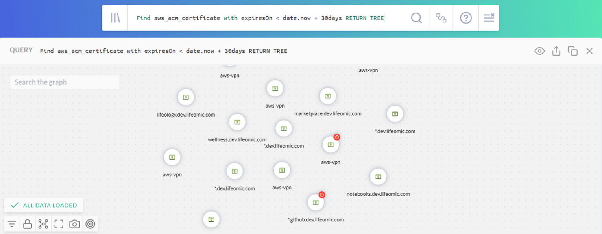
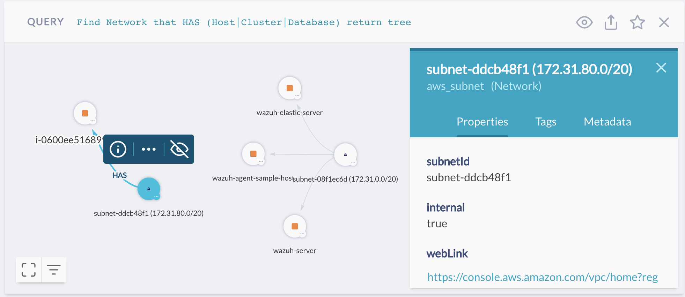
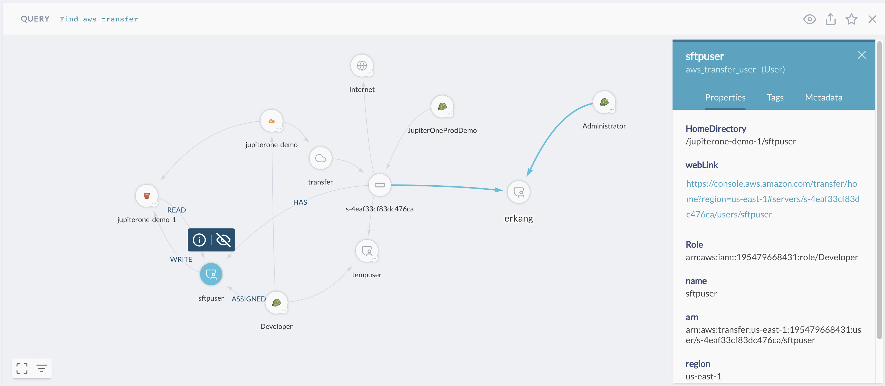
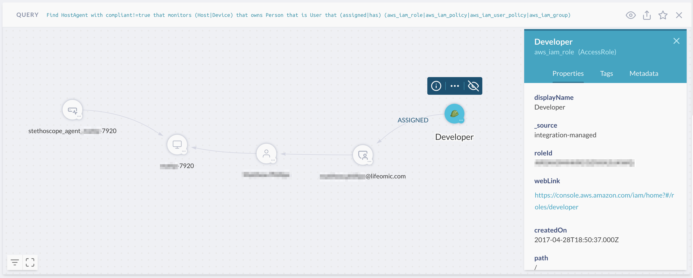

# JupiterOne Query Language Tutorial

Querying can be the most challenging yet the most rewarding part of the
JupiterOne experience. After you become familiar with the query language, 
you will uncover numerous previously undiscovered insights into your data.

The JupiterOne Query Language (J1QL) is a query language for finding the
assets and relationships within your digital environment. J1QL blends together
the capabilities of asking questions, performing full text search, or querying
the complex entity-relationship graph.

There are several prepackaged queries you can use in the **Search**
app or browse for in **Query Library**. This tutorial focuses on helping you
construct custom queries yourself.

This tutorial builds on the [full J1QL documentation][../j1ql-doc.md] using some
common use cases.

_The queries in this tutorial and other JupiterOne documentation are examples _
_that work in most cases, but may require fine-tuning based on the specific _
_structure of your data sources._

## Part 1:  Simple Root Query

Try this query:

```j1ql
Find Account that relates to Root return tree
```

The noun that immediately follows the verb is case-sensitive:

- A `TitleCase` word tells the query to search for assets of that **class** (such as
`Account`, `Firewall`, `Gateway`, `Host`, `User`, `Root`, `Internet`).
- A `snake_case` word tells the query to search for assets of that **type**
  (such as `aws_account`, `aws_security_group`, `aws_internet_gateway`,
  `aws_instance`, `aws_iam_user`, `okta_user`, `user_endpoint`)

You get a result similar to this (the `return tree` part of the query
tells it to show the graph view by default):



The selected asset in the above example is the special `Root` asset node, which
represents your organization. Depending on the number of integration
configurations you have, you see a different number of connected accounts,
showing that the `Root` entity `OWNS` these `Account`assets.

There are three sets of controls in the result panel. Starting from top-right to
bottom-left of the graph:

The first set of controls (next to the query) allows you to:

- Switch views between **Table**, **Graph**, **Raw JSON**, and **Pretty JSON**.

- Share the query, using a provided weblink to copy and share.

- Save the query, where you give it a title, description and, optionally, some tags to
  save it to your own query library.

- Close or remove this results panel from the page.

The second set of controls (above the selected asset node) allows you to:

- Show the detailed properties, tags, and metadata of the selected asset.
- Expand the asset to see more of its connected neighbors, which shows
  additional data that the original query may not have returned,
  allowing you to further the search and analysis.

- Hide the selected asset node from the graph view. After you have hidden
  an asset, an unhide button appears in the third set of controls at the
  bottom-left of the graph, allowing you to unhide all currently hidden
  assets.

The last set of controls (in the bottom-left corner) allows you to:

- Toggle the full screen mode.

- Opens the filter panel to show/hide assets in the graph by account or
  asset type.

- Unhide all currently hidden assets (not shown in the above image as it
  only shows when there is at least one hidden asset).

See more details on the graph controls in this [documentation][../quickstart-graph.md].

## Part 2: Infrastructure Analysis

*Examples in this section require at least one AWS integration configuration.*

If you have configured an AWS integration, you are now ready to try something more 
advanced

### SSH Key Usage Examples

Enter this query:

```j1ql
Find AccessKey with usage='ssh'
```

> This query finds a set of `aws_access_key` assets used for SSH access into
> your EC2 instances, assuming you have some of those and they are configured to
> allow SSH access.

You can also query by the asset type instead of its class. The following query
returns the same result unless you also have SSH keys you have added from
other non-AWS integrations or from the UI or API.

```j1ql
Find aws_key_pair
```

You can expand the search using the following:

```j1ql
Find Host as h
  that uses AccessKey with usage='ssh' as k
  return
    h.tag.AccountName,
    h._type,
    h.displayName,
    h.instanceId,
    h.region,
    h.availabilityZone,
    h.publicIpAddress,
    h.privateIpAddress,
    h.platform,
    h.instanceType,
    h.state,
    k._type,
    k.displayName
```

> This query finds the `Host` asset that `USES` each `AccessKey` and returns a set
> of specific properties. You can add or remove the returned properties, if necessary.
>
> The keyword `that` is what tells the query to traverse the graph to find
> connections/relationships between assets, followed by a _verb_ that
> represents the relationship class.
>
> Also,  you can switch to the **Graph** view to get a more visual result, and 
> continue to drill down interactively.

Again, you can query using the more specific asset types. For example:

```j1ql
Find aws_instance that uses aws_key_pair
```

Or mix and match them:

```j1ql
Find Host that uses aws_key_pair
```

> The relationship keyword/verb is *not* case-sensitive.

### EBS Volume Examples

First, to see if there are any unencrypted EBS volumes, use this query:

```j1ql
Find aws_ebs_volume with encrypted != true
```

> In the above query the `with` keyword binds to the asset noun
immediately to its left, and allows you to filter results on the property 
values of that entity.

If the above query finds some unencrypted EBS volumes, you can see what
is using them by entering:

```j1ql
Find Host that uses aws_ebs_volume with encrypted != true
```

> You can view the `aws_ebs_volume` assets and their relationships in the
> **Graph** mode, and further inspect the properties on each asset node or
> relationship edge. You can also expand to see more connected assets and
> relationships.

To see which volumes are active and in production, enter:

```j1ql
Find Host with active = true and tag.Production = true
  that uses aws_ebs_volume with encrypted != true
```

To determine which subnets these instances are in and to only return a few key properties
from type of assets related to this search, enter:

```j1ql
Find Network as n
  that has Host as h
  that uses aws_ebs_volume with encrypted != true and tag.Production = true as e return
    n.displayName, h._type, h.displayName, e.displayName, e.encrypted
```

To remove any unused EBS volumes, enter:

```j1ql
Find aws_ebs_volume that !uses Host
```

> The above query may seem backwards. The query works the same way 
> regardless of the direction of the relationship. Because the
> query, by default, returns all properties from the initial set of assets,
> it is sometimes easier to reverse the query direction so that you can more
> easily get the data you are searching.
>
> Technically, `Find Host that !uses aws_ebs_volume as v return v.*` may seem
> more correct, but it is a more lengthy query to enter.

### Unencrypted Data

There are many types of data stores you can have in AWS, such as EBS
Volumes, S3 Buckets, RDS Clusters and Instances, DynamoDB Tables, and
Redshift Clusters. You should ensure they are encrypted if they store 
confidential data.

To know if the data stores are encryped, enter:

```j1ql
Find (aws_s3_bucket|aws_rds_cluster|aws_db_instance|aws_dynamodb_table|aws_redshift_cluster) with encrypted!=true
```

The above query is complex. The abstract class labeling automatically assigned 
by J1 can help by querying by class:

```j1ql
Find DataStore with encrypted != true
```

Add a few property filters to make the results more focused, to help reduce the noise,
or to prioritize remediation:

```j1ql
Find DataStore with
  encrypted != true and
  tag.Production = true and
  (classification = 'confidential' or classification = 'restricted')
```

### Tagging Resources

As shown in the earlier examples, tagging resources is useful. It is recommended 
that you tag your resources at the source. J1 ingests these tags and you can use 
them in custom queries.

By default, the packaged queries provided by J1, as seen in the Query
Library from the Search app and used in the Compliance app, rely on
the following tags:

- `Classification`
- `Owner`
- `PII` or `PHI` or `PCI` (`boolean` tags to indicate data type)
- `AccountName`
- `Production`

All custom tags ingested by J1 integrations are prefixed with
`tag.<TagName>`, therefore. you must use the tags this way in the query.

The `Classification` and `Owner` tags are automatically captured as properties
so J1 can use them directly in the query without the `tag.` prefix, in all
lower case: `classification = '...'` or `owner= '...'`.

J1 can add the `tag.AccountName` (`string`) and `tag.Production` (`boolean`) tags 
as part of the advanced options in each integration configuration.

### Network Resources and Configurations

You can use queries to ask questions or confirm information about your network
resources and their configurations. 

For example, to find network resources and their connections:

```j1ql
Find (Gateway|Firewall) with category='network'
  that relates to *
  return tree
```

> Remember that you can toggle the result back to **Table** view.

To find networks and subnets:

```j1ql
Find Network that contains Network return tree
```

Or resources in a VPC:

```j1ql
Find Network that has (Host|Cluster|Database) return tree
```

> This is a basic result. Your environment may look more complex:
> 
>
> 
>The properties side panel for the selected `aws_subnet` has a `webLink`
> that enables you to quickly get to the source directly in the AWS web
> console.

In AWS, you may have set up CloudFront distributions to distribute
traffic to your API gateways or static websites hosted in S3, such as this example:

```j1ql
Find aws_cloudfront_distribution that relates to * return tree
```

> The following is a J1 account with multiple AWS integration configurations 
> and several `aws_cloudfront_distribution` assets and relationships.
> 
>
> 
>This graph shows you the origins connected to the distributions: both
> S3 buckets (for static website/contents) and API gateways.
> Additionally, the graph shows you the ACM certificate they use
> and the WAF ACL, if any, configured to protect them.
> 
>You can select any asset node in the graph to inspect its
> detailed properties, or find a web link to get to the source in the AWS
> web console.

If you use AWS Transfer for SFTP, you can find the transfer servers,
users, which IAM roles are assigned to them, and to which S3 buckets
the users have access.

```j1ql
Find aws_account
  that HAS aws_transfer
  that HAS Host
  that HAS User
  that RELATES TO *
  return tree
```

> You get a visual similar to this:
>
> 

### Serverless Functions

If you are using serverless (Lambda) functions) there are a few things
to help you see how they are configured.

To see a listing of your lambda functions:

```j1ql
Find aws_lambda_function
```

To see what triggers each function:

```j1ql
find aws_lambda_function as function
  that TRIGGERS * as trigger
  return
    trigger._type, trigger.displayName, trigger.arn, trigger.webLink, function.functionName, function.arn, function.webLink
```

To see if there are Lambda functions with access to resources in a VPC:

```j1ql
Find aws_lambda_function that has aws_vpc return tree
```

> The above query gives you a visual graph of the Lambda functions and
> the VPC they are configured to run inside.
>
> It is a best practice to **not** run Lambda functions without access
> to a VPC unless they need direct access to resources within one, such as 
> EC2 instances, RDS databases, or ElasticSearch/ElastiCache.

To see if inbound SSH is allowed directly from an external host or network:

```j1ql
Find Firewall as fw
  that ALLOWS as rule (Host|Network)
    with internal=false or internal=undefined as src
  where rule.ingress=true and (rule.fromPort<=22 and rule.toPort>=22)
  return
    fw._type,
    fw.displayName,
    rule.fromPort,
    rule.toPort,
    src.displayName,
    src.ipAddress,
    src.CIDR
```

> The above query uses `where` to filter the property values of the
> relationship. You can use both `with` and `where` to filter property values of
> assets. See the [full J1QL documentation][../j1ql-doc.md] for more details.
>
> Also, you can toggle to the **Graph** view to see the above results more 
> visually and interactively.

To see which production resources are directly connected/exposed to the internet/everyone:

```j1ql
Find (Internet|Everyone)
  that relates to *
    with tag.Production=true and _class!='Firewall' and _class!='Gateway'
  return tree
```

To see your network layer resources:

```j1ql
Find (Firewall | Gateway) with category='network'
```

To learn about security group protection:

```j1ql
Find aws_security_group that PROTECTS aws_instance return tree
```

> **TIP**: Select a relationship edge in the graph to see the security group rule details, such as
> the properties on the relationship edge.

## Part 3: User and Access Analysis

After you have configured an Okta or OneLogin integration,  you can use these queries.

### IdP users and access

*Examples in this section require an identity provider integration (Okta or OneLogin)*.

To find out if there are system accounts that do not belong to an individual employee/user:

```j1ql
Find User that !is Person
```

> `User` entities in J1 are automatically mapped to a corresponding
> `Person` (`_type: 'employee'`) asset when there is at least one Identity
> Provider (IdP) integration configuration such as Okta or OneLogin.
>
> **TIP**:  Set the `userType` property of the user profile in your IdP account
> to `'system' or 'generic' or 'bot'` to prevent J1 from creating a
> `Person` entity for that user.
>
> **TIP:** Setting the `username` of your `aws_iam_user` or other non-IdP users to
> be the email address of a person / employee enables J1 to
> automatically map that user to its corresponding person. Alternatively, you
> can add an `email` tag to your `aws_iam_user` for the mapping to work.

To see which active user accounts do not have multi-factor authentication enabled:

```j1ql
Find User with active = true and mfaEnabled != true
  that !(ASSIGNED|USES|HAS) mfa_device
```

> Depending on the specific IdP integration, a `User` asset may have a
> relationship mapping to an `mfa_device` instead of the `mfaEnabled` flag
> directly as a property.
>
> Therefore, the above query finds all `User` assets with the `active` flag
> but not the `mfaEnabled` flag set to true on its properties and, additionally,
> checks for the existence of an relationship between that `User` and any
> `mfa_device` assigned or in use.

To find out if there are users accessing my AWS application without using MFA:

```j1ql
Find User with active = true and mfaEnabled != true
  that ASSIGNED Application with displayName = 'Amazon Web Services'
```

> Replace the string value of the `displayName` to check for another application.
>
> You can also use `shortName = 'aws'`, which checks for all AWS application
> instances, if you have more than one AWS SAML app configured with your IdP.

**Find all contractors and external users in the environment.**

```j1ql
Find User that IS Person that !EMPLOYS Root
```

> The above query finds user accounts belong to any individual not directly
> employed by your organization (`Root` entity).

```j1ql
Find User as u that IS Person as p
  where u.userType='contractor' or p.employeeType='contractor'
```

> The above query finds contractor users.

### Cloud users and access

*Examples in this section require at least one AWS integration configuration.*

To see who has been assigned full administrator access in AWS:

```j1ql
find (aws_iam_role|aws_iam_user|aws_iam_group)
  that ASSIGNED AccessPolicy with policyName='AdministratorAccess'
```

To find which IAM roles are assigned which IAM policies:

```j1ql
find aws_iam_role as role
  that ASSIGNED AccessPolicy as policy
  return
    role._type as RoleType,
    role.roleName as RoleName,
    policy._type as PolicyType,
    policy.policyName as PolicyName
```

### Combined users and access across all environments

*Examples in this section work best when there are both IdP and AWS integration configurations enabled in JupiterOne.*

To see who has access to what systems/resources:

```j1ql
Find (User|Person) as u
  that (ASSIGNED|TRUSTS|HAS|OWNS)
    (Application|AccessPolicy|AccessRole|Account|Device|Host) as a
  return
    u.displayName, u._type, u.username, u.email,
    a._type, a.displayName, a.tag.AccountName
  order by u.displayName
```

## Part 4 - Cross Account Analysis

*Many examples in this section requires both Okta and AWS integration configurations in JupiterOne, as well as an AWS SAML app configured in your Okta account. Some queries work best when you have multiple AWS configurations.*

To see who has access to your AWS accounts via single sign on (SSO):

```j1ql
Find User as U
  that ASSIGNED Application as App
  that CONNECTS aws_account as AWS
  return
    U.displayName as User,
    App.tag.AccountName as IdP,
    App.displayName as ssoApplication,
    App.signOnMode as signOnMode,
    AWS.name as awsAccount
```

To know if there are assume role trusts from one AWS account to other external entities:

```j1ql
Find aws_account
  that HAS aws_iam
  that HAS aws_iam_role
  that TRUSTS (Account|AccessRole|User|UserGroup) with _source='system-mapper'
  return tree
```

> In the above query, `_source='system-mapper'` is an indicator that the
> trusted asset is not one ingested by an integration configuration. Instead, it is
> mapped and created by J1 during the analysis of Assume Role policies
> of the IAM roles in your accounts. Therefore, these entities are most likely
> external.
>
> For example, you can see the JupiterOne integration IAM role
> with a `TRUSTS` relationship to the JupiterOne AWS account.

## Part 5 - Endpoint Compliance

*Examples in this section require the activation of at least one JupiterOne Endpoint Compliance Agent - powered by Stethoscope app.*

To see if the local firewall is enabled on end-user devices:

```j1ql
Find HostAgent as agent
  that MONITORS user_endpoint as device
  return
    device.displayName,
    device.platform,
    device.osVersion,
    device.hardwareModel,
    device.owner,
    agent.firewall,
    agent.compliant,
    agent._type,
    agent.displayName
```

To see which endpoints are non-compliant:

```j1ql
Find Person as person
  that OWNS (Host|Device) as device
  that MONITORS HostAgent with compliant!=true as agent
  return
    person.displayName,
    person.email,
    device.displayName,
    device.platform,
    device.osVersion,
    device.hardwareModel,
    device.owner,
    agent.compliant,
    agent._type,
    agent.displayName
```

To know which applications those users have access to:

```j1ql
Find HostAgent with compliant!=true
  that MONITORS (Host|Device)
  that OWNS Person
  that IS User
  that Assigned Application
  return tree
```

To see if any of those above have access to AWS:

```j1ql
Find HostAgent with compliant!=true
  that MONITORS (Host|Device)
  that OWNS Person
  that IS User
  that (ASSIGNED|HAS) (aws_iam_role|aws_iam_policy|aws_iam_user_policy|aws_iam_group)
  return tree
```

The resulting graph looks similar this:



