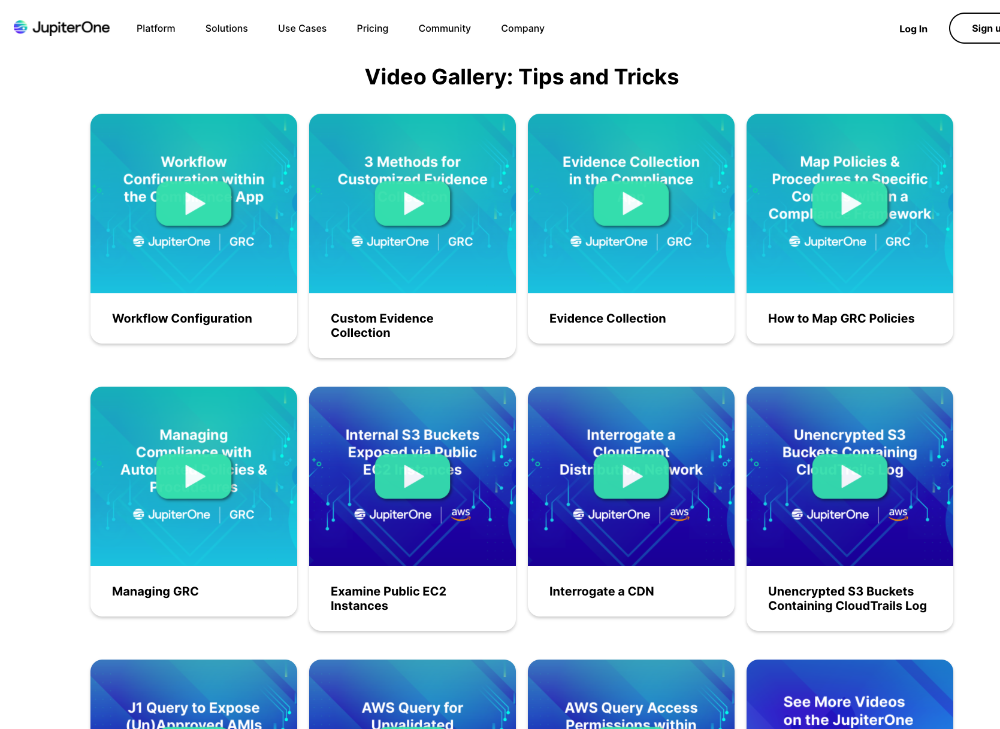

# Video Gallery

Check out our JupiterOne [video
gallery](https://info.jupiterone.com/community?submissionGuid=a634e4ba-ea04-4cd5-9f5c-bcf644cac6a6)
for numerous videos on tips + tricks using J1 in variety of use cases.

## Examining your AWS environment:
1. Examine public EC2 instances
1. Interrogate a CDN
1. Unencrypted S3 buckets containing CloudTrail logs
1. Unapproved AMIs
1. Unvalidated external trusts
1. Access permissions

## Governance, risk, compliance (GRC), e.g., SOC 2:
1. Workflow functionality within the Compliance app
1. Evidence collection in the Compliance app
1. Methods for customized evidence collection
1. Mapping policies + procedures to compliance framework controls/requirements

## Insights dashboards
1. Insights overview/quick start
1. Creating custom Insights dashboards
1. Creating custom widgets for dashboards
1. AWS-specific dashboards
1. General security dashboards

 And much more!

