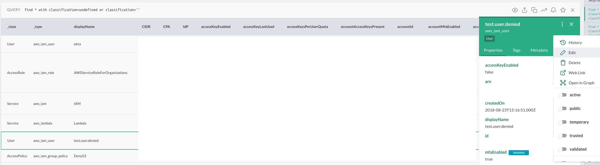
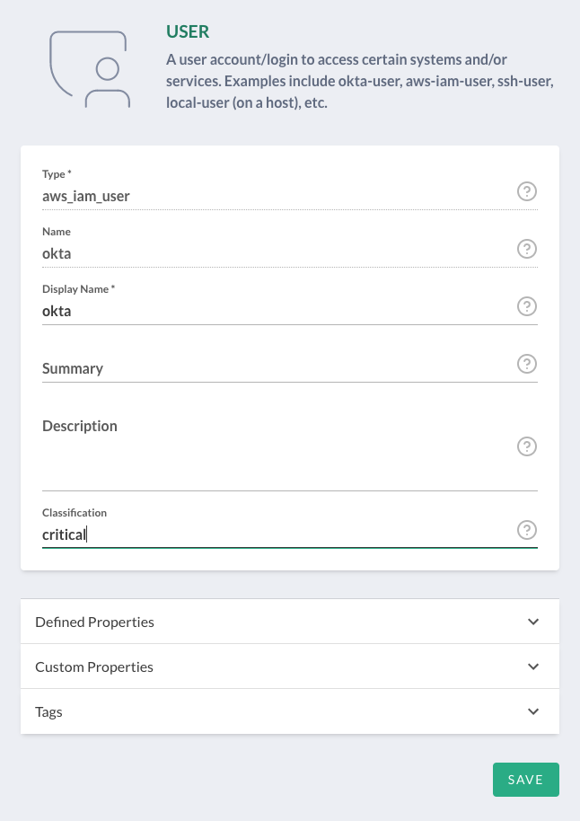
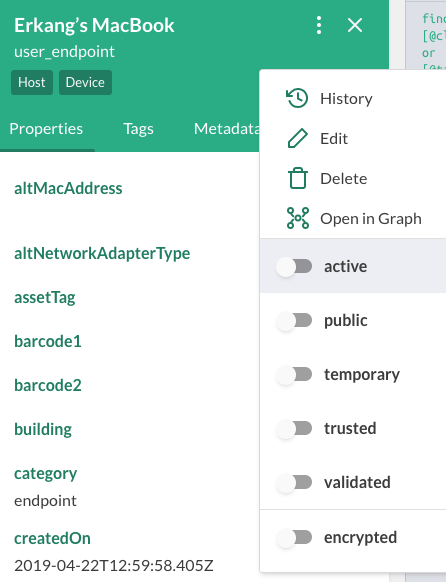
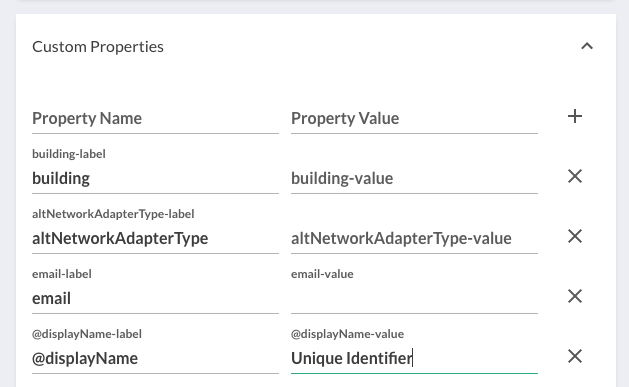
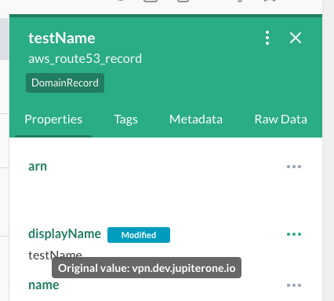
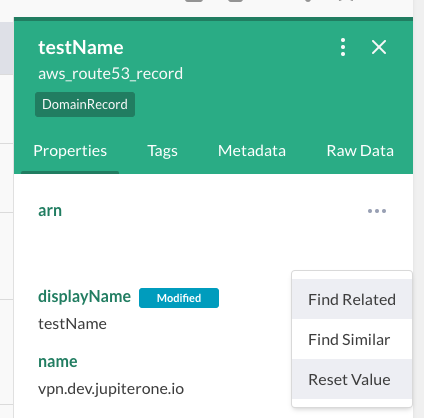

# Add and Query enriched or modified properties 

JupiterOne allows users to *enrich* or add properties to a resource. JupiterOne
also allows you to modify the existing properties of a resource. 

## Add enriched and modified properties

### Enrich a resource's properties in the UI

Let's take the example of our needing to classify all of our organization's
resources for compliance reasons. To start, let's run a query to determine which
of our resources do not already have a classification property defined.

```j1ql
Find * with classification=undefined or classification=''
```

You can now enrich the classification property in the UI for each of the
resources returned by following these steps:

1. Select the entity from the list of results
2. Click on the three vertical dots to access settings
3. Click on *Edit*
4. Enter a value under *Classification*
5. Click *Save*





**TIP -** Keep in mind that when you enrich/modify a property in JupiterOne,
these changes are only reflected in JupiterOne, and not to the properties of a
entity at the source. It is recommended to make changes at the data source when
possible.

### Modify a resource's properties in the UI

Let's take a different example of needing to modify the display name of a
resource because the name displayed in the JupiterOne graph view does not
provide helpful context.

1. Select the entity from the list of results
2. Click on the three vertical dots to access settings

From here, there are 2 ways to modify a resource's properties:

1. Toggle properties that have a true or false value



2. Click on *Edit* -> Select *Custom Properties* -> Edit the value next to
   *@displayName-value* -> Click *Save*



## Query for enriched and modified properties

J1QL (JupiterOne Query Language) uses the `@` prefix to query for any property
that has been manually enriched/modified. Let's take this example:

```j1ql
Find * with 
  [@classification]!=undefined or 
  [@tag.Classification]!=undefined
```

If an `@` property exists, this means that manual edit has been done to the
property.

**TIP -** The `[]` must be used when querying with special characters like `@`.

### Reset the value of enriched or modified properties

When you are viewing the properties of an entity, edited properties will have either an `Enriched` banner or a `Modified` banner next to them. If the original value of the property was undefined or null, the property will be flagged as `Enriched`. Otherwise, the property is flagged as `Modified`.

If the property had an original value from a JupiterOne managed integration, when you hover over the chip, you will see the original value in a tooltip.



In both instances, you can reset the property to the original value by clicking on the horizontal dots, and selecting *Reset Value*. This will remove the modified banner.




