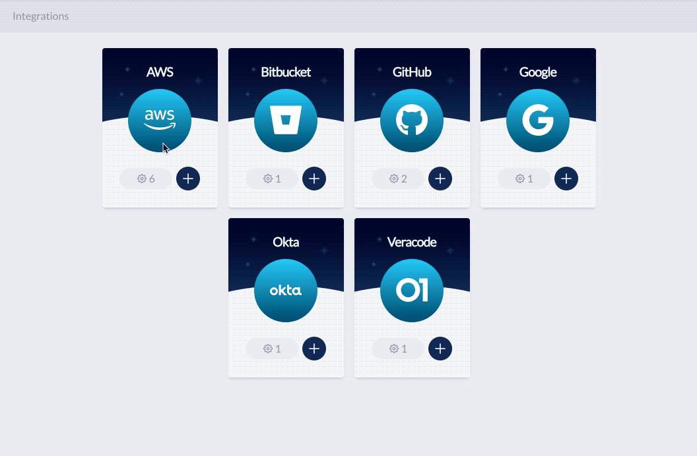

# JupiterOne 2019.18 Release

2019-03-18

## New Features

- Major UI update to provide a true single page app experience.

- Brand new experience for integrations configuration.

   

- New ingestion and analysis from **AWS**:

    - **AWS Transfer for SFTP** servers and users. Try this query:
    
      ```j1ql
      Find aws_account
        that HAS aws_transfer
        that HAS Host
        that HAS User
        that RELATES TO *
        return tree
      ```

- **Carbon Black PSC and Defense Sensor integration** released - ingests sensor
  agents, policies, and relationships indicating which sensor is assigned which
  policy. Also maps the sensors to end-user devices and the device owner. See
  [docs][carbon-black-psc-doc] for more details.

  Try these queries:

    ```j1ql
    Find cbdefense_sensor that PROTECTS Device

    Find Person
      that OWNS Device
      that PROTECTS cbdefense_sensor
    ```

- **OneLogin integration** released - ingests users, user groups, applications
  and their relationships. Similar to the Okta integration, this allows you to
  easily query and visualize *who has access to what* within your identity and
  access configuration and the connections to the rest of your digital
  infrastructure. See [docs][onelogin-doc] for more details.

## Improvements and Bug Fixes

- Improved entity relationships for Veracode integrations. Findings are mapped
  to vulnerablities and weaknesses when applicable.

- Lots of documentation updates on <https://support.jupiterone.io>, including:

    - Updated docs for each integration
    - [JupiterOne query tutorial][j1ql-tutorial]

- Improvements and bug fixes with AWS integration:

    - Lambda functions and Redshift clusters are now properly connected to their corresponding VPCs
    - Fixed an issue where duplicate Bucket ACL grants are processed
    - Added mapping to external/public AMIs not owned by the AWS account instance
    - Fixed a couple of Type Errors associated with property ingestion

- Fixed an authentication parameter issue with Google integration.

- Fixed an issue where deleted entities still appear in the Asset Inventory.

[carbon-black-psc-doc]: ../docs/integrations/cbdefense/jupiter-integration-cbdefense.md
[onelogin-doc]: ../docs/integrations/onelogin/jupiter-integration-onelogin.md
[j1ql-tutorial]: ../guides/tutorial-j1ql.md