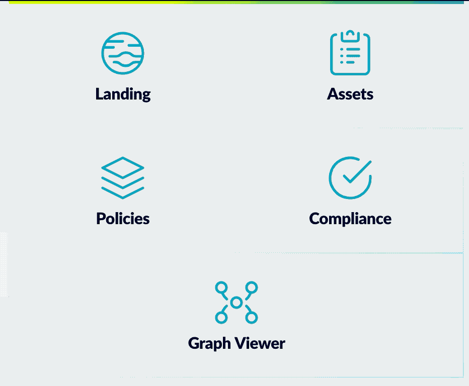
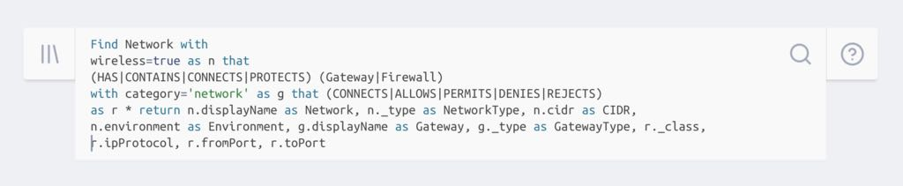

# JupiterOne 2019.19 Release

2019-04-01

## New Features

_We are excited to announce a major release with a ton of new features:_

- Major update to the **Policies** app, including

  - the ability to build (from a library of **over 150 document templates**),
    edit and continuously manage your organization's security policies and
    procedures directly online, using the web app;

  - a hierarchical graph view of the policies and the procedures that implements
    each policy, which serves as a visual proof to compliance auditors that the
    policies are fully implemented;

  - ability to allow general staff (all employees) to log in to JupiterOne to
    view published version of the policies and procedures, and capture their
    acknowledgement and acceptance.

- Updated **Policy Builder CLI** with `publish` command to promote local copies
  of the policies and procedures to your JupiterOne account online, to easily
  take advantage of the new features in the web app.

- Brand new **Compliance** app (early access release) that
  
  - automatically connects policies, procedures to each individual requirements
    of supported compliance frameworks; and
  
  - maps stored queries to compliance requirements to generate evidences for
    audits and assessments, in a data-centric and fully automated manner.

  - providers out-of-box support for
    - CIS Controls,
    - HIPAA,
    - HITRUST CSF and
    - PCI DSS

- Brand new **Onboarding** experience when you first sign up for a JupiterOne
  account, with guided tutorials for the major features.

- Early access release of the **Alerts** app -- alert rules must be provisioned
  via the API in this pre-release. Rules are configured using J1QL queries and
  alerted in the app. Future release will include email and Slack notifications.

- **WhiteHat Security integration** released - ingests vulnerability findings
  and maps them to applications or code repos as well as associated CVEs and
  CWEs as applicable. See [docs][whitehat-doc] for more details.

- **Wazuh OSSEC agent integration** released - ingests Wazuh OSSEC agents from
  your internally managed Wazuh deployment, and maps the agents to the hosts
  they protect. See [docs][wazuh-doc] for more details.

- New **App Switcher** design

  

- **Multi-line query input** with syntax highlighting in the Landing app

  

- New **status indicators** to easily spot data ingestion or authentication
  errors for each integration configuration.

  

## Improvements and Bug Fixes

- Fixed an issue with Okta integration where mapped relationship between an Okta
  user to the AWS IAM role assigned to the user was not properly removed when
  the assignment is revoked.

- Fixed the component height issue with the query result graph.

- Fixed an issue Asset Inventory app not properly filtering boolean properties.

- Improved performance and user experience when creating/updating/deleting an
  entity from the Asset Inventory web UI.

[whitehat-doc]: http://docs.jupiterone.io/en/latest/docs/integrations/whitehat/jupiter-integration-whitehat.html
[wazuh-doc]: http://docs.jupiterone.io/en/latest/docs/integrations/wazuh/jupiter-integration-wazuh.html
