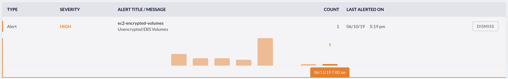
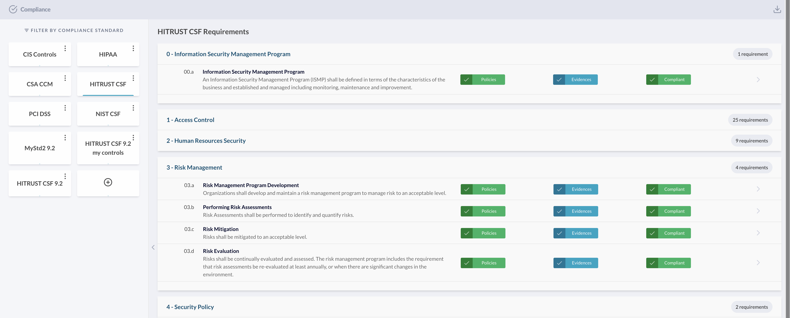
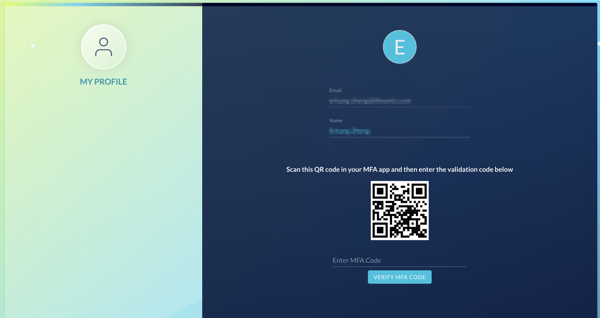
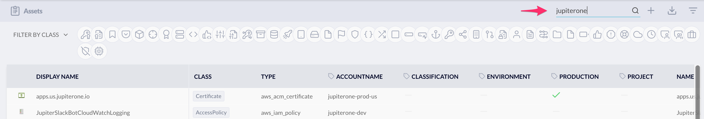

# JupiterOne 2019.24 Release

2019-06-11

## New Features

- Query language now supports **group by aggregates** based on entity attributes
  in addition to relationships. For example, try:

    ```j1ql
    // Count number of pull requests by repo and then state

    Find PR as pr
      return pr.repository, pr.state, count(pr)
    ```

    or

    ```j1ql
    // Count unencrypted data store by type

    Find DataStore with encrypted=false as ds
      return ds._type, count(ds) as value
    ```

- Updated **AWS GuardDuty** integration to better support threat analysis by
  parsing the threat intel list and attack source details. Try:

    ```j1ql
    Find Finding as f return f.threatList, count(f)
    ```

    or

    ```j1ql
    Find Finding as f return f.attackSrouce, count(f)
    ```

- **Alerts Trend and History Data**:

  Each alert now displays a **trend chart** to visualize changes over time.
  Selecting a data point on the trend chart will show you the results data
  captured by the alert at that point in time.

  

- **Compliance** app
  
    - allows you to import/upload any compliance framework, including your own
      custom security controls and best practices

    - performs automated **continuous gap analysis** based on matching queries

    - shows improved indicators to show status of *policies*,
      *evidence collected*, and *gap analysis outcome*.

  

- Multi-factor authentication (MFA) can be enabled for JupiterOne user accounts
  (requires feature enablement per account)

  

- **Quick Search** in **Asset Inventory** allows you to type in simple full text
  search strings to quick filter results based on entity property values.

  

- New packaged questions and queries added:

    - [aws] _Show me correlation of instances impacted by Inspector findings and GuardDuty findings_
    - [appdev] _Are code changes reviewed and approved?_
    - [appdev] _Are there code commits by an unknown developer in a PR?_
    - [grc] _Are security policies and procedures updated or reviewed within the past 12 months?_
    - [grc] _Is vendor SLA being monitored? Is there regular status reporting for my vendors?_
    - [general] _What vendor software applications are in use?_
    - [general] _What operating systems are in use?_
    - [general] _What applications are we developing?_

## Improvements and Bug Fixes

- Significant query performance improvements

- Query result improvements:

    - common timestamp properties are parsed into human readable ISO datetime strings
    - URL / web link properties are parsed and hyperlinked
    - IP address properties are linked out to geolocation details

- Bitbucket integration now allows you to selectively enable/disable ingestion
  of PR data for analysis. See details in [this article][1].

- Various small updates across all integrations.

- Many updates to package questions/queries to support compliance gap analysis.

[1]: ../guides/detect-suspicious-code-commits.md