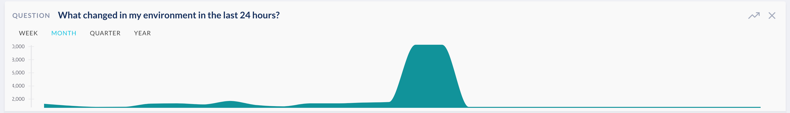

# JupiterOne 2019.25 Release

2019-06-25

## New Features

- Compliance app updates:

    - You can edit **policy/procedure-to-requirement/control mappings** directly
      in the webapp UI

    - You can add **links to external compliance evidence** to each
      requirement/control and optionally provide notes on the external evidence.
    
    - Improved compliance gap analysis logic - added `warning/attention`
      status in addition to `compliant/fulfilled`, `gap`, and `indeterminate`.

    - All mappings now work for controls of a standard framework in addition to
      requirements.

- Added an option to **Hide unrelated node** to filter out nodes in the graph
  that are not directly connected to the selected node.

- **Snyk** integration initial release - captures open source dependency
  vulnerability findings identified by Snyk scans and map them to code repos,
  CVEs, and CWEs. See details at
  <https://support.jupiterone.io/hc/en-us/articles/360024788554-Snyk>

## Early Access / Beta Features

- **Insights** app with customizable dashboards and metric charts.
  (For Enterprise tier subscriptions only)

    - Supports query driven charts in *Number*, *Pie/Donut*, *Line*, *Table*, or
      *Matrix* format.

    - Supports customizable *Team* (shared) and *Personal* dashboards. Layout of
      each dashboard is individually customizable per user.

- **Trends** for saved/packaged questions. (For Enterprise tier subscriptions
  only)

    - When enabled, question result will present a chart showing historic data
      trends.
    
    - The timeframe of the trend chart can be switched to *WEEK*, *MONTH*,
      *QUARTER* or *YEAR*.
    
    - You can also save/add the trend chart to a dashboard in the Insights app
      via the ![][1] **Add to Dashboard** button.

  

- Support **CREATE_JIRA_TICKET** and **SEND_EMAIL** as an alert action.
  This must be configured via the advanced rule editor, in the
  `operations.actions` portion of an alert rule's JSON configuration.

  For example:

  ```json
  {
    ...
    "operations": [
      {
        ...
        "actions": [
          ...
          {
            "type": "CREATE_JIRA_TICKET",
            "summary": "Summary text of the Jira issue",
            "project": "11024",
            "issueType": "Task",
            "integrationInstanceId": "88ce9ad3-a49d-4995-aa9f-56d996f88b34",
            "entityClass": "Vulnerability"
          },
          {
            "type": "SEND_EMAIL",
            "recipients": [
              "user@company.com"
            ]
          }
        ]
      }
    ]
  }
  ```

  Each action can be configured independently on a rule.
  
  > Notes on Jira issue creation:
  >
  > - Requires a Jira integration to have been configured, since the action
  >   references its `integrationInstanceId`. This is the UUID in the URL by
  >   going to your Jira integration configuration.
  >
  > - `project` specifies the Jira Project ID (*not* Project Key) - the `pid`
  >   number in this URL:
  >   <https://yourjira.domain/secure/project/EditProject!default.jspa?pid=11024>
  >
  > - UI improvements are coming soon to make configuration the above easier.

## Improvements and Bug Fixes

- More query performance improvements

- Added pagination support for query results in the web UI (for more than 250
  items) and when browsing questions in the library

- UI improvements for compliance requirement details modal

- UI improvements for Assets Inventory app, including the data grid and quick
  search bar

- Fixed an issue with sorting in the Alerts > Vulnerability Findings view

- Updated documentation for common questions and queries. See details at
  <https://support.jupiterone.io/hc/en-us/articles/360024909073-Common-Questions-and-Queries-Catalog>

- "Clear All" button to clear query results also clears the query in search bar

[1]: https://raw.githubusercontent.com/feathericons/feather/master/icons/trending-up.svg?sanitize=true
