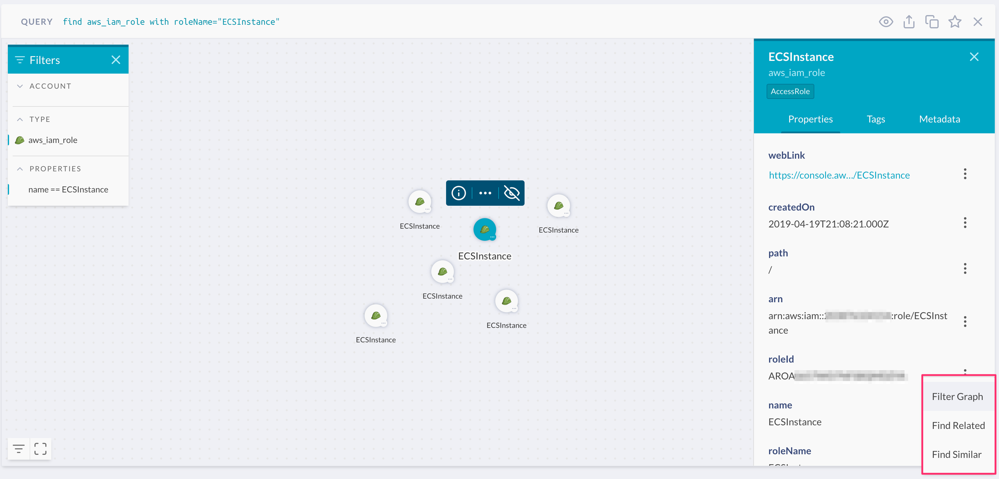
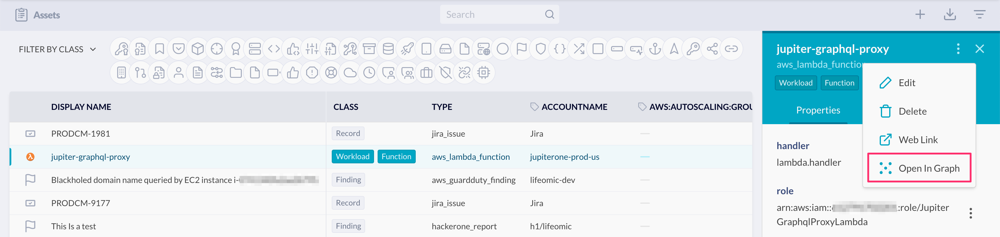
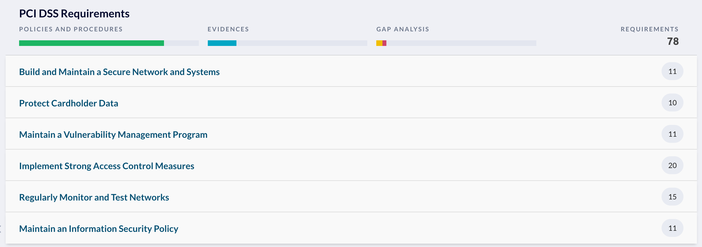

# JupiterOne 2019.27 Release

2019-08-05

## New Features

- Added additional filtering capabilities from entity property panel -- see
  lower right corner in the screenshot below:

  

  Clicking on the dropdown action button next to any property value in the
  entity property panel allows you to select the following actions:

  - **Filter Graph:** applies a filter with the current property key and value
    to the graph, hides other nodes that do not match.
  
  - **Find Related:** runs a full text search query in a new tab with the
    selected property value, finding all entities related to the search value.
    _This action is also available in Asset Inventory app._

  - **Find Similar:** runs a query to look for similar entities of the same type
    and with the same property key/value pair as the selected one.
    _This action is also available in Asset Inventory app._

- From the **Asset Inventory** app, you can select an entity and jump to a graph
  visualization of the selected entity and its connected entities using the
  **Open in Graph** action, as shown here:

  

- New **Compliance** app features:

  - For each requirement or control, you can **add links** to additional
    evidences hosted external to JupiterOne.

  - Additionally, you can capture **free form notes** to each compliance
    requirement.

  - Added **search** to quickly filter compliance requirements.

  - Added **summary summary / progress indicators**, as seen in this example
    screenshot:

    

- New **Alerts** app features:

  - Added **search** to both **Alerts** and **Alert Rules** view.

  - Added **Run** action to each alert rule, which runs the query in Landing
    to show your current results.
    
    _Note that **Run** is different from the **Evaluate** action, which triggers
    the alert rule to be evaluated in the backend and generates alert actions if
    the rule conditions match._

- You can **export/download policies and procedures** in both Markdown and HTML
  format in a zip package from the webapp.

- You can now **clone a Saved question** from the Query Library.

- Added a copy button to allow you to easily copy a query to clipboard from
  the query results view.

- Added support to upload SAML metadata file content in addition to providing a
  URL link to the SAML metadata document when configuring SSO.

## Improvements and Bug Fixes

- Fixed an issue where entity type icons were not displaying properly in the
  Asset Inventory app.

- Fixed an issue where boolean values for custom properties/tags are stored as
  string when an entity is manually edited in the Asset Inventory app.

- Fixed an issue where integration setup instructions did not properly display
  for certain users.

- Captured additional attributes such as `port`, `protocol`, `ruleType`, `eni`,
  etc. for `aws_inspector_finding` entities.

- Improved query error reporting.

- Minor UI and styling improvements.

- Various minor integration updates.
